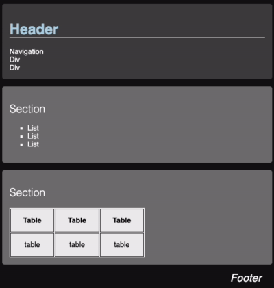

# CSS Practice

Now that you know how to create CSS rules using selectors to apply declarations to HTML elements, it's time to experiment and see what you can come up with.

## ☑ Assignment

Add CSS to the provided HTML to style it so that it looks like the following.




```masteryls
{"id":"37a86410-ae62-446a-a8d4-69325c4a0157", "title":"CSS practice", "type":"ai-web-page", "allowAiPrompt":false, "syncGrade":false, "autoGrade":false, "gradingCriteria":"Make the background for the body black, header dark gray, and sections gray. Color on the header text. Bottom border to the h1 text. Font is sans-serif font. Right align the footer. Animatation on the section elements.", "height":500 }
1. Make the background for the body black, header dark gray, and sections gray.
2. Add color to the header text.
3. Add a bottom border to the h1 text.
4. Set the font to be a sans-serif font. Right align the footer.
5. Animate the section elements.

~~~html
<style>
</style>

<body>
  <header>
    <h1>Header</h1>
    <nav>Navigation
      <div>Div</div>
      <div>Div</div>
    </nav>
  </header>

  <main>
    <section class="fly-in">
      <h2>Section</h2>
      <ul>
        <li>List</li>
        <li>List</li>
        <li>List</li>
      </ul>
    </section>
    <section class="fly-in">
      <h2>Section</h2>
      <table id="table-data">
        <tr>
          <th>Table</th>
          <th>Table</th>
          <th>Table</th>
        </tr>
        <tr>
          <td>table</td>
          <td>table</td>
          <td>table</td>
        </tr>
      </table>
    </section>
  </main>

  <footer>
    <div>Footer</div>
  </footer>
</body>
~~~
```


Don't forget to update your GitHub startup repository notes.md with all of the things you learned and want to remember.
