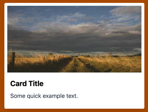
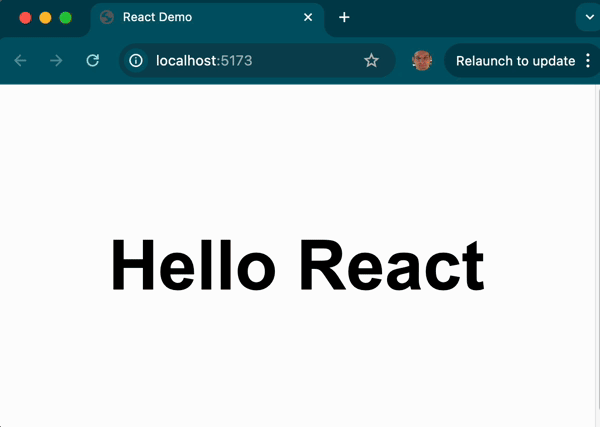

# Tailwind

📖 **Deeper dive reading**:

- [Tailwind website](https://tailwindcss.com/)
- [Getting started using Vite](https://tailwindcss.com/docs/installation/using-vite)

Tailwind is a CSS framework that takes a different approach from traditional frameworks. Instead of simply importing a bunch of predefined components such as buttons or navbars, Tailwind provides low-level utility classes that you apply directly in your HTML.

## History

- **Created by**: Adam Wathan, Steve Schoger, Jonathan Reinink, and David Hemphill
- **Initial release**: November 2017
- **Motivation**: The team behind Tailwind wanted a way to build UIs faster and more flexibly without constantly switching between HTML and CSS files or overriding styles from traditional frameworks like Bootstrap.
- **Success**: It has grown to become one of the most popular CSS frameworks due to its developer-first philosophy and modern tooling ecosystem.

## Tailwind philosophy

When you use Tailwind you simply add standard Tailwind class names to your HTML elements. You then run the HTML through a tool chain process, for example with Vite, and it dynamically builds your CSS files from the classes that you explicitly reference.

This has several advantages. It reduces CSS bloat, puts your styling directly in the HTML where it is used, and increases performance because you only include styling that you actually use. It also is closer to CSS and so if you are familiar with CSS you can quickly style your HTML using a simplified style syntax.

Tailwind works really well with web component frameworks because it encourages you to build reusable components in a framework like React so that you avoid creating similar components with slightly different Tailwind class references.

Here is an example of a button that is styled with Tailwind.

```html
<button className="bg-blue-400 text-white px-4 py-2 rounded shadow hover:bg-blue-700 transition-colors m-4">Get Started</button>
```


## Comparison to Bootstrap

You can get a deeper understanding of Tailwind by comparing it to the popular Bootstrap CSS framework. The following example shows that same HTML that is styled first with Bootstrap and then Tailwind.

### Bootstrap

With Bootstrap you use Bootstrap's card, card-body, card-tile, and card-text component classes. The HTML then references a large static stylesheet in order to apply the CSS rule sets for the classes.

```html
<div class="card" style="width: 18rem;">
  
  <div class="card-body">
    <h5 class="card-title">Card Title</h5>
    <p class="card-text">Some quick example text.</p>
  </div>
</div>
```

### Tailwind

With Tailwind there are no component level definitions. You simply work with class names that are similar to primitive CSS directives. You apply the class names directly in the HTML and not through CSS files.

```html
<div class="max-w-sm rounded overflow-hidden
<div className="max-w-sm rounded bg-white overflow-hidden shadow-lg m-4 p-2">
  
  <div className="px-2 py-4">
    <div className="font-bold text-xl mb-2">Card Title</div>
    <p className="text-gray-700 text-base">Some quick example text.</p>
  </div>
</div>
```

The visual result is similar in either case.



However, because Bootstrap uses predefined component level classes, you will need to download the entire Bootstrap CSS framework file in order to render the card. With Tailwind, a custom CSS file is created dynamically for you that only contains the styling that you used.

### Feature comparison

| Feature            | Tailwind CSS                                          | Bootstrap                                                    |
| ------------------ | ----------------------------------------------------- | ------------------------------------------------------------ |
| **Philosophy**     | Utility-first (build from primitives)                 | Component-based (prebuilt UI components)                     |
| **Customization**  | Highly customizable via config (`tailwind.config.js`) | Customizable but more rigid without overrides                |
| **Design freedom** | Full control over spacing, color, layout              | Limited to pre-defined component styling                     |
| **File size**      | Smaller                                               | Larger due to bundled components and styles                  |
| **Learning curve** | Steep at first as you learn native CSS                | Easy to get started                                          |
| **JS dependency**  | No JS (except if using plugins)                       | Depends on jQuery (Bootstrap ≤ 4) or native JS (Bootstrap 5) |

## Adding Tailwind to your project

Since you are already using Vite as the tool chain processor for you react application, it is easy to configure Vite to support tailwind. You need to install tailwind, configure vite to execute tailwind as part of the tool chain, add a reference to the resulting CSS, and start adding Tailwind class names to your HTML elements.

1. Start with the [Hello World React](../../webFrameworks/react/introduction/introduction.md#react-hello-world) application. This will result in an application that looks like this:

   

   When you are done configuring Tailwind the application should look very similar.

1. Install Tailwind CSS

   ```sh
   npm install tailwindcss @tailwindcss/vite
   ```

1. Configure the Vite plugin to use Tailwind to compile the CSS by modifying/creating `vite.config.js`

   ```ts
   import { defineConfig } from 'vite';
   import tailwindcss from '@tailwindcss/vite';
   export default defineConfig({
     plugins: [tailwindcss()],
   });
   ```

1. Create a `index.css` file and import tailwindcss. This will bring in the dynamically generated Tailwind CSS file.

   ```css
   @import 'tailwindcss';
   ```

1. Modify `index.html` head element to reference the placeholder CSS file.

   ```html
   <link href="/src/style.css" rel="stylesheet" />
   ```

1. Modify the `index.jsx` file to use Tailwind classes.

   ```jsx
   import React from 'react';
   import ReactDOM from 'react-dom/client';

   function App() {
     const [bgColor, setBgColor] = React.useState('bg-white');

     const handleClick = () => {
       setBgColor(bgColor === 'bg-white' ? 'bg-yellow-200' : 'bg-white');
     };

     return (
       <div onClick={handleClick} className={`h-screen font-bold text-8xl flex items-center justify-center ${bgColor}`}>
         <div> Hello React </div>
       </div>
     );
   }

   const root = ReactDOM.createRoot(document.getElementById('root'));
   root.render(<App />);
   ```
