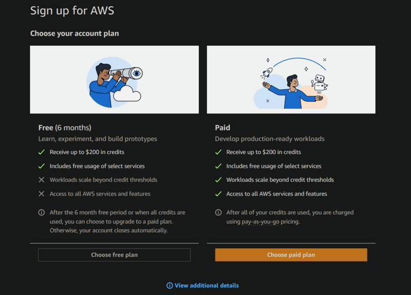

# AWS Account

Before we get started with anything else, you need to create an account with Amazon Web Services (AWS). You want to do this as soon as possible as you will need it for much of the work in this course and it might take some time to authorize your account.

There are lots of other great vendors out there, but AWS is by far the leader in the space and so it is good for you to get experience with them. Follow these instructions on how to create an [account with AWS](https://signin.aws.amazon.com/signup). When you create your account make sure you remember your account ID so that you can use it when you log in to the AWS browser console.

## What is this going to cost you?

There is no cost to create an account with AWS, you only pay for what you use, and in many cases they will give you a significant starting credit, and [some services are free](https://aws.amazon.com/free) for a short period of time or monthly usage. The services we are going to use include the following:

| Service        | Purpose                              | Estimated Cost (subject to change)                                                                                     |
| -------------- | ------------------------------------ | ---------------------------------------------------------------------------------------------------------------------- |
| EC2            | Server                               | t3.nano $0.0052 an hour ($3.50/month), t3.micro $0.0104 an hour ($7.00/month), t3.small $0.0208 an hour ($14.00/month) |
| EC2 Elastic IP | Keep your IP address between reboots | First one is free if you keep it associated with a running server. $0.0052 an hour otherwise.                          |
| Route 53       | Domain name                          | $3/year for `click` TLD. More for others                                                                               |
| Route 53       | DNS records                          | $0.50 a month for each root domain                                                                                     |
|                |                                      | Estimated total: `$15` - `$50` for the course. Much cheaper than a textbook.                                           |

## Choosing a plan

Currently, as of when this is written, AWS is offering [two initial plans](https://docs.aws.amazon.com/awsaccountbilling/latest/aboutv2/free-tier-plans.html) when creating your AWS account. This includes a **free plan** or a **paid plan**. Both plans require a credit card to create an account.  With either plan you receive $100 of initial credit, with the option to explore different topics that will earn you an addition $100. The following table helps compare the two plans.

|Plan|Credits|Plan expiration|Service limits|
|-      |-           |               -|-                    |
|Free|$100-$200|6 months 90 to covert to paid|Only select service available|
|Paid|$100-$200|unlimited|unlimited|

Unfortunately, the free plan does not provide access to the **Route 53** service. Route 53 is used by this course to manage your DNS hostname and records. That means if you choose the free plan you will need to use some additional service such as **namecheap** or **godaddy** for your DNS activities. For that reason it is suggested that you choose the **paid** plan.

## Billing

When you create your account you provide your credit card. You will be charged for any services that you use. That means that you need to understand what the pricing is for each service. Many services offer free tier usage withing certain limits, or for the first 12 months of your AWS account. Beyond that you will be billed monthly for your usage.

Make sure you monitor your billing by selecting the **Billing and cost management** interface from the user menu on the AWS browser console. This will give you detailed information about your current costs as well as a forecast for the future. An important role of a Web Developer is to understand the costs that result from the architectural choices that you make. This course is a good time to learn these skills before you start incurring bills in the thousands or millions of dollars.

## ☑ Assignment

1. Create your AWS [account](https://signin.aws.amazon.com/signup).
2. Create a browser bookmark for your AWS browser console page that contains your account ID. That way you will be able to access your account quickly.

_If your section of this course requires that you submit assignments for grading_: Submit in the Canvas assignment that you have completed this.
