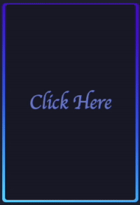

# Demonstration

Before we start digging into creating web servers and talking about protocols let's give you a taste of what web programming technologies can do. In this example we display a card with a rotating border. When you click on the card, the text changes.



You don't need to worry about the details of how this all works. The point of this demonstration is just to give you a taste of the amazing things you can do with very little code. However, there are three technologies that make this work: HTML, CSS, and JavaScript.

The HTML looks like the following and basically has a simple card with text in it.

```html
<body>
  <div class="card" onclick="titleClick()">Click Here</div>
</body>
```

The JavaScript handles when you click on the card and changes the text.

```js
function titleClick() {
  document.querySelector('.card').textContent = 'Wow! Magic!';
}
```

The CSS is a bit more complex to cover in detail, but it basically handles the styling and animation. For example, the CSS for the card specifies the width and height, where it is positioned, what font to use, and what color it should be.

```css
.card {
  background: #191c29;
  width: 45vh;
  height: 65vh;
  padding: 3px;
  position: relative;
  border-radius: 6px;
  justify-content: center;
  align-items: center;
  text-align: center;
  display: flex;
  font-size: 3em;
  color: #7383d7;
  font-family: cursive;
  cursor: pointer;
}
```

The rotating border is animated with the following CSS that dictates which colors to use and how to infinitely animate it between 0 and 360 degrees over 2.5 seconds.

```css
.card::before {
  background-image: linear-gradient(
    var(--rotate),
    #5ddcff,
    #3c67e3 43%,
    #4e00c2
  );
  animation: spin 2.5s linear infinite;
}

@keyframes spin {
  0% {
    --rotate: 0deg;
  }
  100% {
    --rotate: 360deg;
  }
}
```

## Get curious

```masteryls
{"id":"eecac632-b04b-49a9-a0b6-3c3961cb3e58", "title":"Magic card demonstration", "type":"ai-web-page", "allowAiPrompt":false, "gradingCriteria":"The card background color is green to start with", "height":500 }
Have fun playing around with the demonstration source code. Change the card's background color to be green and then press `Submit` once you are done.

~~~html
 <style>
@property --rotate {
  syntax: "<angle>";
  initial-value: 132deg;
  inherits: false;
}

:root {
  --card-height: 65vh;
  --card-width: calc(var(--card-height) / 1.5);
}

body {
  min-height: 100vh;
  background: #212534;
  display: flex;
  align-items: center;
  flex-direction: column;
  padding-top: 2rem;
  padding-bottom: 2rem;
  box-sizing: border-box;
}

.card {
  background: #191c29;
  width: var(--card-width);
  height: var(--card-height);
  padding: 3px;
  position: relative;
  border-radius: 6px;
  justify-content: center;
  align-items: center;
  text-align: center;
  display: flex;
  font-size: 3em;
  color: #7383d7;
  font-family: cursive;
  cursor: pointer;
}

.card::before {
  content: "";
  width: 104%;
  height: 102%;
  border-radius: 8px;
  background-image: linear-gradient(
    var(--rotate),
    #5ddcff,
    #3c67e3 43%,
    #4e00c2
  );
  position: absolute;
  z-index: -1;
  animation: spin 2.5s linear infinite;
}

.card:hover {
  color: rgb(88 199 250 / 100%);
  transition: color 1s;
}
.card:hover:before {
  animation: none;
  opacity: 0;
}

@keyframes spin {
  0% {
    --rotate: 0deg;
  }
  100% {
    --rotate: 360deg;
  }
}

a {
  color: #fff;
  text-decoration: none;
  font-family: sans-serif;
  font-weight: bold;
  margin-top: 2rem;
}

</style>
<body>
  <div class="card" onclick="titleClick()">Click now</div>

  <a 
     href="https://github.com/webprogramming260"
     target="_blank"
     rel="noopener noreferrer">
    Web Programming 260
  </a>

<script>
function titleClick() {
  document.querySelector(".card").textContent = "Wow! Magic!";
}
</script>

</body>
~~~
```

