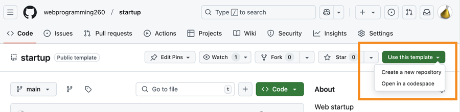
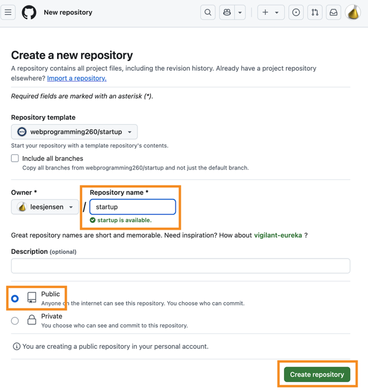

# GitHub


🔑 **Required reading**:

- [GitHub create a repo](https://docs.github.com/en/get-started/quickstart/create-a-repo)
- [GitHub cloning a repo](https://docs.github.com/en/repositories/creating-and-managing-repositories/cloning-a-repository)
- [GitHub personal access tokens](https://docs.github.com/en/authentication/keeping-your-account-and-data-secure/creating-a-personal-access-token)

When we introduced `Git`, we said that Git provides two things, 1) Version tracking in a repository, and 2) the ability to clone a copy of the repository to a different location. You can clone repositories between computers used by your development team, but the management of cloning repositories is much easier when you use a cloud based service such as `GitHub`.

GitHub was launched in 2008 by a small group of developers that wanted to make code collaboration easy. GitHub was acquired by Microsoft in 2018 for $7.5 billion. Since its beginning as a simple web application for cloning and storing Git repositories, GitHub has added functionality for hosting websites, supporting community pull requests, tracking issues, hosting codespaces, running continuous deployment processes, managing projects, and even AI driven code generation.

We are going to use GitHub for three things.

1. Hosting all of this instruction. Because it is hosted on GitHub you can generate pull requests when you see things that need improvement.
1. Publicly hosting your project repositories. This creates a backup copy of your code, demonstrates your progress with your commit history, allows for reviews of your code, and makes it so you can collaborate with your peers. It also looks good on a resume!
1. Keeping notes about what you have learned and things you want to remember.

## Creating a GitHub account

If you do not already have a GitHub account then go and [create one now](https://github.com). GitHub provides a free version of their services that will more than cover your usage in this class. Chances are that once you start using GitHub you will use this account for many years to come, both for personal and professional projects.

## Creating and cloning a repository

While you can create a repository in your development environment using `git init` and then connect it to an upstream repository on GitHub, it is always easier to create your repository first on GitHub and then clone it to your development environment. That way your local repository and your GitHub repository are automatically linked to each other.

To create a repository in GitHub, log into your account, select the `Repositories` tab, and press `New repository`. You then specify a unique repository name, give a description, indicate that you want it to be public, add a default README.md file, and choose a license.


Every repository in GitHub has a unique URL assigned to it. Assuming the repository is public, anyone with the URL can clone it to their development environment. A repository clone is an exact copy of the repository including all of the commits, comments, and SHAs. It also configures the clone to know what the remote source is so that you can use Git commands to keep them in sync as changes are made. In this case, the remote source is the GitHub repository.


You clone a repository by providing the GitHub repository's URL as a parameter to the `git clone` command from in a console window. You can get a copy of the URL from the repository's GitHub page and clicking on the green `Code` button, and then clicking on the copy button next to the HTTPS URL.


When you clone a repository it is placed in a subdirectory named with the name of the repository. So make sure you are in the directory where you keep all of your source repositories before you run the command.

```sh
➜  git clone https://github.com/webprogramming260/startup-example.git

Cloning into 'startup-example'...
remote: Total 4 (delta 0), reused 0 (delta 0), pack-reused 0
Receiving objects: 100% (4/4), done.

➜  cd startup-example
```

## Making changes

You can now make changes to the files in the repository and commit those changes. As you create new commits on your local clone, you want to push those changes back up to the GitHub clone of the repository so that the repositories are in sync with each other. This is done with the `push` Git command. Once you have pushed the new commits then your peers who have cloned the repository can pull the commits down using the `pull` Git command.


The following demonstrates console commands for making a change to a `test.md` file, committing it, and then pushing it up to GitHub. Of course you can also do this using the Git interface of VS Code.

```sh
➜  printf "\nChange from my development environment!\n" >> test.md

➜  git add test.md

➜  git commit -am "update(notes) thoughts about startup applications"

➜  git push
```

This is the pattern that you want to make a reflexive part of your development process.

1. Pull the repository's latest changes from GitHub (`git pull`)
1. Make changes to the code
1. Commit the changes (`git commit`)
1. Push the changes to GitHub (`git push`)

> [!NOTE]
>
> The first time you execute a push to a repository, Git will ask you how you want to identify yourself and what credential (e.g. password) to use in order to authenticate with GitHub. You will need to create a [Personal Access Token](https://docs.github.com/en/authentication/keeping-your-account-and-data-secure/creating-a-personal-access-token) and provide that as your password.

```sh
*** Please tell me who you are

Run
  git config --global user.email "you@example.com"
  git config --global user.name "Your name"
```

Make sure you use the email that you provided for your GitHub account.

After pushing changes to GitHub, you can then view the changes on GitHub with your browser. In the example above, you would see the changes to the `test.md` file. You can also edit and commit changes directly from GitHub. When looking at a repository file on GitHub you will see a little pencil in the top right hand corner of the file. If you press that you will enter edit mode. You use that to modify the file and then commit the changes with an appropriate comment.


Now there is a commit that GitHub has, but you do not have in your development environment. If we run the `fetch` Git command, you will get the latest information about the changes on GitHub without actually changing your local repository. We then run the `status` Git command to see the differences between the clones and see that we are missing a commit. You can pull it down using the `pull` Git command. You can also use the Git functionality in VS Code to view the status and sync up your repository.

```sh
➜  git fetch
➜  git status
Your branch is behind 'origin/main' by 1 commit, and can be fast-forwarded.
  (use "git pull" to update your local branch)

➜  git pull
Updating d13a9ce..cafe81a
Fast-forward
 test.md | 4 +++-
 1 file changed, 3 insertions(+), 1 deletion(-)
```

After running the pull command, your development clone and the GitHub clone are now the same.

## GitHub readme.md

Keeping notes of what you have learned and things that you want to remember is an essential step for accelerating your web programming skills. GitHub supports the inclusion of a file with the special name `README.md` in the root of your repository. The `README.md` file is displayed in GitHub when you view your repository. This file uses `Markdown` syntax. If you have not used Markdown before, then take some time to [learn how to use it](https://docs.github.com/en/get-started/writing-on-github/getting-started-with-writing-and-formatting-on-github/basic-writing-and-formatting-syntax). For this course you will use your startup application's `README.md` file to describe the modifications and alterations that you make to your startup.

In this course you will use the `readme.md` to record your progress on the startup application deliverables. You will also use another Markdown file named `notes.md` to track what you have learned in the course. You can use anything that you put in your `notes.md` file when taking the midterm or final.

## Forks

A GitHub fork provides the ability to create a copy of a GitHub repository. Usually you [fork a repo](https://docs.github.com/en/get-started/quickstart/fork-a-repo) to get a copy of an open source code base that you want to experiment with, or contribute to. For example, the repository containing these instructions. A fork is similar to cloning a repository to your development environment, but it clones to GitHub instead. Then pull the fork down to your development environment to work on it. The fork maintains a link to the upstream (original) repository that allows you to easily pull down updates and merge them with your fork. A fork also allows you to create a pull request in order to push suggested changes to the original repository.

If you have never forked a repository before you should go find an open source project that interests you. For example, here is the [Dad Jokes API](https://github.com/DadJokes-io/Dad_Jokes_API). This simple web service provides an endpoint to get a joke. Consider forking this repository in order to experiment with how it works. Don't worry too much about what the code is doing. That will make more sense as the class goes on.


It would be awesome if we can increase the fork count for `Dad Jokes API` into the hundreds. Also make sure you push the `Star` button to show that you like the repo. Let's blow KegenGuyll's mind!

## Pull requests

📖 **Deeper dive reading**:

- [GitHub Pull Requests](https://docs.github.com/en/pull-requests/collaborating-with-pull-requests/proposing-changes-to-your-work-with-pull-requests/about-pull-requests)
- [GitHub pulls from forks](https://docs.github.com/en/pull-requests/collaborating-with-pull-requests/proposing-changes-to-your-work-with-pull-requests/creating-a-pull-request-from-a-fork)

GitHub allows you to create a fork of any repository on GitHub. You just push the `Fork` button from the repository's GitHub page. You can then make modifications to the repository fork and push the changes as a _pull request_. This notifies the original repository's owner that a request is being made to enhance the original repository. The owner can review your changes and if appropriate commit the changes into the original. This is how open source communities manage development from a volunteer group of global developers.

In this class, if you notice something in the instruction that needs to be enhanced, feel free to fork the repo, and make a pull request. This will give you experience with this practice and improve the instruction for others at the same time. Plus your name will be included as a contributor. How cool is that!

## Creating a history of your work

The majority of your course work will revolve around your Startup Application GitHub repository. In this assignment you will create your repository. For each of your Startup deliverables you will add to, and enhance, the content you have created in a GitHub repository. The commit history that you establish through the course serves the following valuable purposes:

1. **Backup** - Every semester at least one student's computer dies. Having the ability to clone the repo to a new computer could save your grade in the course.
1. **Portfolio** - The code you develop in this course serves as a valuable portfolio artifact that you can use to demonstrate your mastery to future employers.
1. **Proof of work** - You can demonstrate your authorship of your code by consistently, and frequently, committing your work.
1. **Exploration** - The ability to create branches allows you to continuously experiment with different ideas without losing the main thread of your development. Likewise, you can try and implement something, realize it is not working and then simply reset to your last commit.
1. **Experience** - Git is the de facto versioning system. The experience you gain in this class will help prepare you for professional work.

All of this requires that you commit often. You should get in the habit of consistently making a small stable change and then committing.

1. Verify you have the latest code (`git pull`)
1. Refactor, test, and/or implement a small portion of cohesive code (`test` `code` `test`)
1. Commit and push (`git commit` `git push`)
1. Repeat

You will be most successful in this course if you set aside time each day, or every other day, to work on your startup. Those consistent work sessions should be complemented with consistent commits. If you are not creating multiple commits every workday, then you are not reflecting the code management practices you need in order to be successful in a production development environment.

For all of the above reasons, it is required that you use GitHub for your startup project. Additionally, you must use it consistently and frequently.

> [!IMPORTANT]
>
> **It is a prerequisite for all deliverables that you have at least 10 commits evenly spread across the assignment period for the deliverable.**

If you do not have the required number of commits, or if they are all clustered in a single burst of activity, then you will need to justify the discrepancy before the deliverable will be accepted.

## ☑ Assignment

Do the following steps to set up your `Startup application repository` in GitHub and clone it to your development environment.

### Creating Your Startup GitHub Repository

1. Open your web browser to the course [template repository](https://github.com/webprogramming260/startup)
1. Use the template to create a GitHub repository for your startup project

   1. Click on the `Use this template` button.
   1. Choose the `Create a new repository` option.

      

   1. Name it `startup`.
   1. Mark the repository as `public` so that it can be reviewed by the TAs and instructors.
   1. Select the option to create a license file and README.md.

      

1. Open a command line console window.
1. Clone your newly created repository to your development environment. Make sure you put the clone of the repository in a directory that you use for this class's coursework. These commands will look something like the following.

   ```sh
   cd ~/byu/cs260
   git clone https://github.com/YOURACCOUNTHERE/startup.git
   cd startup
   ```

### Practice using Git

1. Open up the repository directory in VS Code and modify the `readme.md` and `notes.md` file.create a file. Commit your changes, and push them to GitHub.
1. Using the GitHub web console modify your `readme.md` file and commit the changes.
1. In VS Code pull down and review the changes.

### Your notes.md

Your notes file is meant as a place to remember all the things you have learned from this course. You should modify this file frequently.

1. Read the GitHub documentation about the basics of [writing markdown](https://docs.github.com/en/get-started/writing-on-github/getting-started-with-writing-and-formatting-on-github/basic-writing-and-formatting-syntax).
1. Access the file in your repository called `notes.md`. You can use the contents of this file on any exam. As you modify your `notes.md` file throughout the class. Make sure that you keep it organized and clean. You can add multiple `.md` files and reference them from your `notes.md` file in order make it easier to organize your content.
1. Make your first notes in your `notes.md` file about what you learned from this assignment. Commit and push your notes to GitHub.

_If your section of this course requires that you submit assignments for grading_: Submit in the Canvas assignment the URL of your GitHub startup repository.
