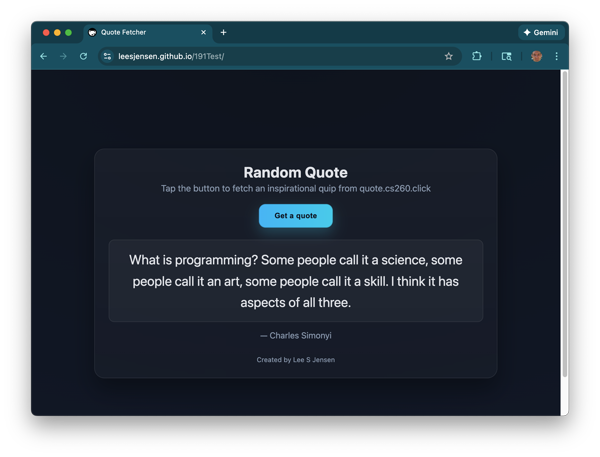
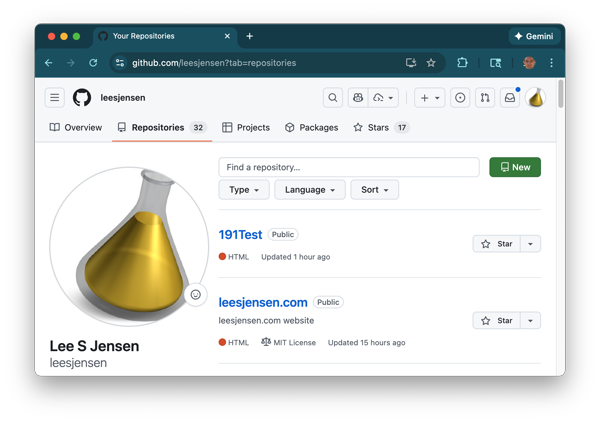
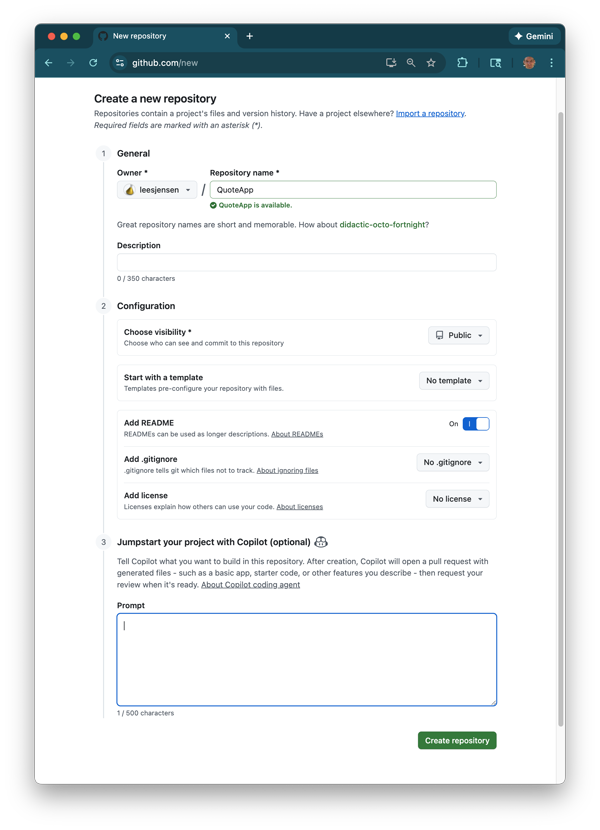
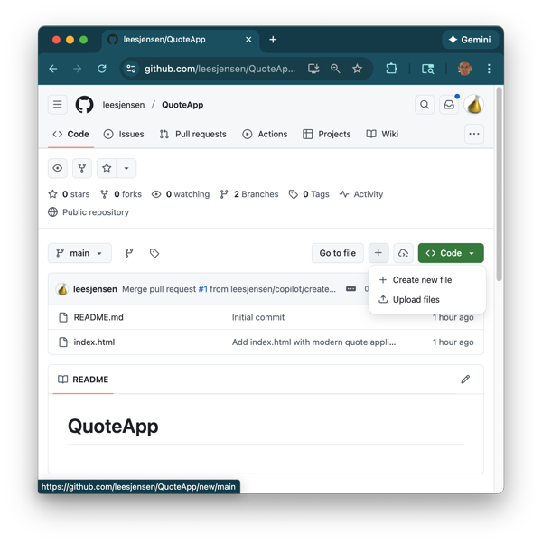
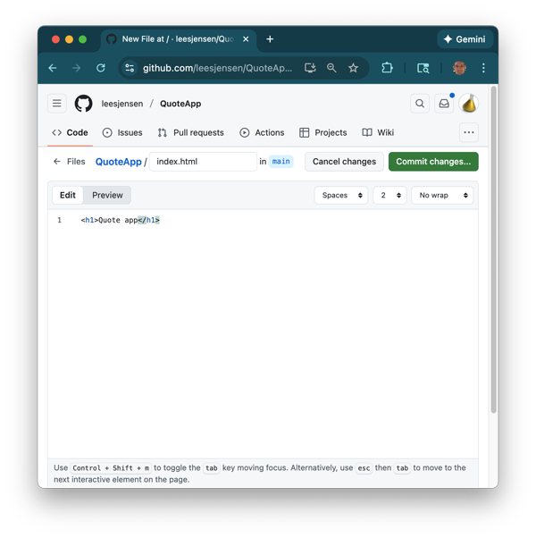
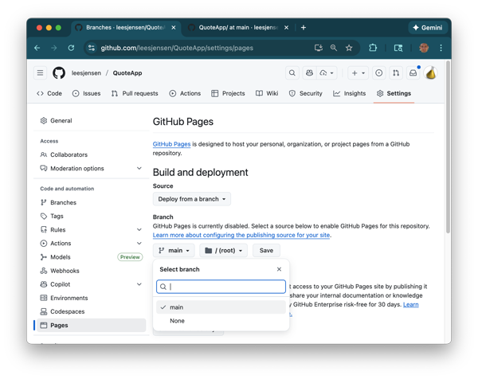
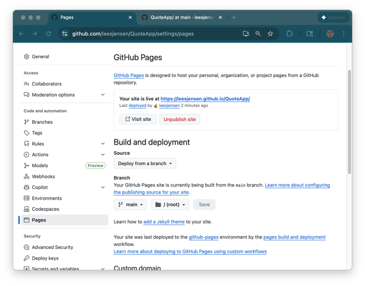
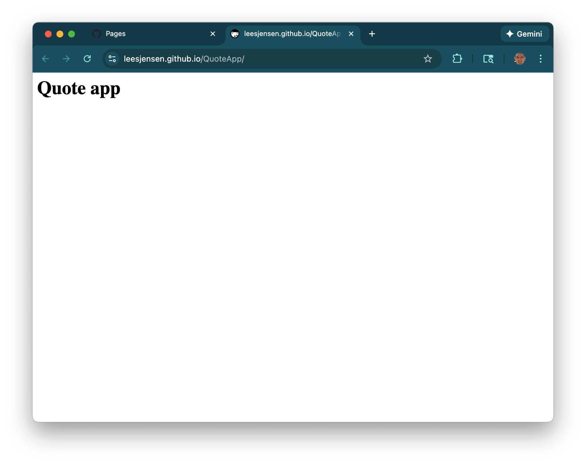
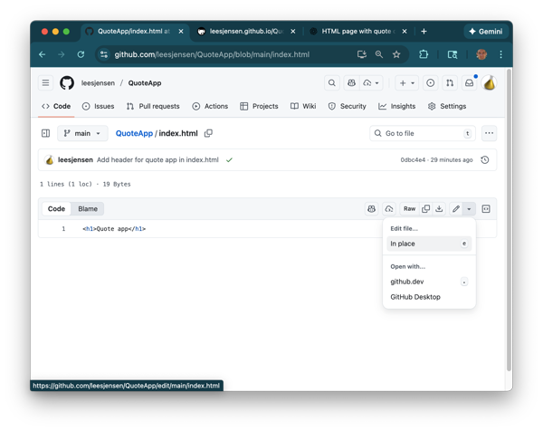
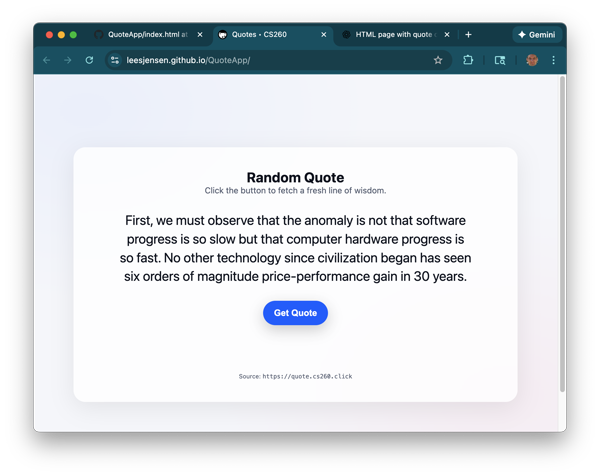

# A day in the life of a Software Engineer

## The request

The product team has asked you to build a demo for a customer that is trying to promote good software engineering principles. They think that showing quotes from influential programmers will accomplish this. The specification that they provided is as follows:

> Make a globally available programming quote web application

You talk to the UI design team and they mock up a design that looks like this.



## Research and design

You do some research and you find that there is an existing web service that generates programming quotes and is freely available using the following URL.

```sh
https://quote.cs260.click
```

This service returns quotes in the following example format.

```json
{
  "author": "Daniel T. Barry",
  "quote": "There is never enough time to do it right, but there is always enough time to fix it or to do it over."
}
```

You brainstorm your team and you decided that you can use this service and host single page application with GitHub Pages free hosting service. So you go to your project tracking system and add the following tasks:

1. Create/Use a GitHub account
1. Create a QuoteApp GitHub repository
1. Add a placeholder `index.html` file
1. Enable GitHub Pages to host the application
1. Implement the Quote application

## Implementation

### Step 1: Create GitHub account

If you don't already have a [GitHub account](https://github.com/signup) then create one now.

### Step 2: Create the QuoteApp repository

Now that you have a GitHub account, you need to create a source code repository where you will store all the source code for your application and also host the application on GitHub's web servers.

1.  Using the GitHub website navigate to the list of your **Repositories** and press the `New` button.

    

1.  Name the repository `QuoteApp`
1.  Chose the option to set the visibility to **Public**
1.  Chose the option to add a README file
1.  Press the **Create Repository** button

    

### Step 3: Add a placeholder index.html file

At this point you want to do iterative development and so you are going to create a little placeholder application that you can then host to the world.

1.  Navigate to the the main display for your **QuoteApp** repository.
1.  Press the `+` button to create a new file.

    

1.  Set the name of the file to be `index.html`.
1.  Insert the text of the file to represent a simple HTML placeholder.

    ```html
    <h1>Quote app</h1>
    ```

    

1.  Press the **Commit changes...** button and give it some meaningful comment about the purpose of the change to the application.

### Step 4: Enable GitHub Pages to host the application

Now you want to set up your hosting so that the world can see your amazing new application.

1.  Navigate to the the main display for your **QuoteApp** repository.
1.  Select the **Settings** option for the repository from the top level options.

1.  Select the **Pages** option from the sidebar options.
1.  Change the **Branch** to be your `main` branch.

    

1.  Toggle the directory to `/docs` and then back to `/(root)`
1.  Press the **Save** button. This will take everything that is in your repository and host it on your GitHub Pages server.
1.  You should see that your site has gone live and is now available for viewing anywhere in the world.

    

1.  Press the `Visit site` button and view your newly deployed website.

    

### Step 5: Implement the Quote application

Now you are ready to do the actually development of your application. You talk to your team and you decide to leverage AI to get a quick prototype up and running. After some debate and discussion you come up with the following AI prompt.

```text
Create a single HTML page named index.html that is a modern looking application that has a button that displays a quote obtained from https://quote.cs260.click. Center the controls. Have the text fit 75% of the viewport width, and be responsive to changes in the viewport size and orientation.
```

1.  Open up your favorite Chat LLM and give it the application creation prompt.
1.  Review the resulting code and make sure you understand what everything is doing. If you don't understand, then discuss it with chat until it is all clear. Feel free to refine what is produced until you are happy with it.
1.  Navigate back to the repository home page and select the `index.html` file in order to view it.
1.  Press the pencil icon to begin editing the file.

    

1.  Replace the simple placeholder HTML with the code generated from the Chat discussion.
1.  Press `Commit changes...` and give it a meaningful comment.

After a few minutes your quote app should show up when you browse to the same URL you previously used to view your GitHub pages application.



## Review

Before you break for lunch, you huddle with the product team and show them the prototype. You record their feedback and add it to your task list to work on later that day. The feedback includes:

1. Display the author if not already displayed.
1. Replace/add the source footer so that it contains your company's subscription plea.
1. Make the button a different color.
1. Change the background color to something different.
1. Change the radius of the card and button border to be square.
1. Make the heading say "Programming Quote".

## ☑ Assignment

Follow the above scenario and create your own website using GitHub Pages and chat. Implement the review requests from the product team. Make sure you understand the code generated by chat. If you don't then discuss it with Chat until you do

Be prepared to demonstrate your Quote Application in a future class discussion.
