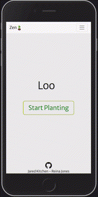
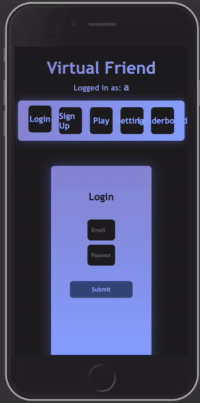
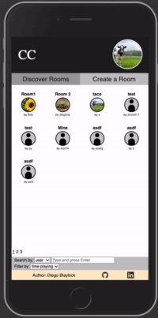
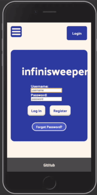
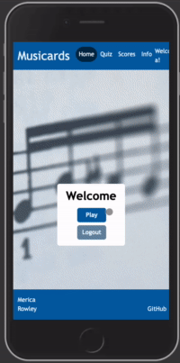

# Startup application

The primary objective of this course is to help you understand the technologies necessary to launch a web application startup. Towards this goal you will build your very own `startup` application. The actual application you build is entirely up to you, but it must successfully demonstrate the technologies we focus on.

The course is divided into distinct milestones. At each milestone, you will evolve your startup application to take on more and more functionality. You start with a conceptual design document and then build a structural shell for the application using HTML, followed by styling with CSS. Next, you will use JavaScript to add interactivity and incorporate these features into a modern web framework, React. You will also integrate third-party web services, host your own web service, connect a database for persistent storage and authentication, and enable real-time data updates from the server using WebSockets.

You will turn in the following deliverable versions of your startup application.

| Deliverable                                                                     | Description                                                                                                                                                                                                             |
| ------------------------------------------------------------------------------- | ----------------------------------------------------------------------------------------------------------------------------------------------------------------------------------------------------------------------- |
| [Specification](../startupSpec/startupSpec.md)                                  | Elevator pitch and basic design for your startup                                                                                                                                                                        |
| [AWS](../../webServers/startupAWS/startupAWS.md)                                | Deploy a server with a custom domain name                                                                                                                                                                               |
| [HTML](../../html/startupHtml/startupHtml.md)                                   | Basic structural and organizational elements                                                                                                                                                                            |
| [CSS](../../css/startupCss/startupCss.md)                                       | Styling and animating                                                                                                                                                                                                   |
| [React Phase 1: Routing](../../webFrameworks/startupReact/startupReactP1.md)    | Port HTML and CSS to React                                                                                                                                                                                              |
| [React Phase 2: Reactivity](../../webFrameworks/startupReact/startupReactP2.md) | Interactivity, interaction, reactivity, components, and routing using JavaScript and React                                                                                                                              |
| [Web service](../../webServices/startupService/startupService.md)               | Remote functions that your application calls on your, and someone else's, web server _(e.g. saveScores, getWeather, chatWithFriend)_                                                                                    |
| [DB](../../webServices/startupDb/startupDb.md)                      | Store application data in a database                                                                                                                                                                                        |
| [WebSocket](../../webServices/startupWebSocket/startupWebSocket.md)             | Support for pushing data from the server. This can be peer to peer communication _(e.g. chatting with friends through the browser)_, or realtime data from the server _(e.g. stock prices or the current game leader)_. |

The [Simon](https://simon.cs260.click) application is meant to give you an example of the level of complexity you are looking for, and how to build your startup application. Use Simon as a chance to experiment with things you are considering doing with your startup application. Once you learn how Simon does something you can leverage that code in your startup.

Immediately start thinking about what you would like to build. What you do for your startup application is completely up to you. So make it something that is interesting to you. It doesn't have to be complex. In fact **simple is usually better**. Dream big, but pick a very small, minimal viable product, for your startup application.

Keep the styling of your application simple. One common mistake is to spend enormous amounts of time trying to make your application look a certain way. Instead leverage what Simon does. Make it look reasonable and then move on to the next technology. You can always come back later and make it look better.

You can change your project as the class progresses, but each deliverable submission must include all the functionality defined by the previous milestones. For that reason, it is suggested that you do not change your project, and carefully consider your project from the beginning, because the longer you go, the more expensive it will be to repeat your previous work.

## Submitting your deliverable

In order to make the submission and grading process as efficient as possible it is required that you do the following for each deliverable.

1. Clear trail of ownership and development work demonstrated by your GitHub commit history
1. Deployment of the deliverable to your production environment
1. Inclusion of a link to your GitHub startup repository prominently displayed on your application's home page
1. Inclusion of notes in your startup Git repository `README.md` file documenting what you modified and added with this deliverable. The TAs will only grade things that have been clearly described as being completed. Review the [voter app](https://github.com/webprogramming260/startup-example) as an example. Please reference the items from the rubric for each deliverable in your description of what you did, and what you did not.

> [!IMPORTANT]
>
> Deliverables that do not include the above will not be accepted for grading.

## Ideas

Some ideas for possible projects include:

- Simple game like connect four. Games with complex rules or animation are difficult and therefore discouraged.
- Peer chat
- Photo URL sharing. Sharing actual photos requires that you to store those files somewhere, and therefore is discouraged.
- Shared story authoring
- Book or recipe reviews
- Geo-location sharing
- News sharing
- Favorite website sharing
- Group voting
- Group calendaring

Demonstrating the technology is more important than complexity or creativity, and basic implementations of each of the course technologies is sufficient to demonstrate your mastery.

## Examples

### Simon

The [Simon](https://simon.cs260.click) demonstration application provides a good example for the level of complexity that you should be working towards. Each of the course technologies are demonstrated in about 100 lines of [code](https://github.com/webprogramming260/simon-react#readme).

### Voter

The [voting application](https://startup.cs260.click) allows multiple users to vote on their favorite startup application in realtime.

### Thesaurdle

Thesaurdle enables players to start with one word and work towards a goal word by traversing synonyms.

> BJ Foutz & Jared Black

### Zen Garden

Zen Garden demonstrates the power of elegant, clean, UI design to create a custom plants that you add to your personal collection.

> Riana Jones & Jared Kitchen

### Virtual Friend

Come hang out with all of your friends in a virtual room.

> Hugh Takara

### Christofori's Cafe

Create a music room where you can play piano and chat with your friends.

> Diego Blaylock

### Infinisweeper

Play an infinite game of mine sweeper with all of your fiends.

> Abby Reynolds

### Musicards

Learn how to quickly read notes. Compete for the high score.

> Merica Rowley

## Common mistakes

Here are some common mistakes that will slow down the development of your startup.

1. **Not putting in consistent effort**. The technology deliverables build on each other. If you get behind, it becomes increasingly difficult to deliver the final product. Rather than cramming your effort into the night before the deliverable is due, set aside a specific time each day to research and add to your startup. Doing this will result in a better application, and make the process much more satisfying.
1. **Too many UI pieces**. Resist the urge to create lots of user inputs and components when one input or component will demonstrate the functionality. Complexity kills in software development. This is true for both the amount of effort it takes to implement and enhance, as well as the poor user experience it creates.
1. **Getting stuck on doing something a specific way**. There are common patterns for doing things in web applications that have been refined over decades of experience. If you find yourself hitting a brick wall because you can't get something to work the way you have designed, then it might be because it goes against the way things are normally done. Instead, look for inspiration in how popular frameworks solve a pattern, and leverage the examples and code that they provide. Common examples of this mistake include writing your own navigation bar, or creating an interactive game by moving HTML elements around pixel by pixel.
1. **Focusing too much on the UI**. In many ways it is the functionality that matters. Make sure that the application does something interesting and utilizes all the required technologies first. You can always make it look nicer once you have made it work.
1. **Implementing too many features**. Focus on delivering a core feature really well. Once you have completely built out that functionality, then you can add additional features. A common mistake is to start building lots of features at the start, and then not completing any of them. For example, if you are writing a stock trading application, then make sure you can display stocks and save your favorites, before you start designing the ability to see your friend's picks, chat about the market, display historical charts, or use AI to predict the future.
1. **Forgetting that programming is an art**. Building a web application is a creative expression of who you are, what you know, and the vision you have. Don't get frustrated because you cannot immediately realize your potential. That will take time and effort. Just remember that as you develop your skills, it will become increasingly satisfying to see what amazing things you can build and what an positive impact you can make for so many people. God has given you specific talents, and as you develop them, you are going to do great things for good with them.
