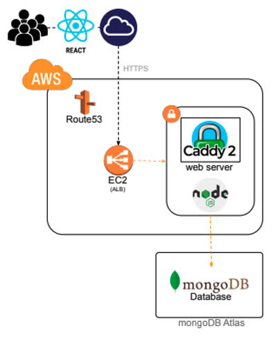
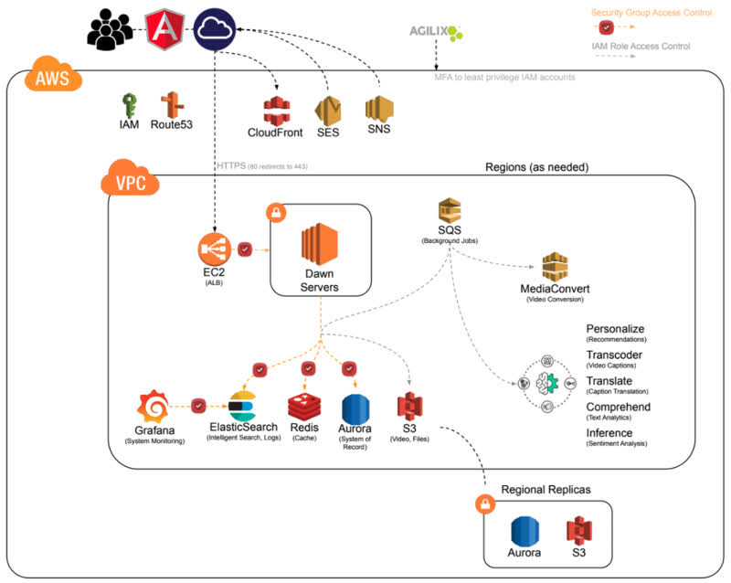

# Technology stack

<iframe src="https://docs.google.com/presentation/d/e/2PACX-1vTpufGYYRU_u3bw1WVaaWK1qdIW1bHITmcpZM9t7Qo8k6ZL0X2Ey7dHEj6Ry3IDxBy-SapRJdS5cSPu/pubembed?start=false&loop=false&delayms=3000" frameborder="0" width="900" height="540" allowfullscreen="true" mozallowfullscreen="true" webkitallowfullscreen="true"></iframe>

The collection of technologies that you use to create or deliver your web application is called a _technology stack_. It is a stack because they usually layer one on top of each other. Generally at the top of the stack is your web framework. This includes possibilities such as Angular, React, Vue, or Svelte. The web framework then communicates with one or more web services to provide authentication, business, data, and persistent storage. The web service then uses backend services such as caching, database, logging, and monitoring.

Here is what our stack looks like: React for the web framework, talking to Caddy as the web server hosted on AWS, running web services with Node.js, and MongoDB as the database hosted on MongoDB Atlas.



The key with a tech stack is the realization that there is no one answer to the question of what technology to use where, and the answer continually evolves. Usually you will use what the company you work for has invested in. Migrating to a new stack is very expensive and error prone. So learning how to maximize your effectiveness, regardless of the technology, will make you very valuable. Being discontent because the latest new toy is not being used will usually cause an unnecessary disruption to the team. However, if you can validate that a change in the tech stack will produce significant monetary, performance, or security gains, then you will greatly benefit your team.


```masteryls
{"id":"22f24721-5dc0-4595-bf54-7761b265fc6e", "title":"Defining a Technology Stack", "type":"multiple-choice"}
In software development, what is the best definition of a technology stack?

- [ ] A physical arrangement of server hardware and networking cables within a data center.
- [x] The combination of programming languages, frameworks, libraries, and tools used to build and run an application.
- [ ] A chronological list of all version updates and code commits made during a project's lifecycle.
- [ ] The hierarchical structure of an IT department, ranging from junior developers to the CTO.
```


## Complex technology stack

Here is an example of a tech stack from a small web application company. You can see that there are dozens of technologies used to make the application work. When you build a commercial stack you want to be very careful about the pieces you choose. Dependability, support, scalability, performance, and security are all important factors. You also want to consider development productivity factors such as documentation, ease of use, common acceptance, community support, build times, and testing integration.


