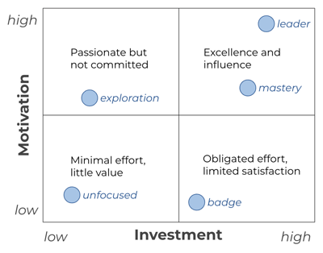

# Why am I here?

To get what you want out of this course, you must intentionally consider two questions:

1. **Motivation**: What do I want?
1. **Investment**: What am I willing to do?

This course is a great opportunity to engage in this type of intentional thinking and behavior. Consider your current motivation and the level of investment you are willing to make. Then as the course progresses, look back on that commitment and let it drive your behavior.

## Motivation: What do I want?

Motivation gives you the reason to get out of bed, invest your energy, and keep you moving when things are difficult. The stronger the motivation, the greater its power. Common motivations include:

- **Unfocused**: I need to do something. It might as well be this.
- **Badge**: I need credit towards graduation or getting a job.
- **Exploration**: I am curious about this.
- **Mastery**: I want this as one of my core abilities.
- **Leader**: I want to be a leader in this space.

## Investment: What am I willing to do?

Your motivation will determine your level of investment and ultimately what you will get out of it. Investment can range from _minimal_ to _immersion_. For each level of motivation, there is a spectrum of possible investment. The effort required for a low level of motivation is significantly less than that for a high level of motivation.

The following rubric describes different levels of investment based upon your level of motivation. To use the table:

1. Select your target motivation from the first column.
1. Complete all of the items in that row up to, and including, your target investment column.

For example, if I wanted to `thoroughly explore`, I would skim all the instruction, study the deliverable instruction, attend class regularly, and complete 100% of the deliverables.

|                 | Minimal                          | Surface                             | Familiar                          | Thorough                  | Immersion                                                  |
| --------------- | -------------------------------- | ----------------------------------- | --------------------------------- | ------------------------- | ---------------------------------------------------------- |
| **Unfocused**   | Only attend first day            | Skim instruction                    | Read some deliverable instruction | 20% of deliverables       | 30% of deliverables                                        |
| **Badge**       | 60% of deliverables              | 70% of deliverables                 | 80% of deliverables               | 93% of deliverables       | 100% of deliverables                                       |
| **Exploration** | Skim all instruction             | Study deliverable instruction       | Attend class regularly            | 100% of deliverables      | Study all instruction                                      |
| **Mastery**     | 100% of deliverables             | Study all instruction               | Actively participate in class     | 125% of deliverables      | Engage beyond instruction                                  |
| **Leader**      | Immersive **Mastery** investment | Creatively exploring new directions | Curiosity driving exploration     | Collaborating with others | With humility, seeking inspiration and eternal application |

## Enjoy the journey

In many ways, the destination is merely a byproduct of the journey and what you’ve learned along the way.

If the journey feels overwhelming, pause and recall your motivation. Instead of dwelling on the challenges ahead, recognize your progress. Focus on the next step, take it one day at a time, and celebrate every success.

> “Life is a journey, not a destination”
>
> — _Attributed: Ralph Waldo Emerson_

## ☑ deliverable

Write down your motivation and what you are willing to invest. Periodically reflect on this as the course progresses.
