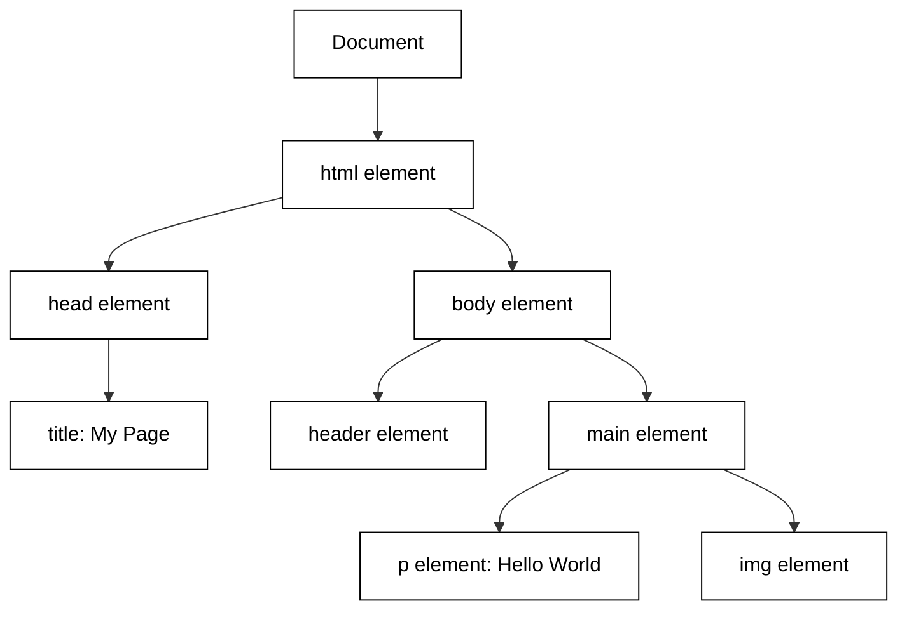

# Learning HTML Through Exploration

Learning HTML is more than memorizing a list of tags; it is about building a robust mental model of how the web is structured. HTML serves as the **backbone** of every website, providing the essential skeleton upon which CSS (styling) and JavaScript (behavior) are built. Without this structural foundation, the other technologies have nothing to hook onto. By exploring HTML through discovery—rather than rote memorization—you foster a sense of curiosity that allows you to see the web as a series of nested containers and relationships.

When you write HTML, you are creating a blueprint. However, the browser doesn't just display your text file; it parses it into an in-memory representation called the **Document Object Model (DOM)**. Understanding the DOM is the "aha!" moment for many developers. It transforms your flat code into a live, branching tree structure where every element is a "node."




To explore this structure effectively, you should focus on the relationship between **Tags** and **Attributes**. Think of tags as the "nouns" (the objects themselves) and attributes as the "adjectives" (the properties or configurations of those objects). For example, an `<a>` tag defines a link, but the `href` attribute tells the browser where that link actually goes.

```html
<!-- The tag (noun) defines the element type -->
<!-- The attribute (adjective) provides extra information -->


<p style="color:green">document text</a>
```

## Interactive experimentation


## Experiment on your own

There are several active methods to explore HTML and deepen your understanding:

*   **The "View Source" Method:** Right-click on any professional website and select "View Page Source." This allows you to see the raw backbone provided by the developers.
*   **Browser DevTools (The Living DOM):** Use the `Inspect` tool (F12 or Cmd+Option+I) to see the DOM in real-time. You can double-click tags to change them or delete elements to see how the layout collapses, which reveals the structural importance of specific tags.
*   **The "Break and Fix" Strategy:** Take a simple HTML template and intentionally remove closing tags or nest elements incorrectly. Observing how the browser tries to "fix" your mistakes (auto-closing tags) helps you understand the browser's parsing logic.

This exploratory approach leads to two major outcomes: **Curiosity** and **Creativity**. When you stop asking "What tag do I use?" and start asking "How is this structured?", you gain the creative freedom to build complex layouts. You begin to see the web not as a magic black box, but as a logical, hierarchical tree that you have the power to manipulate.

```masteryls
{"id":"html-dom-mental-model", "title":"Understanding the DOM", "type":"multiple-choice"}
What is the primary difference between the HTML code you write and the Document Object Model (DOM)?

- [ ] The HTML code is used for mobile devices, while the DOM is only used for desktop browsers.
- [ ] There is no difference; the DOM is simply another name for the text file you save with a .html extension.
- [x] The HTML code is a static blueprint, while the DOM is the live, in-memory tree representation of that structure created by the browser.
- [ ] The DOM refers only to the CSS styling, while HTML refers only to the text content.
```
