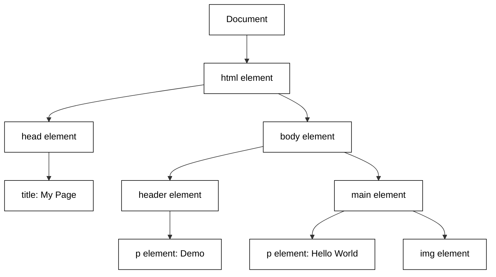

# Learning HTML Through Exploration

Learning HTML is more than memorizing a list of tags; it is about building a robust mental model of how the web is structured. HTML serves as the **backbone** of every website, providing the essential skeleton upon which CSS (styling) and JavaScript (behavior) are built. Without this structural foundation, the other technologies have nothing to hook onto. By exploring HTML through discovery—rather than rote memorization—you foster a sense of curiosity that allows you to see the web as a series of nested containers and relationships.

## Anatomy of a web page's structure


```masteryls
{"id":"cd76a31c-c450-4d5a-a777-c8e86643971f", "title":"Structural elements", "type":"web-page" }
<!DOCTYPE html>
<html lang="en">
<head>
    <meta charset="UTF-8">
    <meta name="viewport" content="width=device-width, initial-scale=1.0">
    <title>Document Structure Demonstration</title>
    <style>
        :root {
            --header-bg: #e3f2fd;
            --nav-bg: #bbdefb;
            --main-bg: #ffffff;
            --section-bg: #f1f8e9;
            --article-bg: #fff9c4;
            --aside-bg: #f3e5f5;
            --footer-bg: #424242;
            --border-color: #9e9e9e;
            --text-main: #212121;
        }

        body {
            font-family: system-ui, -apple-system, sans-serif;
            line-height: 1.6;
            color: var(--text-main);
            margin: 0;
            display: flex;
            flex-direction: column;
            min-height: 100vh;
        }

        /* Visual indicator for structural elements */
        header, nav, main, section, article, aside, footer {
            position: relative;
            border: 2px dashed var(--border-color);
            margin: 10px;
            padding: 20px;
            border-radius: 8px;
        }

        /* Labeling the elements using pseudo-elements */
        header::before, nav::before, main::before, section::before, article::before, aside::before, footer::before {
            content: "<" attr(data-label) ">";
            position: absolute;
            top: -12px;
            left: 10px;
            background: white;
            padding: 0 5px;
            font-family: monospace;
            font-weight: bold;
            font-size: 0.8rem;
            color: #d32f2f;
            border: 1px solid var(--border-color);
            border-radius: 4px;
        }

        header { background-color: var(--header-bg); }
        nav { background-color: var(--nav-bg); }
        main { background-color: var(--main-bg); flex: 1; }
        section { background-color: var(--section-bg); }
        article { background-color: var(--article-bg); }
        aside { background-color: var(--aside-bg); }
        footer { background-color: var(--footer-bg); color: white; }

        .layout-grid {
            display: grid;
            grid-template-columns: 1fr;
            gap: 10px;
        }

        @media (min-width: 768px) {
            .layout-grid {
                grid-template-columns: 3fr 1fr;
            }
            nav ul {
                display: flex;
                gap: 20px;
                list-style: none;
                padding: 0;
            }
        }

        nav ul {
            list-style: none;
            padding: 0;
            margin: 0;
        }

        nav a {
            text-decoration: none;
            color: #0d47a1;
            font-weight: bold;
        }

        .controls {
            background: #fff;
            padding: 10px;
            border-bottom: 1px solid #ccc;
            text-align: center;
            position: sticky;
            top: 0;
            z-index: 100;
        }

        button {
            padding: 8px 16px;
            cursor: pointer;
            background: #2196f3;
            color: white;
            border: none;
            border-radius: 4px;
        }

        button:hover {
            background: #1976d2;
        }

        .hidden-labels header::before, 
        .hidden-labels nav::before, 
        .hidden-labels main::before, 
        .hidden-labels section::before, 
        .hidden-labels article::before, 
        .hidden-labels aside::before, 
        .hidden-labels footer::before {
            display: none;
        }

        .hidden-labels header, 
        .hidden-labels nav, 
        .hidden-labels main, 
        .hidden-labels section, 
        .hidden-labels article, 
        .hidden-labels aside, 
        .hidden-labels footer {
            border-style: solid;
            border-color: transparent;
            margin: 0;
        }
    </style>
</head>
<body>

    <div class="controls">
        <button id="toggleLabels">Toggle Structure Labels</button>
    </div>

    <header data-label="header">
        <h1>Website Architecture</h1>
        <p>This page demonstrates how HTML5 semantic elements organize content.</p>
        
        <nav data-label="nav">
            <ul>
                <li><a href="#">Home</a></li>
                <li><a href="#">About</a></li>
                <li><a href="#">Structure Guide</a></li>
                <li><a href="#">Contact</a></li>
            </ul>
        </nav>
    </header>

    <main data-label="main" class="layout-grid">
        <div class="content-area">
            <section data-label="section">
                <h2>Introduction to Semantics</h2>
                <p>Semantic HTML introduces meaning to the web page rather than just presentation. It helps search engines and assistive technologies understand the role of different content blocks.</p>
                
                <article data-label="article">
                    <h3>The Article Element</h3>
                    <p>An article represents a self-contained composition in a document, page, application, or site, which is intended to be independently distributable or reusable.</p>
                    <p>Examples include a forum post, a magazine or newspaper article, or a blog entry.</p>
                </article>

                <article data-label="article">
                    <h3>The Section Element</h3>
                    <p>A section is a thematic grouping of content, typically with a heading. It is more general than an article but more specific than a div.</p>
                </article>
            </section>
        </div>

        <aside data-label="aside">
            <h3>Related Info</h3>
            <p>This is an <strong>aside</strong>. It contains content indirectly related to the main content, like sidebars, call-out boxes, or advertising.</p>
            <svg width="100" height="100" viewBox="0 0 100 100" style="display: block; margin: 10px auto;">
                <rect width="100" height="100" fill="#ce93d8" />
                <circle cx="50" cy="50" r="30" fill="#f3e5f5" />
                <text x="50" y="55" font-size="10" text-anchor="middle" fill="#4a148c">Sidebar Icon</text>
            </svg>
        </aside>
    </main>

    <footer data-label="footer">
        <p>&copy; 2023 Web Structure Tutorial. Built using semantic HTML5.</p>
        <p>The footer typically contains authorship information, copyright data, or links to related documents.</p>
    </footer>

    <script>
        const btn = document.getElementById('toggleLabels');
        btn.addEventListener('click', () => {
            document.body.classList.toggle('hidden-labels');
            btn.textContent = document.body.classList.contains('hidden-labels') 
                ? 'Show Structure Labels' 
                : 'Hide Structure Labels';
        });
    </script>
</body>
</html>
```


An HTML document is typically comprised of a root element that contains zero or more children elements. Those children can then contain other children. This forms a "tree" of elements the define how the page is structured. When an HTML element is represented in a textual file format it is often refered to as a **tag**. The opening and closing tags show where the element starts and ends with the children represented in between The following code demonstrates a simple document.

```html
<html>
<head><title>My Page</title></head>
<body>
    <header>
        <p>Demo</p>
    </header>
    <main>
        <p>Hello World</p>
    </main>
</html>
```

When you write HTML, you are creating a blueprint. However, the browser doesn't just display your text file; it parses it into an in-memory representation called the **Document Object Model (DOM)**. Understanding the DOM is the "aha!" moment for many developers. It transforms your flat code into a branching tree structure where every element is a "node." JavaScript code and CSS styling directives interact with the nodes in the DOM to make the HTML come alive.





To explore this structure effectively, you should focus on the relationship between **Tags** and **Attributes**. Think of tags as the "nouns" (the objects themselves) and attributes as the "adjectives" (the properties or configurations of those objects). For example, an `<a>` tag defines a link, but the `href` attribute tells the browser where that link actually goes.

```html
<!-- The tag (noun) defines the element type -->
<!-- The attribute (adjective) provides extra information -->


<p style="color:green">document text</a>
```

## Interactive experimentation

```masteryls
{"id":"b9b2c3d4-e5f6-7890-1234-567890123460", "title":"Page structure", "type":"ai-web-page", "height":420}
**Initial Prompt**: Create an HTML page that does not have any styling but demonstrates the common structural elements.

**Styled Prompt**: Create an HTML page that uses CSS to clarify the structure of the document.

Alter the generated HTML and experiment. Use the **Discuss** feature to explain the meaning of the different elements.
```


```masteryls
{"id":"9f5c55c8-27cb-4042-b75e-9844336409ce", "title":"Common elements", "type":"essay" }
Describe the common HTML structural elements.
```


## Experiment on your own

There are several active methods to explore HTML and deepen your understanding:

*   **The "View Source" Method:** Right-click on any professional website and select "View Page Source." This allows you to see the raw backbone provided by the developers.
*   **Browser DevTools (The Living DOM):** Use the `Inspect` tool (F12 or Cmd+Option+I) to see the DOM in real-time. You can double-click tags to change them or delete elements to see how the layout collapses, which reveals the structural importance of specific tags.
*   **The "Break and Fix" Strategy:** Take a simple HTML template and intentionally remove closing tags or nest elements incorrectly. Observing how the browser tries to "fix" your mistakes (auto-closing tags) helps you understand the browser's parsing logic.

This exploratory approach leads to two major outcomes: **Curiosity** and **Creativity**. When you stop asking "What tag do I use?" and start asking "How is this structured?", you gain the creative freedom to build complex layouts. You begin to see the web not as a magic black box, but as a logical, hierarchical tree that you have the power to manipulate.

```masteryls
{"id":"html-dom-mental-model", "title":"Understanding the DOM", "type":"multiple-choice"}
What is the primary difference between the HTML code you write and the Document Object Model (DOM)?

- [ ] The HTML code is used for mobile devices, while the DOM is only used for desktop browsers.
- [ ] There is no difference; the DOM is simply another name for the text file you save with a .html extension.
- [x] The HTML code is a static blueprint, while the DOM is the live, in-memory tree representation of that structure created by the browser.
- [ ] The DOM refers only to the CSS styling, while HTML refers only to the text content.
```
