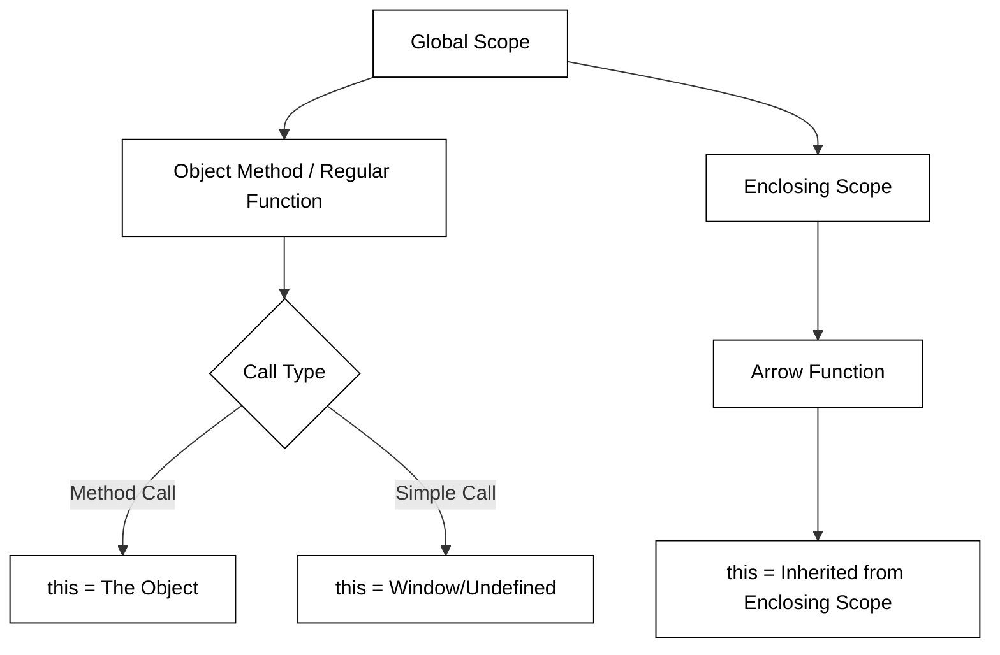

# JavaScript arrow function

Introduced in ES6 (ECMAScript 2015), arrow functions provided a more concise syntax for writing function expressions in JavaScript. Beyond just saving keystrokes, they were designed to solve specific pain points regarding the behavior of the `this` keyword, which often led to bugs in complex applications and asynchronous code. An arrow function is defined using the "fat arrow" (`=>`) syntax and is always anonymous, meaning it must be assigned to a variable or passed as an argument to be used.

## Syntax and Conciseness

Arrow functions allow for implicit returns when the function body consists of a single expression. Here is a function in arrow syntax that takes no parameters and always returns 3.

```js
() => 3;
```

This makes them ideal for functional programming patterns like `map`, `filter`, and `reduce`.

- **Standard Function:** Requires the `function` keyword, curly braces, and a `return` statement.
- **Arrow Function (Explicit):** Uses `=>` but retains curly braces and `return`.
- **Arrow Function (Implicit):** Removes curly braces and `return` for one-liners.

```javascript
const numbers = [1, 2, 3, 4];

// Standard Function
const doubled1 = numbers.map(function (n) {
  return n * 2;
});

// Arrow Function (Implicit return)
const doubled2 = numbers.map((n) => n * 2);

// Returning an object implicitly requires parentheses
const makeObject = (id, name) => ({ id: id, name: name });
```

Besides being compact, the `arrow` function syntax has some important semantic differences from the standard function syntax. This includes how a return value is specified and the scope of variables that an arrow function can access.

## Return values

Arrow functions also have special rules for the `return` keyword. The return keyword is optional if no curly braces are provided for the function and it contains a single expression. In that case the result of the expression is automatically returned. If curly braces are provided then the arrow function behaves just like a standard function.

```js
() => 3;
// RETURNS: 3

() => {
  3;
};
// RETURNS: undefined

() => {
  return 3;
};
// RETURNS: 3
```

## Lexical `this` and Scoping

The most significant technical difference between arrow functions and regular functions is how they handle the `this` context. In a regular function, `this` is defined by _how_ the function is called (dynamic scoping). In an arrow function, `this` is **lexically scoped**, meaning it inherits `this` from the surrounding code block where it was defined.



This lexical binding is particularly "good for" callbacks inside methods. Previously, developers had to use `.bind(this)` or assign `var self = this;` to access the instance context inside a `setTimeout` or a promise chain.

## Arrow Functions and Closures

Arrow functions interact seamlessly with closures. Because they capture the lexical environment, they are excellent for creating factory functions or maintaining state in asynchronous operations. When an arrow function is defined inside another function, it creates a closure over the variables in that outer scope, including the outer scope's `this` value.

```javascript
function Timer() {
  this.seconds = 0;

  // The arrow function creates a closure over 'this' from Timer
  setInterval(() => {
    this.seconds++;
    console.log(this.seconds);
  }, 1000);
}

const myTimer = new Timer();
```

### Closure exmple

Closure can be tricky to wrap your head around, but just remember that a closure includes a function and its creation scope.

The function `makeClosure` follows the **factory method** pattern and returns an anonymous function using the arrow syntax. The function creates a variable from an initialization parameter. Both the parameter (`init`) and the locally scoped variable (`closureValue`) are included in closure for the returned function.

```js
function makeClosure(init) {
  let closureValue = init;
  return () => {
    return `closure ${++closureValue}`;
  };
}
```

Now, when we call the **createClosure** function, it returns the arrow function that includes the closure of the variables that existed when it was created. That is why the closure function can reference a variable that is declared outside of the scope that it executes in. We demonstrate this by calling the closure function multiple times with different resulting values.

```js
const closure = makeClosure(0);

console.log(closure());
// OUTPUT: closure 1

console.log(closure());
// OUTPUT: closure 2
```

Closures provide a valuable property when we do things like execute JavaScript within the scope of an HTML page. This is because it remembers the values of variables that were in scope when the function was created.

## Common Problems and Limitations

While powerful, arrow functions are not a drop-in replacement for all functions. There are several scenarios where they should be avoided:

1.  **Object Methods:** Since arrow functions don't have their own `this`, using them for methods will result in `this` pointing to the global object (or `undefined`) rather than the object instance.
2.  **Constructors:** Arrow functions cannot be used with the `new` keyword and do not have a `prototype` property.
3.  **The `arguments` object:** Arrow functions do not have their own `arguments` object. If you need a variable number of arguments, you must use rest parameters (`...args`) instead.

```javascript
const person = {
  name: 'Alice',
  // PROBLEM: 'this' will not be the person object
  sayHi: () => {
    console.log(`Hi, I am ${this.name}`);
  },
};

person.sayHi(); // Output: "Hi, I am undefined"
```

```masteryls
{"id":"2c99a226-2eea-4382-b74d-dd609e1be0a1", "title":"Understanding Lexical this", "type":"multiple-choice"}
What is the primary difference in how arrow functions handle the `this` keyword compared to regular functions?

- [ ] Arrow functions bind `this` to the object that calls the function at runtime.
- [x] Arrow functions inherit `this` from the scope in which they were defined.
- [ ] Arrow functions always set `this` to the global window object.
- [ ] Arrow functions allow you to manually rebind `this` using the .bind() method.
```

## Using arrow functions with React

React components are a great place to learn how to use arrow functions. The following is a simple React application that increments and decrements a counter when the appropriate buttons are pressed. This code uses standard JavaScript functions.

```jsx
function App() {
  const [count, setCount] = React.useState(0);

  function Increment() {
    setCount(count + 1);
  }

  function Decrement() {
    setCount(count - 1);
  }

  return (
    <div>
      <h1>Count: {count}</h1>
      <button onClick={Increment}>n++</button>
      <button onClick={Decrement}>n--</button>
    </div>
  );
}
```

By using arrow functions the counter logic can be moved directly into the JSX. This makes the code much more concise and actually clarifying what the buttons are doing.

```jsx
function App() {
  const [count, setCount] = React.useState(0);

  return (
    <div>
      <h1>Count: {count}</h1>
      <button onClick={() => setCount(count + 1)}>n++</button>
      <button onClick={() => setCount(count - 1)}>n--</button>
    </div>
  );
}
```

There is however, a problem with this code. Setting state with the function provided by the React useState function is asynchronous. That means you don't know if other, concurrently running code, has changed the value of **count** between when you read it and when you set it. That can lead to the counter being incremented multiple time in some cases or not at all in others. To fix this we need to supply an arrow function to the setCount function that sets the state instead of simply supplying the desired value. The following compares the two versions.

```jsx
// may corrupt value
setCount(count + 1);

// safe
setCount((prevCount) => prevCount + 1);
```

This works because React can control when the state variable is updated instead of allowing your code to do the read operation. Our counter app now looks like this:

```jsx
function App() {
  const [count, setCount] = React.useState(0);

  return (
    <div>
      <h1>Count: {count}</h1>
      <button onClick={() => setCount((prevCount) => prevCount + 1)}>n++</button>
      <button onClick={() => setCount((prevCount) => prevCount - 1)}>n--</button>
    </div>
  );
}
```

However, our nice concise code is now looking a little clunky as we put more duplicated logic inline for the **onClick** handler. We can fix this by moving the creation of the arrow function out of the JSX and in to the component body. At the same time let's reduce the duplication of code caused by the different counter operations and make it easy to add new operations by using the factory pattern to create our operations. Notice the use of closure to reference the operation that is used by the arrow function that is returned from the factory.

```jsx
function App() {
  const [count, setCount] = React.useState(0);

  function counterOpFactory(op) {
    return () => setCount((prevCount) => op(prevCount));
  }

  const incOp = counterOpFactory((c) => c + 1);
  const decOp = counterOpFactory((c) => c - 1);
  const tenXOp = counterOpFactory((c) => c * 10);

  return (
    <div>
      <h1>Count: {count}</h1>
      <button onClick={incOp}>n++</button>
      <button onClick={decOp}>n--</button>
      <button onClick={tenXOp}>n*10</button>
    </div>
  );
}
```

This results in concise, simple, thread safe code in a functional programming style.

## Experiment

Use the **JavaScript Interpreter**, or the console pane in the browser debugger, to experiment with arrow functions.

```masteryls
{"id":"a92239de-b212-437c-becf-f42950a9b999", "type":"web-page", "height":650, "file":"../introduction/javascriptPlayground.html" }
```

## An advanced example

If you are still wanting more, take a look at this complex example that demonstrates the use of functions, arrow functions, parameters, a function as a parameter (callback), closures, and browser event listeners. This is done by implementing a `debounce` function.

The point of a debounce function is to only execute a specified function once within a given time window. Any requests to execute the debounce function more frequently than this will case the time window to reset. This is important in cases where a user can trigger expensive events thousands of times per second. Without a debounce the performance of your application can greatly suffer.

The following code calls the browser's `window.addEventListener` function to add a callback function that is invoked whenever the user scrolls the browser's web page. The first parameter to `addEventListener` specifies that it wants to listen for `scroll` events. The second parameter provides the function to call when a scroll event happens. In this case we call a function named `debounce`.

The debounce function takes two parameters, the time window for executing the window function, and the window function to call within that limit. In this case we will execute the arrow function at most every 500 milliseconds.

```js
window.addEventListener(
  'scroll',
  debounce(500, () => {
    console.log('Executed an expensive calculation');
  }),
);
```

The debounce function implements the execution of windowFunc within the restricted time window by creating a closure that contains the current timeout and returning a function that will reset the timeout every time it is called. The returned function is what the scroll event will actually call when the user scrolls the page. However, instead of directly executing the `windowFunc` it sets a timer based on the value of `windowMs`. If the debounce function is called again before the window times out then it resets the timeout.

```js
function debounce(windowMs, windowFunc) {
  let timeout;
  return function () {
    console.log('scroll event');
    clearTimeout(timeout);
    timeout = setTimeout(() => windowFunc(), windowMs);
  };
}
```

### Debouncing experiment

Drag the scrollbar to see the color change. As long as you keep scrolling the color will keep changing. Once you stop scrolling for half a second, the debounce function will fire and the color will reset to white.

Enhance the debouncer function to report the number of scroll and debounce events. As you scroll around you should see a significant difference between the two.

```
document.querySelector('.scrollable').innerText = `Scroll events: ${scrollCount}, Bounce events: ${bounceCount}`;
```

```masteryls
{"id":"155bb729-1239-4569-8199-1cb5cc13f842", "title":"Debouncer", "type":"ai-web-page", "allowAiPrompt":false, "gradingCriteria":"The debounce function will change the div text to say how many events have occurred.", "height":100 }
When you have experimented with the debouncer and added the display of the different event counts, submit your changes for review.

~~~html
<html>
<style>
  html { font-family: sans-serif; }
  body { margin: 10px; }
  .scrollable { height: 3000px; }
</style>

<body>
  <div class="scrollable">Debounce example</div>

  <script>
  document.addEventListener("DOMContentLoaded", function () {
      let scrollCount = 0;
      let bounceCount = 0;

      function debounce(windowMs, windowFunc) {
        let timeout;
        return function () {
          const color = `hsl(${scrollCount++}, 100%, 50%)`;
          document.documentElement.style.backgroundColor = color;

          clearTimeout(timeout);
          timeout = setTimeout(() => windowFunc(), windowMs);
        };
      }

      document.body.addEventListener(
        "scroll",
        debounce(500, () => {
          bounceCount++;

          document.documentElement.style.backgroundColor = "#FFFFFF";
          document.body.scrollTop = 0;
        })
      );
  });
  </script>
</body>
</html>
~~~
```
