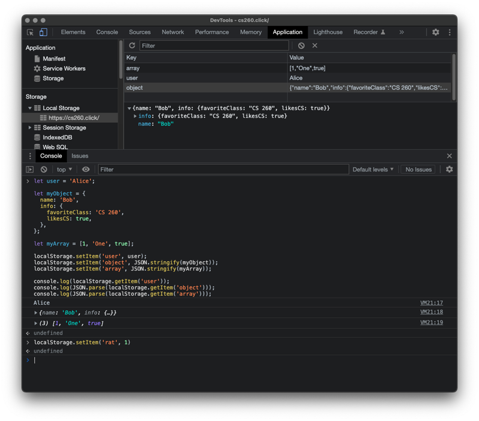

# Local storage

📖 **Deeper dive reading**: [MDN LocalStorage](https://developer.mozilla.org/en-US/docs/Web/API/Window/localStorage)

The browser's `localStorage` API provides the ability to persistently store and retrieve data (i.e. scores, usernames, etc.,) on a user's browser across user sessions and HTML page renderings. For example, your frontend JavaScript code could store a user's name on one HTML page, and then retrieve the name later when a different HTML page is loaded. The user's name will also be available in local storage the next time the same browser is used to access the same website.

In addition to persisting application data between page renderings, `localStorage` is also used as a cache for when data cannot be obtained from the server. For example, your frontend JavaScript could store the last high scores obtained from the service, and then display those scores in the future if the service is not available.

## How to use LocalStorage

There are four main functions that can be used with localStorage.

| Function             | Meaning                                      |
| -------------------- | -------------------------------------------- |
| setItem(name, value) | Sets a named item's value into local storage |
| getItem(name)        | Gets a named item's value from local storage |
| removeItem(name)     | Removes a named item from local storage      |
| clear()              | Clears all items in local storage            |

A local storage value must be of type `string`, `number`, or `boolean`. If you want to store a JavaScript object or array, then you must first convert it to a JSON string with `JSON.stringify()` on insertion, and parse it back to JavaScript with `JSON.parse()` when retrieved.

## Example

Open your startup website and run the following code in the browser's dev tools console window.

```js
let user = 'Alice';

let myObject = {
  name: 'Bob',
  info: {
    favoriteClass: 'CS 260',
    likesCS: true,
  },
};

let myArray = [1, 'One', true];

localStorage.setItem('user', user);
localStorage.setItem('object', JSON.stringify(myObject));
localStorage.setItem('array', JSON.stringify(myArray));

console.log(localStorage.getItem('user'));
console.log(JSON.parse(localStorage.getItem('object')));
console.log(JSON.parse(localStorage.getItem('array')));
```

**Output**

```sh
Alice
{name: 'Bob', info: {favoriteClass: 'CS 260', likesCS: true}
[1, 'One', true]
```

Notice that you are able to see the round trip journey of the local storage values in the console output. If you want to see what values are currently set for your application, then open the `Application` tab of the dev tools and select `Storage > Local Storage` and then your domain name. With the dev tools you can add, view, update, and delete any local storage values.




### Data Serialization
`localStorage` can only store strings. To store complex data structures like objects or arrays, you must serialize them into a JSON string using `JSON.stringify()` when saving and deserialize them using `JSON.parse()` when retrieving.

```javascript
const user = { name: "Alice", theme: "dark" };

// Saving an object
localStorage.setItem("userProfile", JSON.stringify(user));

// Retrieving an object
const storedUser = JSON.parse(localStorage.getItem("userProfile"));
```

### Storage Limits and Error Handling
Most modern browsers provide approximately **5MB** of storage per origin. If you exceed this limit, the browser will throw a `QuotaExceededError`. It is a best practice to use `try...catch` blocks when performing write operations to handle these scenarios gracefully.

```javascript
try {
  localStorage.setItem("key", "large_data_string");
} catch (e) {
  if (e.name === 'QuotaExceededError') {
    console.error("Storage limit reached!");
  }
}
```

### Security Considerations
Data stored in `localStorage` is accessible by any JavaScript code running on the same origin. This makes it vulnerable to **Cross-Site Scripting (XSS)** attacks.
*   **Never** store sensitive information such as passwords, personally identifiable information (PII), or session tokens (like JWTs) in `localStorage`.
*   Always sanitize any data retrieved from `localStorage` before rendering it to the DOM to prevent script injection.

### Synchronous Blocking
`localStorage` operations are **synchronous**. This means that reading or writing large amounts of data blocks the main thread, which can lead to UI "jank" or lag. For high-performance applications requiring larger storage capacities, consider using **IndexedDB**, which is asynchronous.

### The `storage` Event
You can synchronize data across multiple tabs or windows from the same origin using the `storage` event. This event fires on every window **except** the one that performed the change.

```javascript
window.addEventListener('storage', (event) => {
  console.log(`Key changed: ${event.key}`);
  console.log(`New value: ${event.newValue}`);
});
```

### Feature Detection
Some users may have storage disabled or may be using a "Private/Incognito" mode that restricts access. Always verify availability before attempting to use the API.

```javascript
function isLocalStorageAvailable() {
  try {
    const testKey = "__test__";
    localStorage.setItem(testKey, testKey);
    localStorage.removeItem(testKey);
    return true;
  } catch (e) {
    return false;
  }
}
```

### LocalStorage vs. SessionStorage
While both share the same API methods, they differ in persistence:
*   **LocalStorage**: Persists even after the browser is closed and reopened.
*   **SessionStorage**: Cleared when the specific page session ends (when the tab is closed). Use `sessionStorage` for temporary data that should not persist across sessions.


```masteryls
{"id":"0cc9e91e-e677-43a1-99e8-4e164e464b3b", "title":"Uses of localStorage", "type":"essay" }
Describe good and bad uses for `localStorage` in application development.
```

