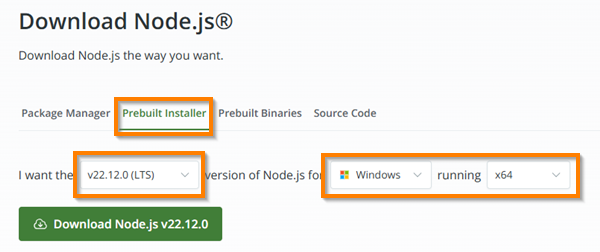

# Node.js


In 2009 Ryan Dahl created `Node.js`. It was the first successful application for deploying JavaScript outside of a browser. This changed the JavaScript mindset from a browser technology to one that could run on the server as well. This means that JavaScript can power your entire technology stack. One language to rule them all. Node.js is often just referred to as Node, and is currently maintained by the [Open.js Foundation](https://openjsf.org/).


> “You can never understand everything. But, you should push yourself to understand the system”
>
> — Ryan Dahl

Browsers run JavaScript using a JavaScript interpreter and execution engine. For example, Chromium based browsers all use the [V8](https://v8.dev/) engine created by Google. Node.js simply took the V8 engine and ran it inside of a console application. When you run a JavaScript program in Chrome or Node.js, it is V8 that reads your code and executes it. With either program wrapping V8, the result is the same.


## Installing Node.js

Your production environment web server comes with Node.js already installed. However, you will need to install Node.js in your development environment if you have not already. The easiest way to install Node.js is to use the official download found on [nodejs.org](https://nodejs.org/en/download/package-manager).

You can pick the method that you would like to use to install, but it is suggested to use the **Prebuilt Installer** for your operating system and computer processor. Make sure that you select the latest Long Term Support version (LTS) in order to get the most stable version. In the image below this will install 22.12.0, however the version may be different by the time you view this instruction.



## Checking that Node is installed

The node.js console application is simply called `node`. You can verify that Node is working correctly by running `node` with the `-v` parameter. Note that your version might be different than what is shown here. As long as it is an LTS version you should be fine.

```sh
➜ node -v
v22.12.0
```

## Running programs

You can execute a line of JavaScript with Node.js from your console with the `-e` parameter.

```sh
➜  node -e "console.log(1+1)"
2
```

You can also run `node` in interpretive mode by executing it without any parameters and then typing your JavaScript code directly into the interpreter.

```sh
➜ node
Welcome to Node.js v16.15.1.
> 1+1
2
> console.log('hello')
hello
```

However, to do real work you need to execute an entire project composed of dozens or even hundreds of JavaScript files. You do this by creating a single starting JavaScript file, named something like `index.js`, that references the code found in the rest of your project. You then execute your code by running `node` with `index.js` as a parameter. For example, with the following JavaScript saved to a file named `index.js`

```js
function countdown() {
  let i = 0;
  while (i++ < 5) {
    console.log(`Counting ... ${i}`);
  }
}

countdown();
```

We can execute the JavaScript by passing the file to `node`, and receive the following result.

```sh
➜  node index.js
Counting ... 1
Counting ... 2
Counting ... 3
Counting ... 4
Counting ... 5
```

## Node package manager

While you could write all of the JavaScript for everything you need, it is always helpful to use preexisting packages of JavaScript for implementing common tasks. To load a package using Node.js you must take two steps. First install the package locally on your machine using the Node Package Manager (NPM), and then include a `require` statement in your code that references the package name. NPM is automatically installed when you install Node.js.

NPM knows how to access a massive repository of preexisting packages. You can search for packages on the [NPM website](https://www.npmjs.com/). However, before you start using NPM to install packages you need to initialize your code to use NPM. This is done by creating a directory that will contain your JavaScript and then running `npm init`. NPM will step you through a series of questions about the project you are creating. You can press the return key for each of questions if you want to accept the defaults. If you are always going to accept all of the defaults you can use `npm init -y` and skip the Q&A.

```sh
➜  mkdir npmtest
➜  cd npmtest
➜  npm init -y
```

## Package.json

If you list the files in the directory you will notice that it has created a file named `package.json`. This file contains three main things: 1) Metadata about your project such as its name and the default entry JavaScript file, 2) commands (scripts) that you can execute to do things like run, test, or distribute your code, and 3) packages that this project depends upon. The following shows what your `package.json` looks like currently. It has some default metadata and a simple placeholder script that just runs the echo command when you execute `npm run test` from the console.

```json
{
  "name": "npmtest",
  "version": "1.0.0",
  "description": "",
  "main": "index.js",
  "keywords": [],
  "author": "",
  "license": "ISC",
  "scripts": {
    "test": "echo \"Error: no test specified\" && exit 1"
  }
}
```

With NPM initialized to work with your project, you can now use it to install a node package. As a simple example, we will install a package that knows how to tell jokes. This package is called `give-me-a-joke`. You can search for it on the [NPM website](https://www.npmjs.com/), see how often it is installed, examine the source code, and learn about who created it. You install the package using `npm install` followed by the name of the package.

```sh
➜  npm install give-me-a-joke
```

If you again examine the contents of the `package.json` file you will see a reference to the newly installed package dependency. If you decide you no longer want a package dependency you can always remove it with the `npm uninstall <package name here>` console command.

With the dependency added, the unnecessary metadata removed, the addition of a useful script to run the program, and also adding a description, the `package.json` file should look like this:

```json
{
  "name": "npmtest",
  "version": "1.0.0",
  "description": "Simple Node.js demo",
  "main": "index.js",
  "license": "MIT",
  "scripts": {
    "dev": "node index.js"
  },
  "dependencies": {
    "give-me-a-joke": "^0.5.1"
  }
}
```

> [!NOTE]
>
> When you start installing package dependencies, NPM will create an additional file named `package-lock.json` and a directory named `node_modules` in your project directory. The `node_modules` directory contains the actual JavaScript files for the package and all of its dependent packages. As you install several packages this directory will start to get very large. You do **not** want to check this directory into your source control system since it can be very large and can be rebuilt using the information contained in the `package.json` and `package-lock.json` files. So make sure you include `node_modules` in your `.gitignore` file.

When you clone your source code from GitHub to a new location, the first thing you should do is run `npm install` in the project directory. This will cause NPM to download all of the previously installed packages and recreate the `node_modules` directory.

The `package-lock.json` file tracks the version of the package that you installed. That way if you rebuild your `node_modules` directory you will have the version of the package you initially installed and not the latest available version, which might not be compatible with your code.

With NPM and the joke package installed, you can now use the joke package in a JavaScript file by referencing the package name as a parameter to the `require` function. This is then followed by a call to the joke object's `getRandomDadJoke` function to actually generate a joke. Create a file named `index.js` and paste the following into it.

**index.js**

```js
const giveMeAJoke = require('give-me-a-joke');
giveMeAJoke.getRandomDadJoke((joke) => {
  console.log(joke);
});
```

If you run this code using `node.js` you should get a result similar to the following.

```sh
➜  node index.js
What do you call a fish with no eyes? A fsh.
```

This may seem like a lot of work but after you do it a few times it will begin to feel natural. Just remember the main steps.

1. Create your project directory
1. Initialize it for use with NPM by running `npm init -y`
1. Make sure `.gitignore` file contains `node_modules`
1. Install any desired packages with `npm install <package name here>`
1. Add `require('<package name here>')` to your application's JavaScript
1. Use the code the package provides in your JavaScript
1. Run your code with `node index.js`

## Deno and Bun

You should be aware that Ryan has created a successor to Node.js called [`Deno`](https://deno.land/). This version is more compliant with advances in ECMAScript and has significant performance enhancements. There are also competitor server JavaScript applications. One of the more interesting rising stars is called [`Bun`](https://bun.sh/). If you have the time you should learn about them.
