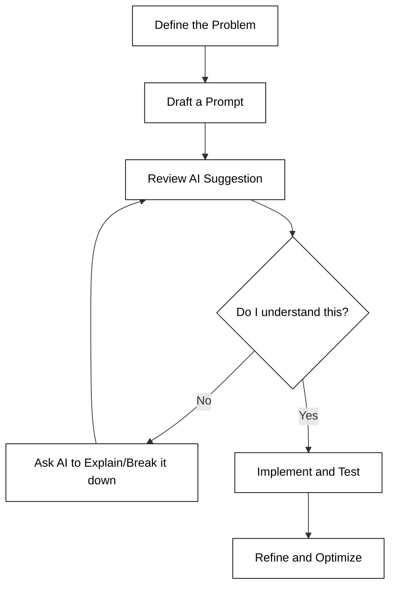
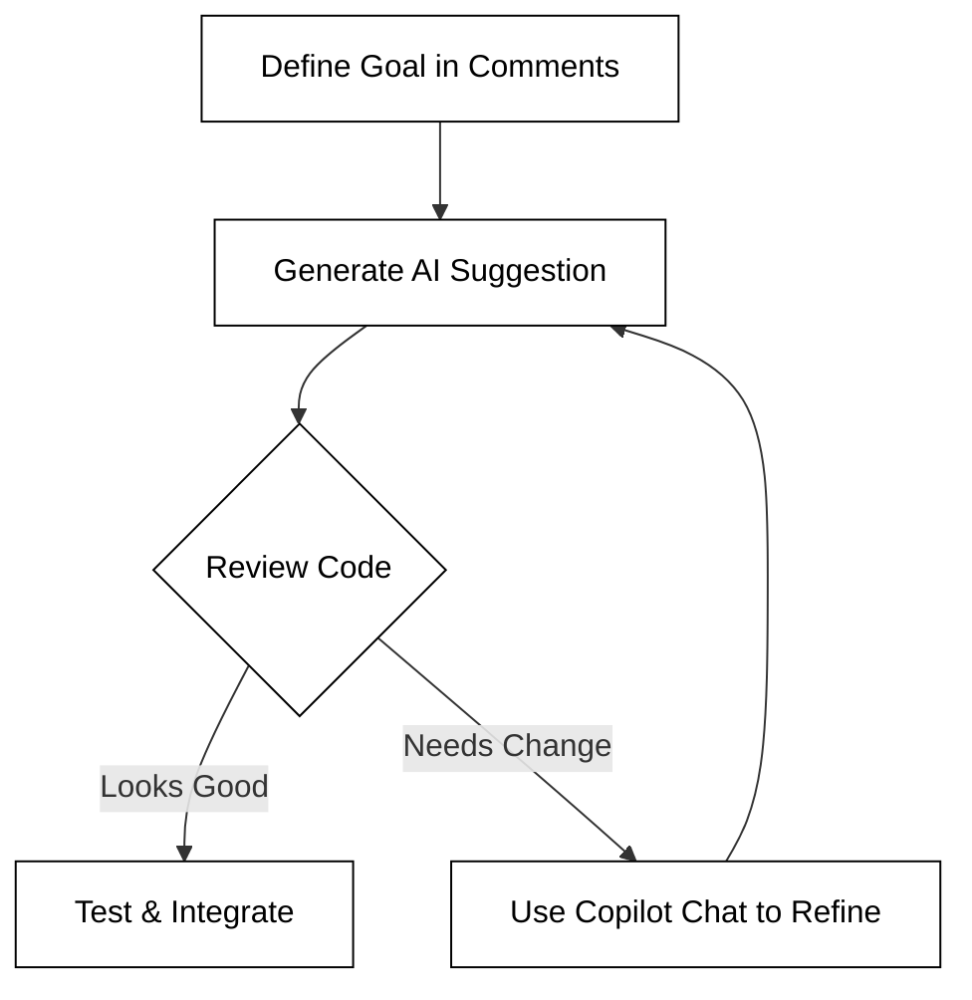

# Partnering with AI

The landscape of web programming is shifting from a focus on manual syntax memorization to a focus on architectural design and problem-solving. As you begin your journey into web development, you are entering an era where Artificial Intelligence (AI) acts as a collaborative partner rather than just a search engine. Learning to "partner" with AI means understanding how to leverage large language models to accelerate your learning, debug complex issues, and scaffold applications more efficiently than ever before.

In this instruction, we will explore the strategic advantages of using AI in your development workflow, how to access professional-grade tools for free as a student, and the practical steps to integrate these tools into your daily coding routine within Visual Studio Code.


## Why Use AI to Build Web Apps?

Modern web development involves a massive ecosystem of languages (HTML, CSS, JavaScript), frameworks, and cloud services. For a beginner, the sheer volume of syntax and configuration can be overwhelming. AI tools like GitHub Copilot serve as an "always-on" mentor that understands the context of your project.

Using AI provides several distinct advantages:

*   **Accelerated Learning:** Instead of spending hours searching through documentation for a specific CSS property, you can ask the AI to explain a concept or provide a snippet. This tightens the feedback loop between curiosity and implementation.
*   **Boilerplate Reduction:** Web apps often require repetitive setup code (like HTML headers or standard API fetch structures). AI can generate these patterns instantly, allowing you to focus on the unique logic of your application.
*   **Debugging Assistance:** When your code fails, you can provide the error message to the AI. It can often identify logical fallacies or syntax errors that are difficult for human eyes to spot after hours of coding.
*   **Exploration of Best Practices:** By observing the code an AI suggests, you are often exposed to modern ES6+ syntax and industry-standard patterns that you might not have encountered yet in basic tutorials.


## AI Usage Policy

Before we begin discussing how to use AI to build a web application, let's review the course policy on what is acceptable use for AI as defined in the [Syllabus](/course/05cf2876-16ce-4db0-864e-caa5d05200ad/topic/2a2c0a38-93b4-4e6c-987f-630bf4fc9a2c).

**Level**: `Partner`

**Intent**: Collaborate with AI while maintaining ownership and understanding.

**Allowed**
- AI-generated code or content contributions
- Iterative co-development
- AI-assisted debugging and refinement

**Requirements**
- You must understand all submitted work
- You must be able to explain any part on request. If you cannot explain your work, you may fail the class.

**Prompt Guidance**: Use prompts that support collaboration with explanation:
- “Help me implement this function step by step and explain each part.”
- “Suggest an approach, then help me code it.”
- “Walk me through improving this design.”
- “Explain why this solution works.”

**Rule of thumb**: You are co-creating, not delegating.

## The Partner Mindset: Mastering AI not being replaced by AI

Using an AI assistant like GitHub Copilot to build web applications is like having a senior developer sitting next to you 24/7. However, there is a fundamental difference between **delegating** your work and **collaborating** on it. In this course, we operate under the `Partner` level AI policy. This means that while the AI can write lines of code, you remain the "Architect of Record". If you allow the AI to do the thinking for you, you aren't just skipping the work; you are skipping the neuroplasticity required to actually become a developer.

The goal is to use AI to maximize your value, not to replace it. Think of AI as a power tool: it can help you build a house faster, but you still need to understand structural integrity, blueprints, and local building codes. If the house falls down, you cannot blame the power saw.

### The Collaborative Loop

To succeed, you must maintain a constant feedback loop with the AI. You should never "blindly" accept a suggestion. Instead, follow this iterative process:



### Prompting for Understanding vs. Prompting for Completion

The way you interact with VS Code and Copilot determines whether you are learning or just copying. Effective "Partner" level prompting focuses on the *how* and *why* rather than just the *what*.

**Bad Prompting (Delegation):**
> "Write the code for a login page with a username and password field."
>
> **Result**: *You get a block of code you might not understand, and you learn nothing about form handling or validation.*

**Good Prompting (Partnership):**
> "I need to create a login form. Can you walk me through the steps of setting up a controlled component in React for the username and password fields? Please explain how the `onChange` handler updates the state."
>
> **Result**: *You get the code, but you also get a tutorial on React state management.*

### Ownership and Accountability

According to our AI policy, you must be able to explain every line of code you submit. If you use Copilot to generate a complex regular expression or a recursive function, you are responsible for its logic. A simple rule of thumb: **If you can't explain it, don't submit it.**

*   **Allowed:** Iterative co-development and debugging assistance.
*   **Required:** Total comprehension of the final product.
*   **Risk:** If you are asked to explain a portion of your code during a review and cannot do so, you may fail the assignment or the class.


```masteryls
{"id":"2b2f6f12-7443-4269-a90f-9e88cd7b25b0", "title":"Defining the Partner Mindset", "type":"multiple-choice"}
Under the 'Partner' level AI policy, which of the following scenarios is considered an acceptable use of AI in this course?

- [ ] Asking the AI to generate the entire project and submitting it immediately because it works.
- [ ] Using AI to write a function, then tweaking what it generated so it looks like you wrote it yourself.
- [x] Using AI to suggest an approach for a database schema, then asking it to explain why it chose certain data types before implementing it.
- [ ] Telling the instructor that you don't know how a specific part of your code works because "I didn't write that part."
```

## Developing your own AI fluency

To transition from a casual user to a fluent AI partner, you should practice specific behaviors that improve the quality of the AI's output and your own understanding. These behaviors ensure that you are directing the tool toward a solution that meets your architectural needs rather than simply accepting a generic response.

The following table comes from an [Anthropic AI Fluency Index Study](https://www.anthropic.com/research/AI-fluency-index) that examined the use of AI across thousands of users and codebases. As you use AI make sure you intentionally explore the use of these behaviors and determine thier impact.

| Behavioral indicator | Example and Usage |
| :--- | :--- |
| **Iterates and refines** | If the AI provides a function that is too complex or doesn't quite fit, provide feedback:<br/> "Can you simplify this so it doesn't use any external libraries?" |
| **Clarifies goal before asking for help** | Start with the "big picture" before the specifics:<br/> "I'm building a Simon game and I need to track the sequence of colors. My goal is to store these in an array." |
| **Provides examples of what good looks like** | Share a snippet of your existing work:<br/> "Here is how I formatted my previous functions. Please use the same arrow function syntax for this new one." |
| **Specifies format and structure needed** | Request specific organization:<br/> "Give me the HTML structure first, then the CSS in a separate block, and finally the JavaScript." |
| **Sets interaction mode** | Use the AI as a teacher:<br/> "I want to learn. Don't give me the code yet; instead, give me three hints on how to solve this logic error." |
| **Communicates tone and style preferences** | Shape the response:<br/>"Write the code comments in a way that explains the logic clearly to a beginner developer." |
| **Identifies when AI might be missing context** | Provide environment details:<br/> "Note that I am working in a Vite environment, so use ES modules for the imports." |
| **Defines audience for the output** | Define a role:<br/>"I am a beginning JavaScript user. Explain this error message." |
| **Questions when AI reasoning doesn’t hold up** | Challenge the output:<br/> "You recommended using `var` here, but isn't `let` or `const` preferred in modern JavaScript? Why did you choose `var`?" |
| **Consults AI on approach before execution** | "Before we write any code, let's discuss the pros and cons of using a `switch` statement versus an `if/else` chain for this game logic." |
| **Checks facts and claims that matter** | Verify technical details:<br/> "You mentioned a `fetchPriority` attribute. Is that supported in all modern browsers, or do I need a fallback?" |
### Key techniques

1. **Staying in the conversation**: Treat your interaction as a dialogue rather than a one-off search query. If a suggested function doesn't work or you don't understand a specific line, don't just discard the output. Instead, provide the error message back to the AI or ask, "Can you explain why you used a `map` function here instead of a `forEach` loop?" This iterative process keeps the context alive and helps you learn the underlying logic.
2. **Questioning polished outputs**: AI is designed to be helpful and confident, even when it is wrong. Just because code is formatted beautifully and follows standard conventions doesn't mean it is bug-free or follows the best security practices. For example, if Copilot suggests a snippet for fetching data, you should critically ask: "Does this handle a 404 error correctly?" or "Is this library actually installed in my project?" Always verify "hallucinated" functions or deprecated syntax before committing the code.
3. **Setting the terms of the collaboration**: You are the lead developer and the "Architect of Record." You can and should dictate how the AI assists you. If you find yourself "tabbing" through suggestions without thinking, reset the terms of the chat: "I want to practice my CSS Grid skills. Give me a high-level strategy for this layout, but don't provide the actual CSS properties yet." By setting these boundaries, you ensure the AI serves your educational goals rather than just finishing the task for you.

## Securing Your GitHub Copilot Subscription

> [!NOTE]
>
> There is no requirement for you to use GitHub Copilot for this course. You can chose to use any AI provider, or none at all as you desire.

To use GitHub Copilot, you will need to purchase a subscription through your personal GitHub account. This provides you with a professional-grade AI coding assistant that integrates directly into your development environment.

To get started, follow these steps:

1.  **Access Billing Settings:** Sign in to your GitHub account and navigate to your **Settings**.
2.  **Navigate to Copilot:** In the left-hand sidebar, under the "Code, planning, and automation" section, click on **Copilot**.
3.  **Choose a Plan:** Click the button to set up a subscription. You can typically choose between a monthly or yearly billing cycle.
4.  **Complete Purchase:** Follow the prompts to provide your payment information and authorize the service.

Having a professional subscription ensures you have access to the latest models and features, such as GitHub Copilot Chat, which provides a more conversational interface for complex architectural questions.

## Integrating Copilot into Visual Studio Code

Once your license is active, you need to bring the AI into your development environment. Visual Studio Code (VS Code) is the primary editor for this course and has a first-class integration with Copilot.

### Installation
Open VS Code and navigate to the **Extensions** view (Ctrl+Shift+X or Cmd+Shift+X). Search for "GitHub Copilot" and install the extension. You will also want to install "GitHub Copilot Chat" for a more interactive experience. Once installed, you will be prompted to sign in to your GitHub account to authorize the extension.

### Interactive Development Workflow
Using Copilot is not about letting the AI write the app for you; it is an iterative conversation. The most effective way to use it is through a "Comment-to-Code" workflow.

1.  **Write a Prompt:** Start by writing a comment in your code file describing what you want to achieve. For example: `// Create a function that fetches weather data from an API`.
2.  **Evaluate Suggestions:** As you type, Copilot will suggest "ghost text" (grayed-out code). Press `Tab` to accept it or keep typing to ignore it.
3.  **Refine via Chat:** If the suggestion isn't quite right, open the Copilot Chat sidebar or press `Cmd+I` (Mac) or `Ctrl+I` (Windows) to open the inline chat. You can give specific instructions like "Make this function use async/await" or "Add error handling to this block."



## Practical Example: Building a Component

Imagine you are building a feature for your "Simon" game or your startup application. You need a button that changes color when clicked. 

Instead of searching for the syntax, you might type:

```sh
Function to toggle the 'active' class on a button and play a sound
```

Copilot might suggest:
```javascript
function handleButtonClick(event) {
    const button = event.target;
    button.classList.toggle('active');
    const audio = new Audio('sounds/click.mp3');
    audio.play();
}
```

At this point, your job as the developer is to verify: Does the `sounds/click.mp3` file exist? Is `event.target` the correct element in this context? The AI provides the foundation, but you provide the validation.

## Common Challenges and Solutions

While AI is powerful, it is not infallible. Students often encounter these common hurdles:

*   **Hallucinations:** AI may suggest libraries that don't exist or use deprecated syntax. 
    
    *Solution:* Always test the code immediately. If it doesn't work, ask the AI, "Is this using the most recent version of the API?"
*   **Over-reliance:** It is tempting to `Tab` through an entire file without reading the code.
    
    *Solution:* Make it a rule to explain every line of AI-generated code to yourself. If you don't understand what a line does, ask the AI: "Explain this specific line of code to me."
*   **Context Blindness:** Sometimes the AI forgets the structure of your other files.
    
    *Solution:* Keep relevant files open in your VS Code tabs. Copilot uses open tabs to understand the context of your project.

## Summary

Partnering with AI is a core competency for modern web developers. By utilizing GitHub Copilot within VS Code, you can bridge the gap between a conceptual idea and a working prototype much faster. However, the AI is a "Co-pilot," not the "Pilot." You remain responsible for the logic, security, and maintenance of your code. Use the GitHub Student Developer Pack to your advantage, engage with the AI interactively, and always maintain a critical eye toward the code it generates.

For further reading on effective prompting, check out the [GitHub Copilot Documentation](https://docs.github.com/en/copilot).