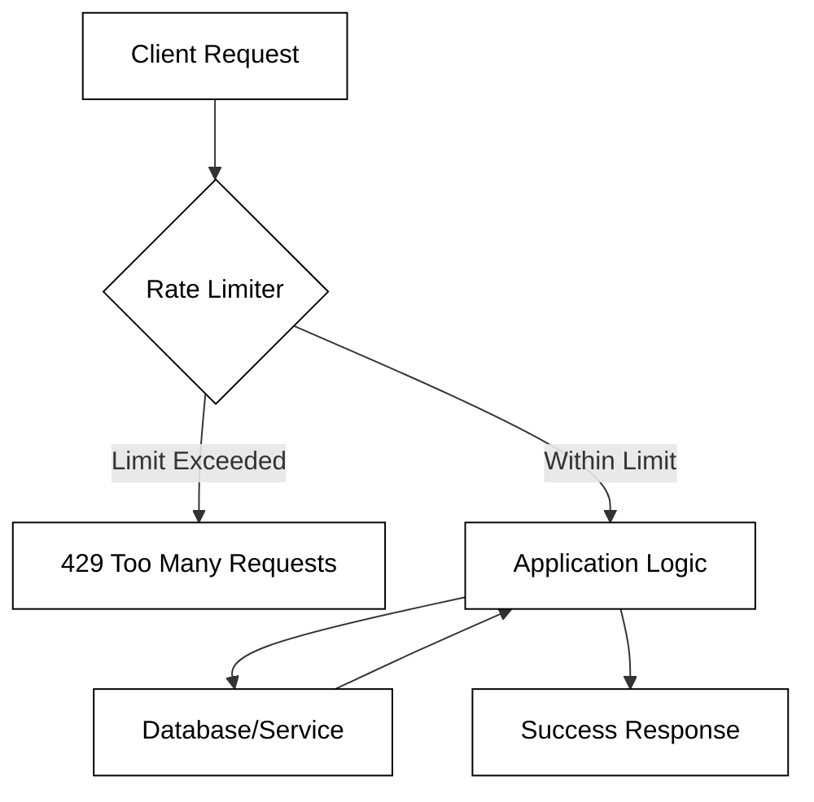
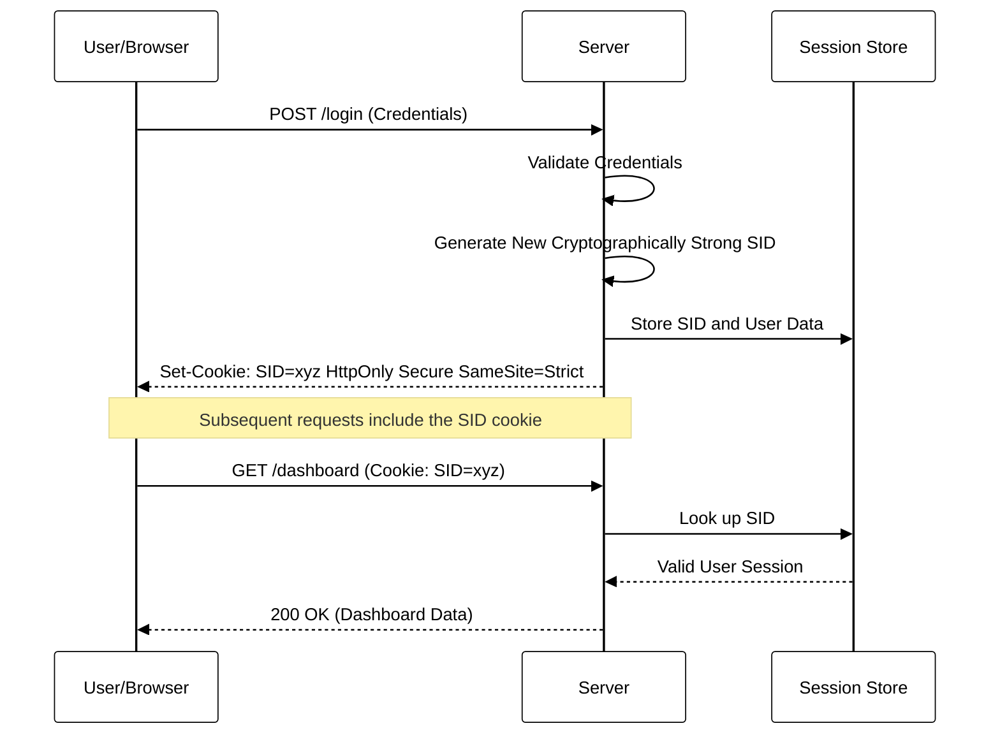

# Security overview

<iframe src="https://docs.google.com/presentation/d/e/2PACX-1vQs_pHMXafmU8T91kLMxZV39RKAP0qLkEHpQRq-6rLMii-r2DnnTrDx2r9OrrKbz96qxGsRmw9koyU-/pubembed?start=false&loop=false&delayms=3000" frameborder="0" width="900" height="540" allowfullscreen="true" mozallowfullscreen="true" webkitallowfullscreen="true"></iframe>

---

📖 **Deeper dive reading**:

- [Database of publicized software vulnerabilities](https://cve.mitre.org/)
- [SQL Injection](https://portswigger.net/web-security/sql-injection)

The internet allows us to socially connect, conduct financial transactions, and provide access to sensitive individual, corporate, and government data. It is also accessible from every corner of the planet. This positions the internet as a tool that can make the world a much better place, but it also makes a very attractive target for those who would seek to do harm. Preventing that potential for harm needs to be in the forefront of you mind whenever you create or use a web application.

You can see bad actors at work on your very own server by using `ssh` to open a console to your server and reviewing the authorization log. The authorization log captures all of the attempts to create a session on your server.

```sh
sudo less +G /var/log/auth.log
```

The last entry in the log will be from your connection to the server.

```sh
Feb 23 16:26:54 sshd[319071]: pam_unix(sshd:session): session opened for user ubuntu(uid=1000) by (uid=0)
Feb 23 16:26:54 systemd-logind[480]: New session 1350 of user ubuntu.
Feb 23 16:26:54 systemd: pam_unix(systemd-user:session): session opened for user ubuntu(uid=1000) by (uid=0)
```

However, you will see lots of other attempts with specific user names associated with common exploits. These all should be failing to connect, but if your server is not configured properly then an unauthorized access is possible. The sample of attempts below show the IP addresses of the attacker, as well as the user name that they used. Using the `whois` utility we can see that these attacks are originating from servers at DLive.kr in Korea, and DigitalOcean.com in the USA.

```sh
Feb 19 02:34:28 sshd[298185]: Invalid user developer from 27.1.253.142
Feb 19 02:37:12 sshd[298193]: Invalid user minecraft1 from 27.1.253.142
Feb 23 14:26:19 sshd[318868]: Invalid user siteadmin 174.138.72.191
Feb 23 14:22:18 sshd[318845]: Invalid user tester 174.138.72.191
```

As an experiment, one of our TAs created a test server with a user named `admin` with password `password`. Within 15 minutes, an attacker had logged in, bypassed all the restrictions that were in place, and started using the server to attack other servers on the internet.

Even if you don't think your application is valuable enough to require security, you need to consider that you might be creating a security problem for your users on other systems. For example, think about a simple game application where a user is required to provides a username and password in order to play the game. If the application's data is then compromised, then an attacker could use the password, used for the game application, to gain access to other websites where the user might have used the same password. For example, their social networking sites, work account, or financial institution.

## Security terminology

Web application security, sometimes called AppSec, is a subset of cybersecurity that specifically focuses on preventing security vulnerabilities within end-user applications. Web application security involves securing the frontend code running on the user's device and also the backend code running on the web server.

Here is a list of common phrases used by the security community that you should be familiar with.

- **Hacking** - The process of making a system do something it's not supposed to do.
- **Exploit** - Code or input that takes advantage of a programming or configuration flaw.
- **Attack Vector** - The method that a hacker employs to penetrate and exploit a system.
- **Attack Surface** - The exposed parts of a system that an attacker can access. For example, open ports (22, 443, 80), service endpoints, or user accounts.
- **Attack Payload** - The actual code, or data, that a hacker delivers to a system in order to exploit it.
- **Input sanitization** - "Cleaning" any input of potentially malicious data.
- **Black box testing** - Testing an application without knowledge of the internals of the application.
- **White box testing** - Testing an application by **with** knowledge of the source code and internal infrastructure.
- **Penetration Testing** - Attempting to gain access to, or exploit, a system in ways that are not anticipated by the developers.
- **Mitigation** - The action taken to remove, or reduce, a threat.

## Motivation for attackers

The following lists some common motivations at drives a system attack.

- **Disruption** - By overloading a system, encrypting essential data, or deleting critical infrastructure, an attacker can destroy normal business operations. This may be an attempt at extortion, or simply be an attempt to punish a business that that attacker does not agree with.
- **Data exfiltration** - By privately extracting, or publicly exposing, a system's data, an attacker can embarrass the company, exploit insider information, sell the information to competitors, or leverage the information for additional attacks.
- **Resource consumption** - By taking control of a company's computing resources an attacker can use it for other purposes such as mining cryptocurrency, gathering customer information, or attacking other systems.

## Examples of security failures

Security should always be a primary objective of any application. Building a web application that looks good and performs well, is a lot less important than building an application that is secure.

Here are a few examples where companies failed to properly prevent attacks to their systems.

- [$100 million dollars stolen through insider trading using SQL injection vulnerability](https://www.theverge.com/2018/8/22/17716622/sec-business-wire-hack-stolen-press-release-fraud-ukraine)
- [Log4Shell remote code execution vulnerability, 93% of cloud vulnerable at time of discovery, dubbed "the most severe vulnerability ever"](https://en.wikipedia.org/wiki/Log4Shell)
- [Russian hackers install backdoor on 18,000 government and Fortune 500 computers](https://www.npr.org/2021/04/16/985439655/a-worst-nightmare-cyberattack-the-untold-story-of-the-solarwinds-hack)
- [Hackers Hold Computers of 23 Texas Towns For Ransom](https://www.usnews.com/news/national-news/articles/2019-08-20/hackers-hold-computers-of-23-texas-towns-for-ransom)

## Common hacking techniques

There are a few common exploitation techniques that you should be aware of. These include the following.

- **Injection**: When an application interacts with a database on the backend, a programmer will often take user input and concatenate it directly into a search query. This allows a hacker to use a specially crafted query to make the database reveal hidden information or even delete the database.

- **Cross-Site Scripting (XSS)**: A category of attacks where an attacker can make malicious code execute on a different user's browser. If successful, an attacker can turn a website that a user trusts, into one that can steal passwords and hijack a user's account.

- **Denial of Service**: This includes any attack where the main goal is to render any service inaccessible. This can be done by deleting a database using an SQL injection, by sending unexpected data to a service endpoint that causes the program to crash, or by simply making more requests than a server can handle.

- **Credential Stuffing**: People have a tendency to reuse passwords or variations of passwords on different websites. If a hacker has a user's credentials from a previous website attack, then there is a good chance that they can successfully use those credentials on a different website. A hacker can also try to brute force attack a system by trying every possible combination of password.

- **Social engineering** - Appealing to a human's desire to help, in order to gain unauthorized access or information.

## Common security measures

### Content Security Policy (CSP)
Content Security Policy is a security layer that helps detect and mitigate certain types of attacks, including Cross-Site Scripting (XSS) and data injection attacks. By defining which dynamic resources are allowed to load, a CSP prevents the browser from executing malicious scripts injected by an attacker.
*   **Implementation:** Delivered via the `Content-Security-Policy` HTTP header.
*   **Key Benefit:** Restricts the sources of executable scripts, styles, and images to trusted domains.

### Cross-Origin Resource Sharing (CORS)
CORS is a browser mechanism that allows restricted resources on a web page to be requested from another domain outside the domain from which the first resource was served.
*   **Risk:** Misconfigured CORS policies (such as using a wildcard `*` for `Access-Control-Allow-Origin`) can allow malicious sites to interact with your API and steal sensitive data.
*   **Best Practice:** Explicitly whitelist trusted origins and avoid allowing credentials on broad origins.


### HTTP Security Headers
Beyond CSP, several other HTTP headers harden the web application against common browser-based vulnerabilities:
*   **HSTS (HTTP Strict Transport Security):** Forces the browser to communicate with the server only over HTTPS, preventing SSL stripping attacks.
*   **X-Frame-Options:** Prevents "Clickjacking" by indicating whether a browser should be allowed to render a page in a `<frame>`, `<iframe>`, or `<object>`.
*   **X-Content-Type-Options:** Prevents the browser from "sniffing" the MIME type, forcing it to stick to the declared `Content-Type`.

### Subresource Integrity (SRI)
Subresource Integrity is a security feature that enables browsers to verify that resources fetched (for example, from a CDN) are delivered without unexpected manipulation.
*   **Mechanism:** It uses a cryptographic hash to ensure that the file fetched matches the hash defined in the HTML tag.
*   **Use Case:** Protects your users if a third-party library or CDN is compromised and the source code is altered.


## Protecting Resources with Rate Limiting and Throttling

Rate limiting and throttling are critical security and traffic management strategies used to control the rate of incoming requests to a service. In the context of security, these mechanisms prevent various forms of abuse, including Denial of Service (DoS) attacks, brute-force login attempts, and API scraping. By restricting how many times a user or IP address can interact with an endpoint within a specific timeframe, organizations can ensure system availability and protect backend resources from exhaustion.

While the terms are often used interchangeably, they have distinct behaviors:
*   **Rate Limiting:** Usually refers to a "hard cap" on requests. Once the limit is reached, subsequent requests are rejected (typically with a `429 Too Many Requests` HTTP status code) until the time window resets.
*   **Throttling:** Often refers to the dynamic slowing down of requests. Instead of an immediate rejection, the system might introduce latency or reduce the bandwidth available to the user to keep the overall system load manageable.

### Common Rate Limiting Algorithms

Choosing the right algorithm depends on the specific needs of your application, such as whether you need to handle bursts of traffic or maintain a strictly smooth flow.

1.  **Fixed Window Counter:** The simplest method where a counter is incremented for a user within a fixed time block (e.g., 1 minute). If the counter exceeds the limit, requests are blocked until the next minute starts.
2.  **Token Bucket:** Tokens are added to a "bucket" at a fixed rate. Each request consumes a token. If the bucket is empty, the request is dropped. This allows for small bursts of traffic as long as tokens have accumulated.
3.  **Leaky Bucket:** Requests enter a "bucket" and are processed at a constant, steady rate. If the bucket overflows, new requests are discarded. This is excellent for smoothing out "spiky" traffic.

#### Request Flow Visualization

The following diagram illustrates how a Rate Limiter sits between the client and the application logic to filter excessive traffic.



### Implementation Example (Node.js)

In modern web development, rate limiting is often implemented as middleware. Below is an example using the popular `express-rate-limit` library for a Node.js application.

```javascript
const rateLimit = require('express-rate-limit');

// Define the limit rule
const apiLimiter = rateLimit({
  windowMs: 15 * 60 * 1000, // 15 minutes
  max: 100, // Limit each IP to 100 requests per windowMs
  message: "Too many requests from this IP, please try again after 15 minutes",
  standardHeaders: true, // Return rate limit info in the `RateLimit-*` headers
  legacyHeaders: false, // Disable the `X-RateLimit-*` headers
});

// Apply the rate limiting middleware to API calls only
app.use('/api/', apiLimiter);
```

### Best Practices for Throttling

When implementing these controls, it is important to provide feedback to the client so legitimate users or automated systems can adjust their behavior.
*   **Use HTTP 429:** Always return the correct status code so the client knows exactly why the request failed.
*   **Retry-After Header:** Include a `Retry-After` header indicating how many seconds the client should wait before attempting a new request.
*   **Tiered Limits:** Apply different limits based on authentication status. For example, anonymous users might get 10 requests per minute, while authenticated "Pro" users might get 1000.
*   **Logging and Alerting:** Monitor when rate limits are being hit frequently. A spike in `429` errors on a login endpoint is a strong indicator of an ongoing brute-force attack.

```masteryls
{"id":"sec-rl-01", "title":"Identifying Rate Limiting Behavior", "type":"multiple-choice"}
A security administrator notices that an API is allowing small bursts of 10 requests per second, even though the sustained limit is set to 2 requests per second. Which algorithm is likely being used?

- [ ] Fixed Window Counter
- [x] Token Bucket
- [ ] Static Throttling
- [ ] Strict Leaky Bucket
```


## Secure Session Management Principles

Session management is the mechanism used by web applications to maintain state over the inherently stateless HTTP protocol. Because every HTTP request is independent, the server needs a way to associate a sequence of requests with a specific user. This is typically achieved using a unique **Session Identifier (SID)**. If this identifier is intercepted or predicted by an attacker, they can "hijack" the user's session, gaining unauthorized access to their account without needing a password.

To ensure session security, developers must focus on three primary areas: the generation of the session ID, the security attributes of the session cookie, and the lifecycle management of the session itself.

### Key Cookie Security Attributes

When storing session IDs in cookies, several flags must be set to protect the token from common attacks like Cross-Site Scripting (XSS) and Cross-Site Request Forgery (CSRF):

*   **HttpOnly**: Prevents client-side scripts (JavaScript) from accessing the cookie. This is a critical defense against session theft via XSS.
*   **Secure**: Ensures the cookie is only transmitted over encrypted (HTTPS) connections, preventing interception via man-in-the-middle attacks.
*   **SameSite**: Controls whether cookies are sent with cross-site requests. Setting this to `Strict` or `Lax` provides significant protection against CSRF.

### Session Lifecycle and Rotation

A secure session should have a limited lifespan. This includes **idle timeouts** (logging the user out after inactivity) and **absolute timeouts** (logging the user out after a set period regardless of activity). Furthermore, session IDs should be regenerated immediately after a privilege level change, such as during a successful login. This prevents **Session Fixation** attacks, where an attacker provides a known session ID to a victim and waits for them to authenticate.



### Implementation Example (Node.js/Express)

The following example demonstrates how to configure secure session middleware in a Node.js environment using the `express-session` library. Note the use of secure defaults:

```javascript
const session = require('express-session');

app.use(session({
  name: 'server-session-id', // Use a generic name to hide technology stack
  secret: process.env.SESSION_SECRET, // Strong, environment-specific secret
  resave: false,
  saveUninitialized: false,
  cookie: {
    httpOnly: true,    // Prevent XSS access
    secure: true,      // Requires HTTPS
    sameSite: 'strict', // CSRF protection
    maxAge: 3600000    // Absolute timeout (1 hour)
  }
}));

// Regenerate session on login to prevent fixation
app.post('/login', (req, res) => {
  const user = authenticate(req.body.user, req.body.pass);
  if (user) {
    req.session.regenerate((err) => {
      if (err) next(err);
      req.session.user = user.id;
      res.redirect('/dashboard');
    });
  }
});
```

```masteryls
{"id":"sec-sess-001", "title":"Identifying Secure Cookie Flags", "type":"multiple-choice"}
An attacker successfully executes a Cross-Site Scripting (XSS) attack on a web application and attempts to steal the user's session cookie via `document.cookie`. Which cookie attribute would have prevented the attacker's script from accessing the session token?

- [ ] The `Secure` attribute
- [x] The `HttpOnly` attribute
- [ ] The `SameSite=Strict` attribute
- [ ] The `Domain` attribute
```


## What can I do about it?

Taking the time to learn the techniques a hacker uses to attack a system is the first step in preventing them from exploiting your systems. From there, develop a security mindset, where you always assume any attack surface will be used against you. Make security a consistent part of your application design and feature discussions. Here is a list of common security practices you should include in your applications.

- **Sanitize input data** - Always assume that any data you receive from outside your system will be used to exploit your system. Consider if the input data can be turned into an executable expression, or can overload computing, bandwidth, or storage resources.
- **Logging** - It is not possible to think of every way that your system can be exploited, but you can create an immutable log of requests that will expose when a system is being exploited. You can then trigger alerts, and periodically review the logs for unexpected activity.
- **Traps** - Create what appears to be valuable information and then trigger alarms when the data is accessed.
- **Educate** - Teach yourself, your users, and everyone you work with, to be security minded. Anyone who has access to your system should understand how to prevent physical, social, and software attacks.
- **Reduce attack surfaces** - Do not open access anymore than is necessary to properly provide your application. This includes what network ports are open, what account privileges are allowed, where you can access the system from, and what endpoints are available.
- **Layered security** - Do not assume that one safeguard is enough. Create multiple layers of security that each take different approaches. For example, secure your physical environment, secure your network, secure your server, secure your public network traffic, secure your private network traffic, encrypt your storage, separate your production systems from your development systems, put your payment information in a separate environment from your application environment. Do not allow data from one layer to move to other layers. For example, do not allow an employee to take data out of the production system.
- **Least required access policy** - Do not give any one user all the credentials necessary to control the entire system. Only give a user what access they need to do the work they are required to do.
- **Safeguard credentials** - Do not store credentials in accessible locations such as a public GitHub repository or a sticky note taped to a monitor. Automatically rotate credentials in order to limit the impact of an exposure. Only award credentials that are necessary to do a specific task.
- **Public review** - Do not rely on obscurity to keep your system safe. Assume instead that an attacker knows everything about your system and then make it difficult for anyone to exploit the system. If you can attack your system, then a hacker will be able to also. By soliciting public review and the work of external penetration testers, you will be able to discover and remove potential exploits.


