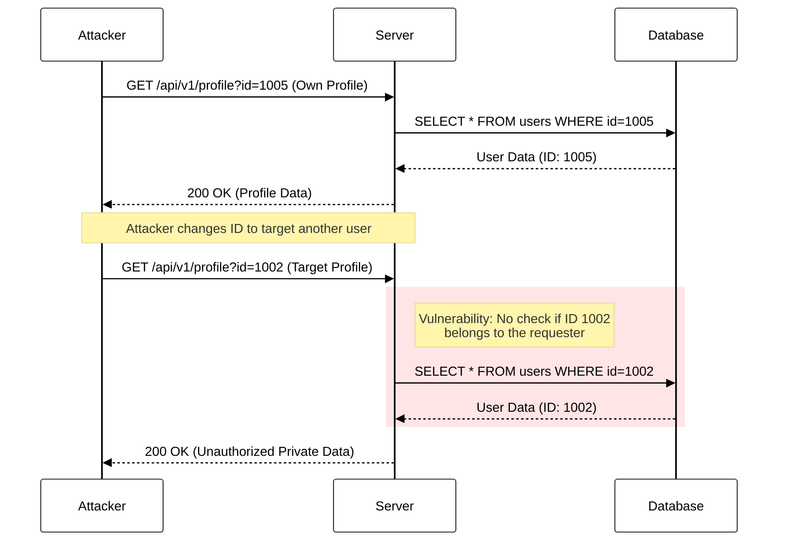
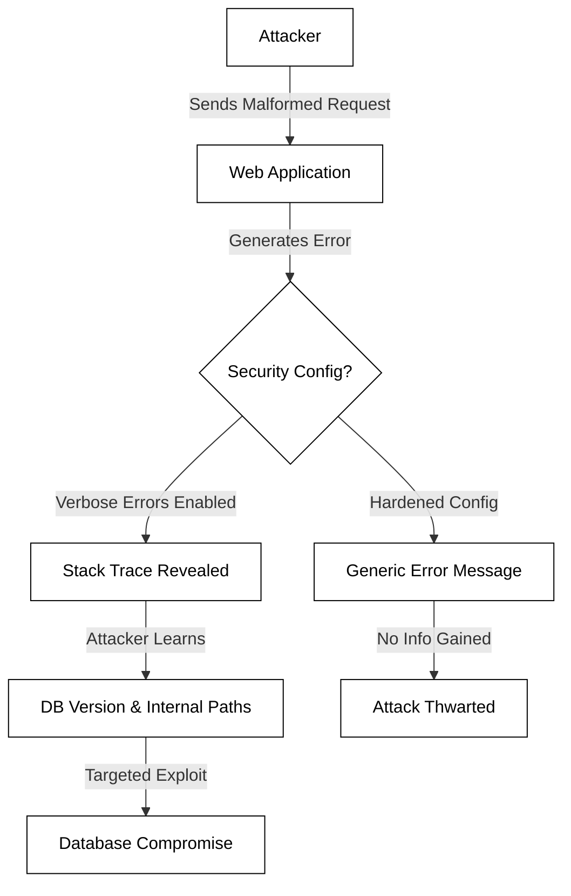
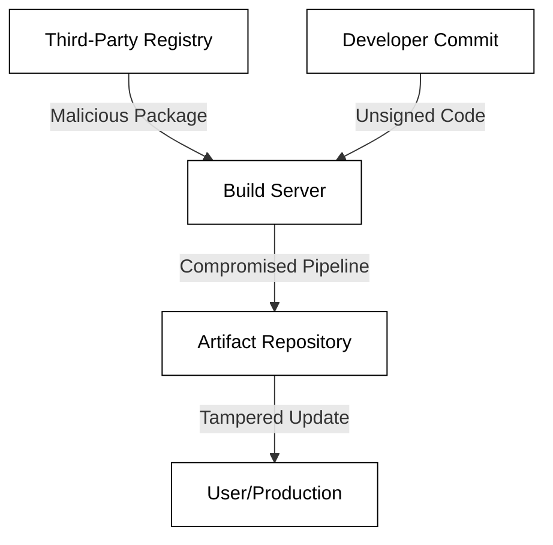
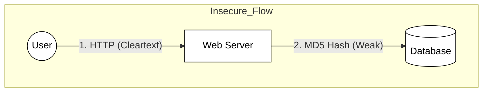
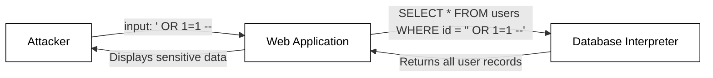
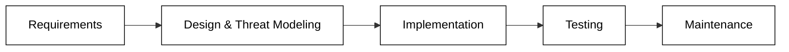
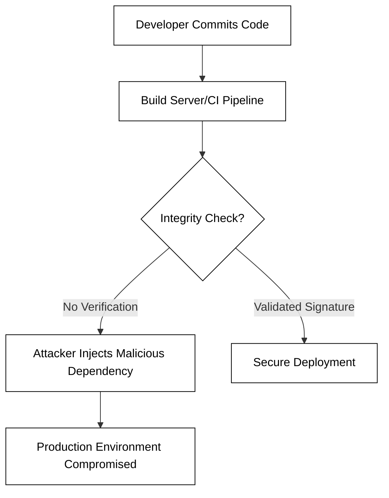
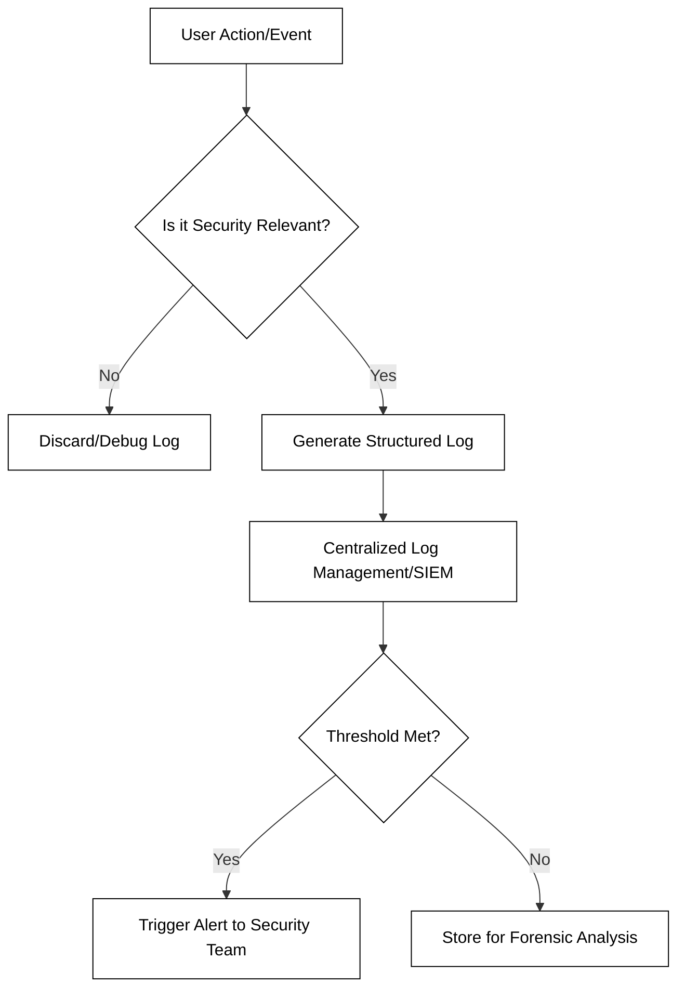
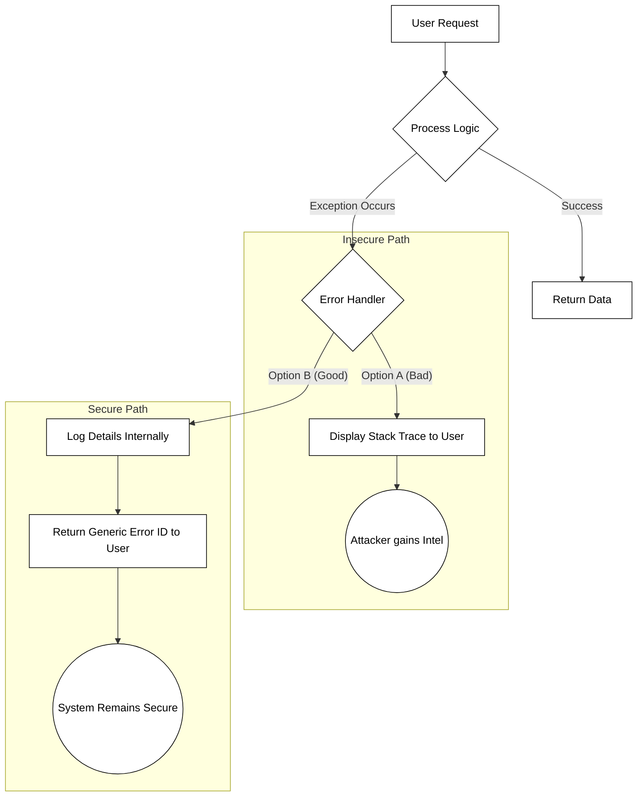

# OWASP


📖 **Deeper dive reading**: [OWASP 2025](https://owasp.org/Top10/2025/)

The Open Web Application Security Project (OWASP) is a non-profit research entity that manages the _Top Ten_ list of the most important web application security risks. Understanding, and periodically reviewing, this list will help to keep your web applications secure.

| Risk | Name                                   |
| ---- | -------------------------------------- |
| A01  | Broken Access Control                  |
| A02  | Security Misconfiguration              |
| A03  | Software Supply Chain Failures         |
| A04  | Cryptographic Failures                 |
| A05  | Injection                              |
| A06  | Insecure Design                        |
| A07  | Authentication Failures                |
| A08  | Software or Data Integrity Failures    |
| A09  | Security Logging and Alerting Failures |
| A10  | Mishandling of Exceptional Conditions  |

The following is a discussion of each of the entries in the top ten list, along with examples, and suggested mitigations.

## A01 - Broken Access Control

Broken Access Control has moved up from the fifth position to become the most serious web application security risk in the OWASP Top 10. Access control ensures that users cannot act outside of their intended permissions. When these checks fail, attackers can gain unauthorized access to sensitive data, modify or delete content, and even take over administrative functions.

Access control vulnerabilities typically fall into three main categories:

- **Vertical Privilege Escalation:** A lower-privileged user (e.g., a customer) accesses functions reserved for higher-privileged users (e.g., an administrator).
- **Horizontal Privilege Escalation:** A user accesses resources belonging to another user with the same privilege level (e.g., User A viewing User B's private messages).
- **Context-Dependent Access Control:** A user performs actions out of the required order, such as skipping a payment screen to reach a "thank you" or download page.

### Common Failure Modes

The following diagram illustrates how a lack of server-side validation allows an attacker to manipulate request parameters to access unauthorized data.



### Insecure Direct Object References (IDOR)

A common manifestation of broken access control is **Insecure Direct Object Reference (IDOR)**. This occurs when an application uses user-supplied input to access objects directly without performing an authorization check.

Consider the following vulnerable JavaScript code using the Flask framework:

**Insecure Implementation:**

```javascript
app.get('/view_invoice', async (req, res) => {
  // The application trusts the 'invoice_id' provided by the user via URL
  const invoiceId = req.query.invoice_id;

  const invoice = await db.query(`SELECT * FROM invoices WHERE id = ${invoiceId}`);

  // MISSING: A check to see if the current user owns this invoice
  return res.render('invoice.html', { invoice });
});
```

To remediate this, the application must verify ownership of the record before returning data:

**Secure Implementation:**

```javascript
app.get('/view_invoice', requireLogin, async (req, res) => {
  const invoiceId = req.query.invoice_id;

  // Authorization Check: Ensure the invoice belongs to the logged-in user
  const invoice = await db.query('SELECT * FROM invoices WHERE id = ? AND owner_id = ?', [invoiceId, req.user.id]);

  if (!invoice || invoice.length === 0) {
    return res.status(403).send('Forbidden');
  }

  return res.render('invoice.html', { invoice: invoice[0] });
});
```

### Best Practices for Prevention

To effectively implement access control, developers should follow the principle of **Least Privilege** and ensure all checks happen on the server side.

1.  **Deny by Default:** All resources should be inaccessible unless explicitly allowed for a specific role or user.
2.  **Centralize Control:** Implement access control logic in a single, reusable module rather than duplicating checks across every endpoint.
3.  **Disable Directory Browsing:** Ensure web servers do not list file directories and ensure metadata (like `.git`) is not accessible.
4.  **Log Failures:** Log all access control failures and alert administrators when repeated violations occur from a single source.

```masteryls
{"id":"1d29b77d-bf9a-48ea-8a99-42b7b521b216", "title":"Identifying Access Control Types", "type":"multiple-choice"}
A user logs into a banking application and discovers that by changing the 'account_id' parameter in the URL from '12345' to '12346', they can view the transaction history of a completely different customer. Which specific type of Broken Access Control does this represent?

- [ ] Vertical Privilege Escalation
- [x] Horizontal Privilege Escalation
- [ ] Administrative Impersonation
- [ ] Context-dependent Access Bypass
```

## A02 - Security Misconfiguration

Security Misconfiguration is a critical vulnerability that occurs when security settings are not defined, implemented, or maintained properly. Unlike many other vulnerabilities that stem from flaws in code logic, security misconfigurations often arise from human error during the deployment and maintenance phases of the software development lifecycle (SDLC).

This vulnerability can manifest at any level of the application stack, including the network services, platform, web server, application server, database, frameworks, and custom code. With the rise of highly automated and complex cloud environments, the risk of misconfiguration has increased significantly.

### Common Forms of Misconfiguration

Security misconfigurations can take many forms. Some of the most frequent include:

- **Default Credentials:** Leaving default administrative usernames and passwords (e.g., `admin/admin` or `root/password`) active on routers, databases, or applications.
- **Unnecessary Features:** Enabling features that are not required for the application's function, such as unnecessary ports, services, pages, or privileges.
- **Verbose Error Messages:** Providing stack traces or overly descriptive error messages to users, which can reveal sensitive information about the underlying infrastructure.
- **Improper Cloud Permissions:** Configuring S3 buckets or cloud storage with "Public" access, allowing anyone on the internet to read or write sensitive data.
- **Missing Security Headers:** Failing to implement HTTP security headers like `Content-Security-Policy`, `X-Frame-Options`, or `Strict-Transport-Security`.

### Attack Path Illustration

The following diagram illustrates how an attacker can leverage a simple misconfiguration, such as a verbose error message, to gain deeper access to a system.



### Example: Insecure vs. Secure Configuration

Consider a typical configuration for a web application environment. Below is an example of an insecure configuration compared to a hardened, secure version.

**Insecure Configuration (e.g., `web.config` or `.htaccess`)**
In this example, the application reveals detailed errors and allows directory browsing.

```xml
<!-- INSECURE: Detailed errors and directory browsing enabled -->
<configuration>
  <system.web>
    <customErrors mode="Off" />
  </system.web>
  <system.webServer>
    <directoryBrowse enabled="true" />
  </system.webServer>
</configuration>
```

**Secure Configuration**
In this version, errors are handled gracefully with a custom page, and directory browsing is strictly disabled.

```xml
<!-- SECURE: Generic errors and directory browsing disabled -->
<configuration>
  <system.web>
    <customErrors mode="On" defaultRedirect="ErrorPage.html" />
  </system.web>
  <system.webServer>
    <directoryBrowse enabled="false" />
  </system.webServer>
</configuration>
```

### Prevention and Mitigation

To effectively prevent security misconfigurations, organizations should implement the following strategies:

1.  **Automated Build Processes:** Use Infrastructure as Code (IaC) templates (like Terraform or CloudFormation) that are pre-audited for security.
2.  **Hardened Images:** Deploy applications using "hardened" OS and container images that have unnecessary services removed.
3.  **Regular Audits:** Use automated tools to scan for open ports, default accounts, and misconfigured cloud buckets.
4.  **Least Privilege:** Ensure that every component of the stack runs with the minimum privileges necessary to perform its function.
5.  **Security Headers:** Use a tool like `securityheaders.com` to verify that your production environment is sending the correct headers to protect clients.

```masteryls
{"id":"e1e02026-17e9-4a8d-88c4-71fa503ed016", "title":"Identifying Security Misconfiguration", "type":"multiple-choice"}
A developer deploys a new REST API to a production environment. During testing, an attacker sends a request with an invalid data type, and the API returns a '500 Internal Server Error' response containing a full Java stack trace, including the database driver version and internal file paths. Which OWASP category does this best represent?

- [ ] A01: Broken Access Control
- [x] A02: Security Misconfiguration
- [ ] A03: Injection
- [ ] A07: Identification and Authentication Failures
```

## A03 - Software Supply Chain Failures

Software supply chain failures occur when an application relies on plugins, libraries, or modules from untrusted sources, or when the infrastructure used to build and deploy software is compromised. In modern development, applications are rarely built from scratch; they are "assembled" using a vast ecosystem of third-party dependencies. If any component in this chain—from the developer's IDE to the production server—is tampered with, the entire application becomes a vehicle for malware or unauthorized access.

The risk extends beyond just the code you write. It includes the integrity of updates, the security of the Continuous Integration/Continuous Deployment (CI/CD) pipeline, and the verification of third-party packages. Common attack vectors include **Typosquatting** (registering a package with a name similar to a popular one, like `requestzs` instead of `requests`) and **Dependency Confusion** (tricking a build system into pulling a malicious public package instead of an intended private one).

### The Software Supply Chain Flow

The following diagram illustrates the various points where a supply chain failure can occur:



### Key Risk Factors

- **Lack of Integrity Verification:** Using dependencies without verifying their digital signatures or checksums.
- **Insecure CI/CD Pipelines:** Pipelines that lack sufficient access controls, allowing attackers to inject malicious steps into the build process.
- **Unvetted Dependencies:** Automatically pulling the "latest" version of a library without auditing the changes or ensuring the maintainer's account hasn't been hijacked.
- **Shadow IT:** Developers using unauthorized tools or libraries that bypass corporate security scanning.

### Practical Example: Pinning Dependencies

To mitigate risks, developers should avoid using floating versions (e.g., `^1.2.0`) and instead use "lock files" or specific hashes (digests). This ensures that the exact same code is used across all environments.

**Vulnerable GitHub Action (using a mutable tag):**

```yaml
- name: Upload Logs
  uses: actions/upload-artifact@v3 # This tag can be moved by an attacker if the repo is compromised
```

**Secure GitHub Action (using a specific commit SHA):**

```yaml
- name: Upload Logs
  uses: actions/upload-artifact@0b2276b8976003d70b7407d1d124afc821265283 # Immutable hash
```

### Prevention and Mitigation

1.  **Software Bill of Materials (SBOM):** Maintain a comprehensive inventory of all components and dependencies used in your software.
2.  **Dependency Scanning:** Use automated tools (like Snyk, GitHub Dependabot, or OWASP Dependency-Check) to identify known vulnerabilities in your libraries.
3.  **Digital Signatures:** Ensure that all artifacts, including code commits and container images, are signed and verified before being deployed.
4.  **Vulnerability Disclosure Programs:** Monitor the security advisories of the third-party projects you consume.


```masteryls
{"id":"50b6fc38-1c88-4aa0-aa67-6a43240373f3", "title":"Identifying Supply Chain Risks", "type":"multiple-choice"}
A developer notices that their build system automatically downloads the "latest" version of a popular logging library every time the CI/CD pipeline runs. Which of the following best describes the primary security risk in this scenario?

- [ ] The build will fail if the library's server goes offline, causing a Denial of Service.
- [ ] The library might use too much memory, leading to performance bottlenecks in production.
- [x] An attacker could hijack the library maintainer's account and push a malicious "latest" version that is automatically integrated into the app.
- [ ] Using the latest version ensures that all previous security patches are applied, making this the most secure approach.
```

## A04 – Cryptographic Failures

Cryptographic failures, previously known as "Sensitive Data Exposure," represent one of the most critical categories in the OWASP Top 10. This category focuses on the failure to protect data in transit and at rest using strong, modern cryptographic practices. When cryptography is implemented incorrectly or omitted entirely, sensitive information—such as personally identifiable information (PII), health records, credit card numbers, and authentication credentials—becomes vulnerable to interception or theft.

Common causes of cryptographic failures include the use of deprecated algorithms (like MD5 or SHA1), transmitting data over unencrypted channels (HTTP, FTP), and improper key management. Even when strong algorithms are used, failures can occur if initialization vectors (IVs) are reused or if keys are hardcoded directly into the source code.

### Data Protection Lifecycle

To prevent cryptographic failures, developers must consider the state of the data. Data is typically classified into two states: **Data in Transit** (moving over a network) and **Data at Rest** (stored on a disk or database).

- **In Transit:** All sensitive data must be encrypted using TLS (Transport Layer Security) with modern ciphers. Legacy protocols like SSL or early versions of TLS should be disabled.
- **At Rest:** Data should be encrypted using strong symmetric encryption like AES-256. For passwords, one-way cryptographic hashes with "salting" and "peppering" are mandatory to prevent rainbow table attacks.

The following diagram illustrates a secure vs. insecure data flow:



### Common Cryptographic Pitfalls

1.  **Using Broken Algorithms:** MD5 and SHA1 are no longer secure for digital signatures or password hashing because they are susceptible to collision attacks.
2.  **Hardcoded Secrets:** Storing API keys or encryption keys in `git` repositories.
3.  **Lack of Salting:** Hashing passwords without a unique salt allows attackers to use pre-computed tables to crack passwords instantly.
4.  **Insufficient Entropy:** Using weak random number generators for generating keys or tokens.

### Code Example: Secure Password Hashing

In modern applications, you should never implement your own cryptographic logic. Instead, use high-level, audited libraries. Below is an example of an insecure vs. a secure approach in Node.js.

**Insecure (MD5):**

```javascript
const crypto = require('crypto');
// DANGER: MD5 is fast and prone to collisions/cracking
const hash = crypto.createHash('md5').update(password).digest('hex');
```

**Secure (Argon2):**

```javascript
const argon2 = require('argon2');

async function secureStore(password) {
  try {
    // Argon2 automatically handles salting and is computationally expensive
    const hash = await argon2.hash(password);
    return hash;
  } catch (err) {
    // handle error
  }
}
```

### Remediation Strategies

- **Classify Data:** Identify which data is sensitive according to privacy laws (GDPR, CCPA) and apply controls based on classification.
- **Disable Legacy Protocols:** Ensure web servers do not support older versions of TLS (1.0, 1.1) or weak cipher suites.
- **Automated Scanning:** Use Static Application Security Testing (SAST) tools to find hardcoded keys and weak cryptographic functions in the codebase.
- **Key Rotation:** Implement a lifecycle for cryptographic keys, ensuring they are rotated regularly and stored in a Secure Vault (e.g., AWS KMS, HashiCorp Vault).

```masteryls
{"id":"cce849da-d28f-461c-b92e-217cdf957cdc", "title":"Identifying Cryptographic Failures", "type":"multiple-choice"}
A developer is building a login system. Which of the following scenarios represents a "Cryptographic Failure" according to the OWASP Top 10?

- [ ] Using AES-256 to encrypt user session tokens stored in a secure cookie.
- [ ] Implementing TLS 1.3 for all communications between the client and the server.
- [x] Storing user passwords using the SHA-1 hashing algorithm without a salt.
- [ ] Using a hardware security module (HSM) to manage and rotate encryption keys.
```

## A05 - Injection

Injection vulnerabilities occur when an application sends untrusted data to an interpreter as part of a command or query. The interpreter, unable to distinguish between the intended command and the malicious data, executes the attacker's input. This can lead to unauthorized data access, data corruption, or even full system compromise. While SQL injection is the most well-known form, injection can occur in any system that uses an interpreter, including NoSQL databases, OS shells, LDAP servers, and XML parsers.

The fundamental flaw in injection is the blurring of the line between **code** and **data**. When an application concatenates user-provided strings directly into a query, it allows the user to "break out" of the data context and enter the command context.

### Common Types of Injection

- **SQL Injection (SQLi):** Malicious SQL statements are inserted into entry fields for execution (e.g., bypassing login screens).
- **Command Injection:** An attacker executes arbitrary operating system commands on the server via a vulnerable application.
- **LDAP Injection:** Exploiting web applications that construct LDAP statements based on user input.
- **Cross-Site Scripting (XSS):** While often categorized separately, XSS is essentially the injection of malicious scripts into a web page viewed by other users.

### The Injection Workflow

The following diagram illustrates how unsanitized input reaches an interpreter and causes an unintended action:



### Vulnerable vs. Secure Code Examples

Consider a JavaScript application using a library to fetch user details.

**Vulnerable Code (String Formatting):**
This approach is dangerous because it directly embeds the `user_id` into the query string.

````js
// DANGEROUS: Direct string concatenation
const user_id = "105 OR 1=1";
const query = `SELECT username, email FROM users WHERE id = ${user_id}`;
cursor.execute(query);```

**Secure Code (Parameterized Queries):**
Parameterized queries (or prepared statements) ensure that the interpreter treats the input strictly as data, not as executable code.
```js
// SECURE: Using parameterized queries
const user_id = "105";
const query = "SELECT username, email FROM users WHERE id = ?";
cursor.execute(query, [user_id]); // The library handles escaping
````

### Prevention Strategies

To effectively mitigate injection risks, developers should adopt a "defense in depth" strategy:

1.  **Use Safe APIs:** Use parameterized queries, Object-Relational Mapping (ORM) tools, or stored procedures that automatically handle parameterization.
2.  **Input Validation:** Implement "allow-list" validation. If you expect a numeric ID, ensure the input contains only digits before processing it.
3.  **Escaping:** If a safe API is unavailable, use the specific escaping syntax for that interpreter (e.g., `mysql_real_escape_string()`), though this is less reliable than parameterization.
4.  **Principle of Least Privilege:** Ensure the database account used by the application has only the minimum permissions necessary. For example, a web app should rarely have `DROP TABLE` or `GRANT` permissions.

```masteryls
{"id":"577f4ed1-cc3d-413e-b972-43b954d21d2a", "title":"Identifying Injection Prevention", "type":"multiple-choice"}
Which of the following techniques is considered the most effective primary defense against SQL Injection?

- [ ] Manually stripping out single quotes and semicolons from user input strings.
- [x] Using prepared statements with parameterized queries.
- [ ] Changing the database admin password to a complex, 20-character string.
- [ ] Running the web server on a non-standard port to hide the database structure.
```

## A06 - Insecure Design

Insecure design is a category that focuses on risks related to design and architectural flaws. Unlike many other items on the OWASP Top 10, this category does not focus on "broken" code (implementation flaws) but rather on "broken" logic or missing security controls at the conceptual level. A perfectly written piece of code can still be insecure if the underlying design allows for logic abuse or fails to anticipate specific threat vectors.

To mitigate insecure design, organizations must "shift left"—integrating security into the earliest stages of the Software Development Life Cycle (SDLC). This involves using threat modeling, secure design patterns, and reference architectures.

### Design Flaws vs. Implementation Flaws

It is critical to distinguish between a design flaw and an implementation flaw. A design flaw is an inherent weakness in how the system is intended to function, whereas an implementation flaw is an error in the actual coding of that function.

| Feature         | Insecure Design (Architectural)                                     | Insecure Implementation (Coding)                           |
| :-------------- | :------------------------------------------------------------------ | :--------------------------------------------------------- |
| **Root Cause**  | Failure to plan for security requirements.                          | Mistake in translating design to code.                     |
| **Example**     | Allowing password resets via easily guessable "security questions." | A password reset form that is vulnerable to SQL Injection. |
| **Remediation** | Redesigning the workflow or adding new controls.                    | Patching the code to handle input safely.                  |

### The Secure SDLC Flow

The following diagram illustrates where Secure Design fits within the development lifecycle. By identifying threats before a single line of code is written, teams can avoid costly "bolt-on" security measures later.



### Example: E-commerce Logic Flaw

Consider a design for a retail application where the "Apply Discount" logic is handled entirely on the client side to reduce server load.

**The Flawed Design:**

1. User adds items to the cart.
2. User enters a coupon code.
3. The browser calculates the 20% discount and sends the _final price_ to the server's `/checkout` endpoint.

**The Vulnerability:**
Even if the server-side code is written perfectly and prevents SQL injection or XSS, the **design** is insecure. A malicious user can intercept the web request and change the `final_price` parameter to `$0.01`. The server accepts this because the design assumes the client-side calculation is trustworthy.

**The Secure Design:**
The client should only send the `coupon_code` and `item_ids`. The server must perform all price calculations and validation in a trusted environment.

### Key Defensive Principles

1.  **Threat Modeling:** Use frameworks like STRIDE to identify potential threats to your architecture during the design phase.
2.  **Secure Design Patterns:** Use proven templates for common tasks like authentication, authorization, and data encryption.
3.  **Fail Securely:** Ensure that if a component fails, it defaults to a state of least privilege (e.g., a firewall failing "closed" rather than "open").
4.  **Limit Trust:** Never trust data coming from an external source or a client-side component.

```masteryls
{"id":"8c480d6c-024c-4c0b-bc6e-f3146e59e990", "title":"Understanding Insecure Design", "type":"multiple-choice"}
A developer creates a web application where the password recovery system asks for the user's "Favorite Color" to reset their credentials. The code is bug-free and sanitizes all inputs. Why is this considered Insecure Design?

- [ ] It is not insecure design; if the code is bug-free, the application is secure.
- [ ] It is an implementation flaw because the developer should have used a different database.
- [x] It is a design flaw because the mechanism (security questions) is fundamentally weak and predictable, regardless of code quality.
- [ ] It is a vulnerability only if the developer forgot to use HTTPS.
```

## A07 - Identification and Authentication Failures

Identification and Authentication Failures occur when an application fails to properly verify a user's identity, manage their session, or protect their credentials. Previously known as "Broken Authentication," this category was renamed in the 2021 OWASP Top 10 to reflect a broader scope that includes failures in identifying who the user is before authentication even takes place.

These vulnerabilities often arise from weak password requirements, lack of multi-factor authentication (MFA), or improper session handling. Attackers exploit these weaknesses using automated tools to perform credential stuffing or brute-force attacks. Once an identity is compromised, an attacker can access sensitive data, perform unauthorized transactions, or escalate privileges within the system.

### Common Vulnerabilities

- **Permitting Brute Force:** Allowing an unlimited number of login attempts without rate limiting or account lockout.
- **Credential Stuffing:** Failing to protect against automated attacks that use lists of known, leaked username/password pairs.
- **Weak Password Policies:** Allowing users to choose easily guessable passwords or failing to check against common password lists.
- **Insecure Session Management:** Using predictable session IDs, failing to rotate session IDs after login, or not implementing proper session timeouts.
- **Plaintext Credentials:** Storing passwords in a reversible format or using weak hashing algorithms (like MD5 or SHA1).

### Credential Stuffing Attack Flow

The following diagram illustrates how an attacker uses leaked credentials from one platform to compromise accounts on a target application that lacks proper authentication safeguards.

```mermaid
sequenceDiagram
    participant Attacker
    participant LeakedDB as Leaked Database (Site A)
    participant TargetApp as Target Application (Site B)
    participant UserAccount as Legitimate User Account

    Attacker->>LeakedDB: Download 1M credentials
    loop For every credential pair
        Attacker->>TargetApp: Attempt Login (User/Pass)
        alt Success
            TargetApp-->>Attacker: Session Cookie (Access Granted)
            Attacker->>UserAccount: Exfiltrate Data / Change Password
        else Failure
            TargetApp-->>Attacker: 401 Unauthorized
        end
    end

    classDef default fill:#ffffff,stroke:#000000,color:#000000,stroke-width:1px;
```

### Prevention and Mitigation

To secure an application against authentication failures, developers should implement a multi-layered defense strategy. This includes enforcing strong password policies, implementing Multi-Factor Authentication (MFA), and securing the session lifecycle.

Below is an example of implementing a basic rate-limiting middleware in a Node.js/Express application to prevent brute-force attacks:

```javascript
const rateLimit = require('express-rate-limit');

// Define a rate limiter for the login route
const loginLimiter = rateLimit({
  windowMs: 15 * 60 * 1000, // 15 minutes
  max: 5, // Limit each IP to 5 login attempts per window
  message: 'Too many login attempts from this IP, please try again after 15 minutes',
  standardHeaders: true, // Return rate limit info in the `RateLimit-*` headers
  legacyHeaders: false, // Disable the `X-RateLimit-*` headers
});

// Apply the limiter to the login endpoint
app.post('/api/login', loginLimiter, (req, res) => {
  // Authentication logic here...
});
```

### Best Practices Checklist

1.  **Implement MFA:** Multi-factor authentication is the single most effective defense against credential stuffing and brute force.
2.  **Use Secure Hashing:** Always use Argon2, bcrypt, or scrypt with a unique salt for every user.
3.  **Secure Session IDs:** Ensure session identifiers are long, random, and flagged with `HttpOnly`, `Secure`, and `SameSite` attributes.
4.  **Implement Account Lockout:** Temporarily lock accounts or introduce exponential delays after a specific number of failed attempts.
5.  **Check Password Breaches:** Use APIs like "Have I Been Pwned" to prevent users from choosing passwords known to be compromised.

```masteryls
{"id":"3d530df4-e733-4912-b715-870bc1685108", "title":"Identifying Authentication Vulnerabilities", "type":"multiple-choice"}
A security auditor notices that an application allows users to stay logged in indefinitely, even after closing the browser tab, and does not require a password change for over two years. Which aspect of A07 is most directly violated?

- [ ] Lack of Multi-Factor Authentication (MFA)
- [ ] Insecure Credential Storage
- [x] Insecure Session Management and Weak Password Policy
- [ ] Exposure of Sensitive System Metadata
```

## A08: Software and Data Integrity Failures

Software and data integrity failures occur when an application relies on code or data from untrusted sources without verifying its integrity. This category focuses on making assumptions about software updates, critical data, and CI/CD pipelines without performing adequate checks. A common example is an application that automatically downloads and executes an update from a remote server without verifying a digital signature, allowing an attacker to distribute malicious code.

This category also encompasses **Insecure Deserialization**, which was previously its own category in the OWASP Top 10. When an application deserializes untrusted data, an attacker can manipulate the serialized object to execute arbitrary code or perform unauthorized actions.

### Key Risk Areas

- **Software Supply Chain:** Using libraries or modules from public repositories (like NPM, PyPI, or Maven) without verifying their provenance or using a "lock file" to ensure version consistency.
- **CI/CD Pipelines:** If the build and deployment pipeline is not secured, an attacker can introduce malicious code into the production environment during the build process.
- **Unsigned Updates:** Many devices and applications check for updates automatically. If these updates are not digitally signed and verified, an attacker can perform a Man-in-the-Middle (MitM) attack to push a malicious update.

### Visualizing a Supply Chain Attack

The following diagram illustrates how a lack of integrity verification in a CI/CD pipeline can lead to a compromise.



### Insecure Deserialization Example

Insecure deserialization is a subset of integrity failures where the "data" being trusted is a serialized object. In JavaScript, applications can become vulnerable when they parse or process untrusted serialized data without validating its integrity or authenticity.

**Vulnerable Code:**

```js
const crypto = require('crypto');

// This function receives a 'sessionData' string from a cookie
function loadSession(sessionData) {
  // DANGER: parsing untrusted serialized data without integrity checks
  const data = JSON.parse(Buffer.from(sessionData, 'base64').toString('utf8'));
  return data;
}
```

**Secure Alternative:**
Instead of serializing complex objects, use a standard, data-only format like JSON and verify the integrity using a Message Authentication Code (MAC) like HMAC.

```js
const crypto = require('crypto');

const SECRET_KEY = Buffer.from('super-secret-key');

function loadSecureSession(sessionJson, providedMac) {
  // Verify the integrity before processing
  const expectedMac = crypto.createHmac('sha256', SECRET_KEY).update(sessionJson).digest('hex');

  if (crypto.timingSafeEqual(Buffer.from(expectedMac), Buffer.from(providedMac))) {
    return JSON.parse(sessionJson);
  } else {
    throw new Error('Integrity check failed!');
  }
}
```

### Prevention Strategies

1.  **Use Digital Signatures:** Ensure all software updates, scripts, and data transfers are signed by a trusted source and verified before execution.
2.  **Secure the Pipeline:** Implement strict access controls and code signing within your CI/CD pipeline to ensure that only reviewed code reaches production.
3.  **Verify Dependencies:** Use tools like `npm audit` or `OWASP Dependency-Check` to scan for known vulnerabilities in third-party libraries and always use fixed versions (pinned dependencies).
4.  **Avoid Deserializing Untrusted Data:** If you must deserialize, use a language-agnostic format like JSON or Protobuf that does not allow for arbitrary code execution.

```masteryls
{"id":"8d034b7e-4e3f-4264-8059-cfaf6ea1788d","title":"Identifying Integrity Failures","type":"multiple-choice"}
Which of the following scenarios best describes a Software and Data Integrity Failure?

- [ ] A user bypasses a login screen by entering ' OR 1=1 -- into the username field.
- [x] An application downloads a plugin from a third-party server and executes it without checking its digital signature.
- [ ] An attacker uses a brute-force script to guess a user's password.
- [ ] A web server returns a 404 error page that includes the server's internal version number.
```

## A09 - Security Logging and Alerting Failures

Security Logging and Alerting Failures occur when an application does not sufficiently record security-relevant events or fails to notify administrators of suspicious activity. Without effective logging and monitoring, attackers can maintain a long-term presence in a system (known as "dwell time") without being detected. This category is unique because it doesn't represent a specific vulnerability in the code that leads to an immediate exploit, but rather a failure in the **visibility and response** capabilities of the organization.

The impact of these failures is often felt during the post-compromise phase. If an attacker successfully bypasses other defenses, the lack of logging ensures they can pivot through the network, exfiltrate data, or tamper with records undetected. According to industry reports, the average time to detect a breach is often over 200 days; effective logging and alerting are the primary tools used to reduce this window.

### Common Logging Failures

Failures in this category typically fall into one of the following patterns:

- **Insufficient Logging:** Auditable events, such as logins, failed login attempts, and high-value transactions, are not logged at all.
- **Local-Only Storage:** Logs are stored only on the local server, allowing an attacker who gains administrative access to delete the evidence of their intrusion.
- **Lack of Context:** Logs contain messages like "Error occurred" without recording the user ID, source IP address, or the specific resource being accessed.
- **Inadequate Alerting:** Security logs are generated but never reviewed, or the alerting thresholds are set so high (or low) that genuine attacks are lost in the noise.

### Implementation Example: Secure vs. Insecure Logging

In a typical Node.js application using a library like `winston`, developers often make the mistake of logging too little information or logging sensitive data (PII).

**Insecure Implementation:**

```javascript
app.post('/login', (req, res) => {
  const { username, password } = req.body;
  if (authenticate(username, password)) {
    res.send('Welcome!');
  } else {
    // FAILURE: Only logging that a failure happened, no context for security teams
    console.log('Login failed');
    res.status(401).send('Invalid credentials');
  }
});
```

**Secure Implementation:**

```javascript
const logger = require('./logger'); // Centralized logging utility

app.post('/login', (req, res) => {
  const { username, password } = req.body;
  const clientIp = req.ip;

  if (authenticate(username, password)) {
    logger.info({
      event: 'auth_success',
      user: username,
      ip: clientIp,
      timestamp: new Date().toISOString(),
    });
    res.send('Welcome!');
  } else {
    // SUCCESS: Logging the attempt, the target user, and the source IP
    // This allows for brute-force detection and alerting.
    logger.warn({
      event: 'auth_failure',
      user: username,
      ip: clientIp,
      severity: 'medium',
      timestamp: new Date().toISOString(),
    });
    res.status(401).send('Invalid credentials');
  }
});
```

### The Incident Response Pipeline

Effective logging is the first step in a larger security pipeline. Data must flow from the application to a centralized repository where it can be analyzed and acted upon.



### Best Practices for Remediation

To mitigate logging and alerting failures, organizations should adopt a "detect and respond" mindset:

1.  **Use Structured Logging:** Ensure logs are generated in a machine-readable format (like JSON) so they can be easily parsed by Log Management tools or SIEMs (Security Information and Event Management).
2.  **Log Integration:** Ensure all logs are pushed to a centralized, append-only service. This prevents attackers from "clearing their tracks" on the compromised host.
3.  **Establish Thresholds:** Define what constitutes an "incident." For example, 10 failed login attempts from a single IP in 60 seconds should trigger an immediate alert.
4.  **Protect Log Integrity:** Ensure logs do not contain sensitive data like passwords, session tokens, or personally identifiable information (PII), which could make the logs themselves a target for attackers.

```masteryls
{"id":"3147b67f-cb2a-4475-9bb9-39002455e7c5","title":"Identifying Logging Failures","type":"multiple-choice"}
A security auditor notices that an application logs every "File Upload" event, but the logs only contain the filename and a timestamp. Which of the following best describes why this is a Logging Failure?

- [ ] The logs are being generated too frequently, causing "log bloat."
- [x] The logs lack sufficient context (such as User ID or Source IP) to identify who performed the action.
- [ ] File uploads are not considered security-relevant events.
- [ ] Logs should only be generated for failed events, not successful ones.
```

## A10 - Mishandling of Exceptional Conditions

Mishandling of Exceptional Conditions occurs when an application fails to gracefully manage unexpected states, errors, or environmental failures. This category focuses on how systems react when things go wrong—such as database timeouts, null pointer exceptions, or out-of-memory errors. If an application "fails open" or leaks sensitive implementation details through verbose error messages, it provides attackers with a roadmap of the system's internal architecture or a way to bypass security controls.

The primary risks associated with this vulnerability include **Information Disclosure** and **Security Logic Bypass**. For instance, a stack trace sent directly to a user's browser might reveal the specific version of a library, the database schema, or internal file paths. Furthermore, if an exception occurs during a critical authorization check and the code does not explicitly handle that failure, the system might default to allowing the action, leading to an unauthorized privilege escalation.

### Common Failure Scenarios

Effective error handling requires a balance between providing enough information for developers to debug and keeping the end-user's view sanitized. Common mistakes include:

- **Verbose Error Messages:** Displaying full stack traces, SQL query strings, or debug information to the end-user.
- **Failing Open:** A security check (like `is_authenticated()`) throws an exception, and the code proceeds as if the check passed.
- **Inconsistent Error Responses:** Using different error messages for "User not found" vs. "Incorrect password," which allows for username enumeration.
- **Ignoring Exceptions:** Using empty `catch` blocks that allow the program to continue in an unstable or undefined state.

### Secure vs. Insecure Error Flow

The following diagram illustrates how an application should handle an exception compared to an insecure implementation that leaks data.



### Code Example: Handling Database Failures

In the insecure example below, a failed database connection reveals the internal connection string and the specific database technology used.

**Insecure Implementation:**

```js
app.get('/user/:id', async (req, res) => {
  try {
    const user = await db.execute(`SELECT * FROM users WHERE id = ${req.params.id}`);
    return res.json(user);
  } catch (e) {
    // VULNERABLE: Returns the raw exception message to the client
    return res.status(500).send(String(e));
  }
});
```

**Secure Implementation:**

```js
app.get('/user/:id', async (req, res) => {
  try {
    // Use parameterized queries to prevent injection + proper handling
    const user = await db.execute('SELECT * FROM users WHERE id = ?', [req.params.id]);
    return res.json(user);
  } catch (e) {
    if (e.name === 'DatabaseConnectionError') {
      // SECURE: Log the actual error for admins, return generic message to user
      logger.error(`Database failure: ${e.message}`);
      return res.status(500).send('A temporary system error occurred. Reference ID: ERR-9921');
    }

    logger.error('Unexpected system failure.');
    return res.status(500).send('An internal error occurred.');
  }
});
```

### Mitigation Strategies

To defend against the mishandling of exceptional conditions, organizations should adopt a "Secure by Default" mindset regarding errors:

1.  **Generic Error Pages:** Configure the web server and application framework to show custom, generic error pages (e.g., a standard 404 or 500 page) instead of default technical pages.
2.  **Centralized Logging:** Use a centralized logging framework to capture full exception details, including stack traces and variable states, but ensure these logs are not accessible to end-users.
3.  **Fail-Safe Defaults:** Ensure that if a security-sensitive function fails, it defaults to the most restrictive state (e.g., `access_denied = true`).
4.  **Standardized Response Codes:** Return consistent HTTP status codes and messages to prevent side-channel attacks like timing analysis or account enumeration.


```masteryls
{"id":"e7bd2a34-1962-45ca-9490-1afa507b8e2f", "title":"Identifying Secure Exception Handling", "type":"multiple-choice"}
An application's payment processing module encounters an unexpected timeout while communicating with a 3rd-party API. Which response demonstrates the most secure handling of this exceptional condition?

- [ ] The application displays the API endpoint URL and the timeout duration to the user so they can report it to support.
- [x] The application logs the full technical error internally and displays a generic "Transaction pending" message with a unique correlation ID to the user.
- [ ] The application catches the exception and, to ensure a smooth user experience, proceeds as if the payment was successful.
- [ ] The application returns a 500 Internal Server Error including the raw Java stack trace to help the user understand why the payment failed.
```

## Exercises

```masteryls
{"id":"5bf7db24-6681-4c93-9c11-4c80b09a704a", "title":"OWASP 10", "type":"essay" }
Describe one of the OWASP top 10. Give an example of how it is commonly exploited.
```
