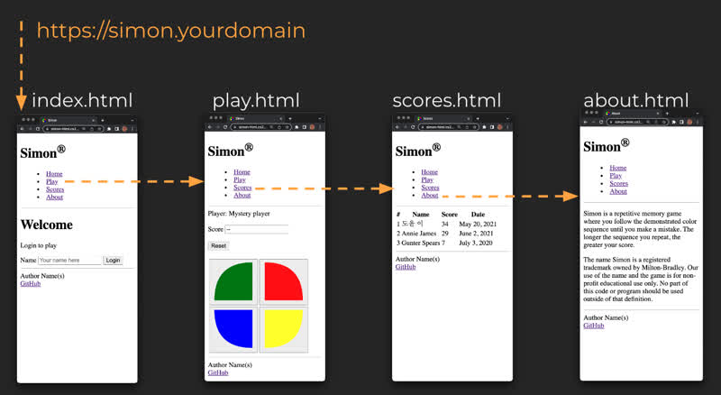
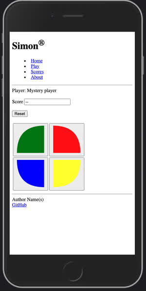

# Simon HTML


🔑 **Required reading**: [Simon HTML](https://www.youtube.com/watch?v=zg7eDNRMnWA)

This deliverable demonstrates the use of basic HTML elements for structure, basic formatting, input, output, links, and drawing.

Because we are not using any CSS for styling we are limited on how visually pleasing our application is. Do not worry about that. At this point we are simply trying to provide structure and content that we will later style and make interactive.

The application has a login (home), game play, high scores, and about page. Each page contains a header that provides navigation between the pages, and a footer that references the source repository.



The header and footer for each page is duplicated so that we have the same navigation controls on each view. Later in the class, when we move to React, the common navigation controls will be represented by a single component, and our application will have a single HTML page (index.html).

> [!IMPORTANT]
>
> Simon provides placeholders for all of the technologies that we cover in the class. It is vital that you provide this in your Startup HTML version or you will not be able to demonstrate your mastery with each deliverable. This also helps you think about how you are going to include the technologies as they are introduced. This may mean that you have to create mocks or generated data that will be replaced later in your development.

You can view this application running here: [Example Simon HTML](https://simon-html.cs260.click)



## Study this code

Get familiar with what the example code teaches.

- Clone the repository to your development environment.

  ```sh
  git clone https://github.com/webprogramming260/simon-html.git
  ```

- Review the code and get comfortable with everything it represents.
- View the code in your browser by hosting it using the VS Code Live Server extension.
- Make modifications to the code as desired. Experiment and see what happens.

## Diving into deployment

Most deliverables that you deploy to your production environment in AWS have a bash shell script that do all the work for you. For this deliverable you will see a file in the root of the simon project named `deployFiles.sh`.

You run a deployment script from a console window in your development environment with a command like the following.

```sh
./deployFiles.sh -k ~/prod.pem -h yourdomain.click -s simon
```

The `-k` parameter provides the credential file necessary to access your production environment. The `-h` parameter is the domain name of your production environment. The `-s` parameter represents the name of the application you are deploying (either `simon` or `startup`).

This will make more sense as we gradually build up our technologies but we can discuss our simon-html deployment script as a starting point for deployment. You can view the [entire file here](https://github.com/webprogramming260/simon-html/blob/main/deployService.sh), but we will explain each step below. It isn't critical that you deeply understand everything in the script, but the more you do understand the easier it will be for you to track down and fix problems when they arise.

The first part of the script simply parses the command line parameters so that we can pass in the production environment's security key (or PEM key), the hostname of your domain, and the name of the service you are deploying.

```sh
while getopts k:h:s: flag
do
    case "${flag}" in
        k) key=${OPTARG};;
        h) hostname=${OPTARG};;
        s) service=${OPTARG};;
    esac
done

if [[ -z "$key" || -z "$hostname" || -z "$service" ]]; then
    printf "\nMissing required parameter.\n"
    printf "  syntax: deployFiles.sh -k <pem key file> -h <hostname> -s <service>\n\n"
    exit 1
fi

printf "\n----> Deploying files for $service to $hostname with $key\n"
```

The target directory on your production environment is deleted so that the new one can replace it. This is done by executing commands remotely using the secure shell program (`ssh`).

```sh
# Step 1
printf "\n----> Clear out the previous distribution on the target.\n"
ssh -i "$key" ubuntu@$hostname << ENDSSH
rm -rf services/${service}/public
mkdir -p services/${service}/public
ENDSSH
```

Then all of the project files copied to the production environment using the secure copy program (`scp`).

```sh
# Step 2
printf "\n----> Copy the distribution package to the target.\n"
scp -r -i "$key" * ubuntu@$hostname:services/$service/public
```


## Deploy to production

> [!IMPORTANT]
>
> Make sure you using a POSIX compliant console (**not PowerShell or CMD on Windows**) and that you run `deployFiles.sh` from the project directory that you want to deploy. If you get a permission denied error when you run the deploy script, you need to run the following command in order to give the script the right to execute.
>
> ```sh
> sudo chmod +x deployFiles.sh
> ```

- Deploy to your production environment using the `deployFiles.sh` script found in the [example class application](https://github.com/webprogramming260/simon-html/blob/main/deployFiles.sh). Take some time to understand how the script works. The script does three things. Deletes any previous deployment for simon, copies up all of the files found in the project directory, and makes sure Caddy is hosting the files under the `simon` subdomain of your domain (e.g. simon.yourdomain.click).

  ```sh
  ./deployFiles.sh -k <yourpemkey> -h <yourdomain> -s simon
  ```

  For example,

  ```sh
  ./deployFiles.sh -k ~/keys/production.pem -h yourdomain.click -s simon
  ```

- Update your `startup` repository notes.md with what you learned.
- Make sure your project is visible from your production environment (e.g. https://simon.yourdomain.click).
