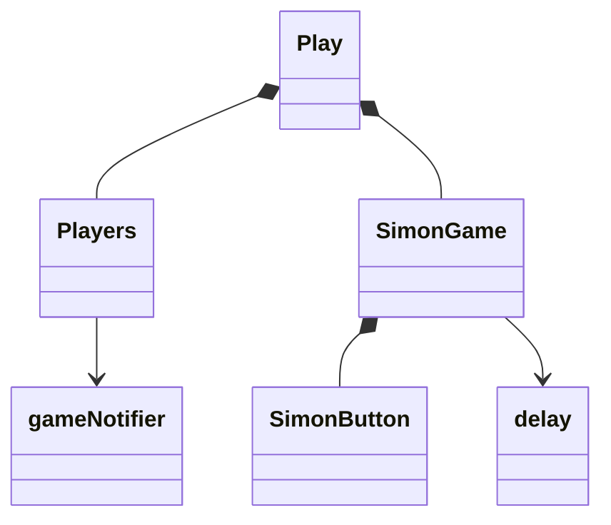
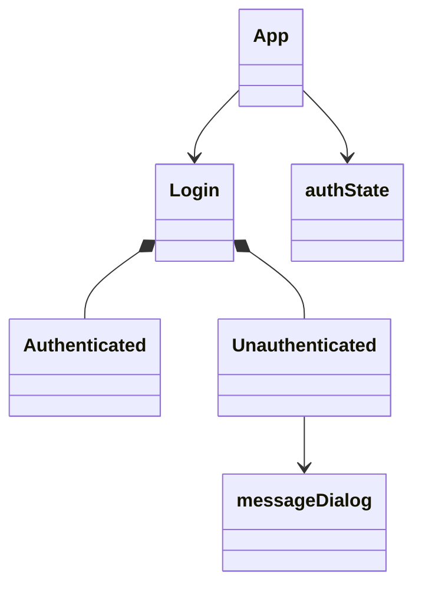

# Simon React Phase 2: Reactivity


Now that we have Simon rendering using React we can implement all of the JavaScript code necessary to make the application interactive and functionally complete. We need to revisit each of the view component JSX files and implement the code that makes them interactive with the user. Some of the functionally will be mocked out until we implement the later deliverables such as the service, login, and WebSocket. However, by the time we are done with this phase everything should basically work in some way.

The following will walk you through how to modify some of the Simon components so that they are reactive. You do not need to completely rewrite Simon React Phase 1 to be reactive. It is enough to clone the final [React repository](https://github.com/webprogramming260/simon-react), run it in your dev environment, study it, modify it a bit to figure out how it works, and then deploy it to your production environment.

With that said you should completely understand how to take a component that is non-reactive and use JavaScript and React to make it reactive. Carefully studying the following instruction will help you gain that mastery.

## About component

Let's start with the **About** component because it is the simplest. The About component is basically an `img` tag and a hard coded quote by the mighty Linus.

```html
<main className="container-fluid bg-secondary text-center">
  <div>
    <div id="picture" className="picture-box">
      
    </div>
    <p>...</p>

    <div id="quote" className="quote-box bg-light text-dark">
      <p className="quote">Words are cheap. Show me the code.</p>
      <p className="author">Linus Torvalds</p>
    </div>
  </div>
</main>
```

We are not yet ready to make fetch requests to hit a 3rd party service that provides the image and quote, but we can set up the JavaScript to get ready for those calls. Basically, we want when this component loads, for it to make a fetch requests to get the URLs for a random image and quote to display. We do this with a `useEffect` hook that sets the image and quote values for the corresponding variables. We then simply display the state variables in the JSX. This looks roughly like the following.

```jsx
export function About(props) {
  const [imageUrl, setImageUrl] = React.useState('');
  const [quote, setQuote] = React.useState('Loading...');
  const [quoteAuthor, setQuoteAuthor] = React.useState('unknown');

  React.useEffect(() => {
    setImageUrl(`placeholder.jpg`);
    setQuote('Show me the code');
    setQuoteAuthor('Linus Torvalds');
  }, []);

  return (
    <main className='container-fluid bg-secondary text-center'>
      <div>
        <div id='picture' className='picture-box'>
          
        </div>

        <p>...</p>

        <div className='quote-box bg-light text-dark'>
          <p className='quote'>{quote}</p>
          <p className='author'>{quoteAuthor}</p>
        </div>
      </div>
    </main>
  );
}
```

This might seem like we just added complexity without adding value, but we now have the full power of JavaScript to control how the page renders and it will be really easy to make the actual fetch requests in the next deliverable.

## Play component

The **play** component is significantly more complex than the About. Here we want to create a parent component that represents the **Play** view and is composed of two children. One for displaying the web socket messages from other players, and one for the game itself. The game is then composed of four button components.

There are also two JavaScript files that provide support for a simple delay between button pushes (delay.js), and the WebSocket messages that will come in the future.



For now, the `gameNotifier.js` will just employ a timer that injects random scores from other players. When we reach the WebSocket deliverable this will be replaced with actual messages that are sent from other players.

```js
setInterval(() => {
  const score = Math.floor(Math.random() * 3000);
  const date = new Date().toLocaleDateString();
  const userName = 'Eich';
  this.broadcastEvent(userName, GameEvent.End, { name: userName, score: score, date: date });
}, 5000);
```

The `play.jsx` file contains simple references to the children components. That means there is not a lot of JavaScript here.

```jsx
import { Players } from './players';
import { SimonGame } from './simonGame';

export function Play(props) {
  return (
    <main className='bg-secondary'>
      <Players userName={props.userName} />
      <SimonGame userName={props.userName} />
    </main>
  );
}
```

The `players.jsx` file sets an effect hook to listen for game notifier events. These are set in the events state for rendering in the JSX.

```jsx
const [events, setEvent] = React.useState([]);

React.useEffect(() => {
  GameNotifier.addHandler(handleGameEvent);

  return () => {
    GameNotifier.removeHandler(handleGameEvent);
  };
});

function handleGameEvent(event) {
  let newEvents = [event, ...events];
  if (newEvents.length > 10) {
    newEvents = newEvents.slice(1, 10);
  }
  setEvent(newEvents);
}
```

The `simonGame.jsx` implements all of the game play for Simon. The application logic is driven by three state variables:

| state       | description                                                  |
| ----------- | ------------------------------------------------------------ |
| allowPlayer | Boolean that controls if a player can interact with the game |
| sequence    | The current sequence the player is suppose to reproduce      |
| playbackPos | The current sequence position that the player is attempting  |

Let's look at one function from the code. The `onPressed` button is called when a player clicks on a button. The first thing the code does is checks to make sure the player is allowed to interact with the game. It then disallows the player form making any further button presses until it has processed the current one. The sequence is then checked to see if it matches the current playback position. If it does then it advances. If the entire sequence has completed then the sequence is increased. If they player pressed the wrong button then the score is saved, the mistake sound played and all the buttons start flashing. Scores are saved in local storage.

```jsx
async function onPressed(buttonPosition) {
  if (allowPlayer) {
    setAllowPlayer(false);
    await buttons.get(buttonPosition).ref.current.press();

    if (sequence[playbackPos].position === buttonPosition) {
      if (playbackPos + 1 === sequence.length) {
        setPlaybackPos(0);
        increaseSequence(sequence);
      } else {
        setPlaybackPos(playbackPos + 1);
        setAllowPlayer(true);
      }
    } else {
      saveScore(sequence.length - 1);
      mistakeSound.play();
      await buttonDance();
    }
  }
}
```

The rest of the code implements all of the details of resetting the game, updating scores, and generating sequences. But it all fits nicely in around 150 lines.

## Scores component

The **Scores** component reads the scores from local storage and displays them in a table that is generated with JSX.

```jsx
const scoreRows = [];
if (scores.length) {
  for (const [i, score] of scores.entries()) {
    scoreRows.push(
      <tr key={i}>
        <td>{i}</td>
        <td>{score.name.split('@')[0]}</td>
        <td>{score.score}</td>
        <td>{score.date}</td>
      </tr>
    );
  }
} else {
  scoreRows.push(
    <tr key='0'>
      <td colSpan='4'>Be the first to score</td>
    </tr>
  );
}
```

Once you play a few rounds you should see a nice table being generated.


## Login component

Like the play component, the **login** has child components that help it render differently based on the authentication state of the player.



The **authState** represents if the player is logged in or not. It uses the [Lifting State Up](https://legacy.reactjs.org/docs/lifting-state-up.html) React model that provides a way for the child components to notify the parent of when the state changes. The authState is actually stored in the **App** component because it needs to know what menu to display and if the Play and Scores view can be accessed.

#### App.jsx routes

```jsx
<Routes>
  <Route
    path='/'
    element={
      <Login
        userName={userName}
        authState={authState}
        onAuthChange={(userName, authState) => {
          setAuthState(authState);
          setUserName(userName);
        }}
      />
    }
    exact
  />
  // ...
</Routes>
```

#### App.jsx nav menu

```jsx
<menu className='navbar-nav'>
  {authState === AuthState.Authenticated && (
    <li className='nav-item'>
      <NavLink className='nav-link' to='play'>
        Play
      </NavLink>
    </li>
  )}
  {authState === AuthState.Authenticated && (
    <li className='nav-item'>
      <NavLink className='nav-link' to='scores'>
        Scores
      </NavLink>
    </li>
  )}
  //...
</menu>
```

Based on the **authState** the Login component will render either the **Authenticated** or **Unauthenticated** component. If an error happens during authentication then the **messageDialog** component is rendered.

```jsx
export function Login({ userName, authState, onAuthChange }) {
  return (
    <main className='container-fluid bg-secondary text-center'>
      <div>
        {authState !== AuthState.Unknown && <h1>Welcome to Simon</h1>}
        {authState === AuthState.Authenticated && <Authenticated userName={userName} onLogout={() => onAuthChange(userName, AuthState.Unauthenticated)} />}
        {authState === AuthState.Unauthenticated && (
          <Unauthenticated
            userName={userName}
            onLogin={(loginUserName) => {
              onAuthChange(loginUserName, AuthState.Authenticated);
            }}
          />
        )}
      </div>
    </main>
  );
}
```

When a player logs in, their username is stored in local storage. This serves as an indicator that the player is already authorized on future visits. In the future this will be enhanced with calls to the service to get an authorization token that verifies the authentication process.

## Study this code

Get familiar with what the example code teaches.

- Clone the repository to your development environment.

  ```sh
  git clone https://github.com/webprogramming260/simon-react.git
  ```

- Review the code and get comfortable with everything it represents.
- Debug the front and backend.
- Make modifications to the code as desired. Experiment and see what happens.

> [!IMPORTANT]
>
> Do not use the `live server` extension since your frontend code will now be served up by the the Vite hot swappable HTTP server when you run `npm run dev`. Set breakpoints for your frontend code in the browser.

## Deploy to production

> [!IMPORTANT]
>
> The `deployReact.sh` deployment script is different from the previous scripts and depends upon the `vite` package to be installed so that it can execute the toolchain that bundles the React application into static files that the browser can render. The bundled files are then deployed to your production environment.

- Deploy to your production environment using the `deployReact.sh` script found in the [example class application](https://github.com/webprogramming260/simon-react/blob/main/deployReact.sh). Take some time to understand how it works.

  ```sh
  ./deployReact.sh -k <yourpemkey> -h <yourdomain> -s simon
  ```

  For example,

  ```sh
  ./deployReact.sh -k ~/keys/production.pem -h yourdomain.click -s simon
  ```

- Update your `startup` repository `notes.md` with what you learned.
- Make sure your project is visible from your production environment (e.g. https://simon.yourdomain.click).
