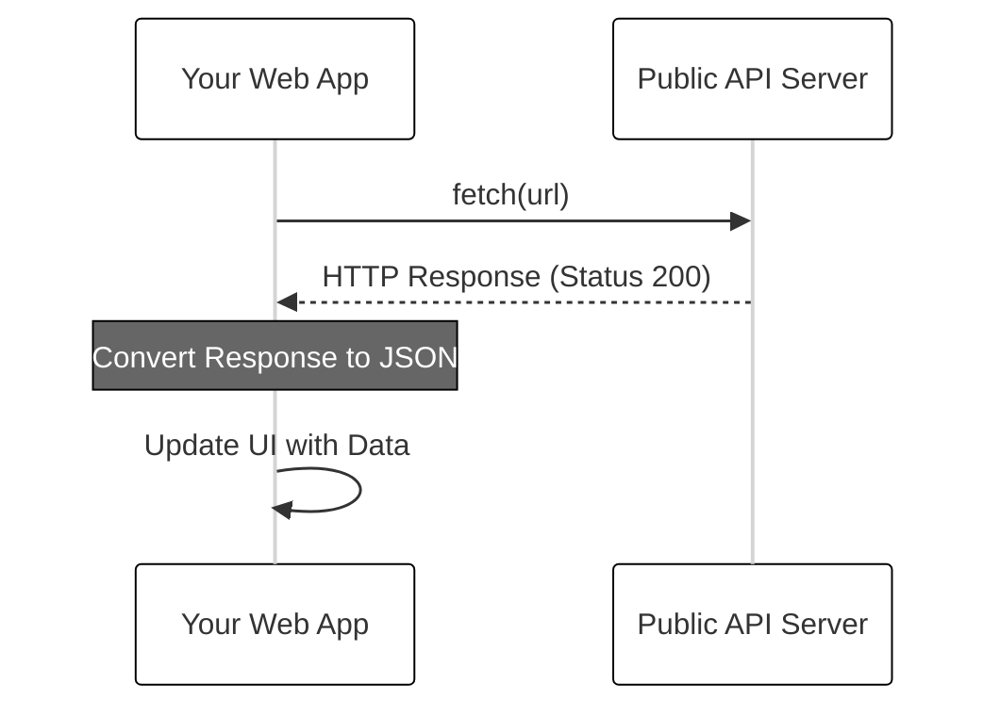

# Using Public APIs

In the modern web ecosystem, you rarely have to build everything from scratch. Whether you need real-time weather data, historical stock prices, or even a random collection of cat facts, there is likely a public API available to provide that data. Using public APIs allows developers to create "mashups"—applications that combine data from multiple sources to provide a unique and valuable user experience. By mastering the ability to fetch data from external services, you transform your static web pages into dynamic, data-driven applications.

Public APIs act as a bridge between your application and a third-party server. They expose specific "endpoints" (URLs) that return data, usually in JSON format, which your JavaScript code can then parse and display. Because these APIs are hosted by other organizations, they handle the complex backend logic and data storage, leaving you free to focus on how that information is presented to your users.

## Discovering Public APIs

Before you can write any code, you need to find a data source. The internet is full of open-access data, but some sources are more developer-friendly than others. Many developers start their search with curated lists like the [Public APIs repository on GitHub](https://github.com/public-apis/public-apis). 

When evaluating an API for your project, look for three things:
*   **Authentication Requirements:** Is it completely open, or does it require an API key?
*   **HTTPS Support:** Modern browsers generally block requests from secure (HTTPS) sites to insecure (HTTP) endpoints.
*   **CORS Support:** Ensure the API allows "Cross-Origin Resource Sharing," which enables your browser-based code to make requests to their server.

## The Fetch Workflow

To interact with a public API, we use the JavaScript `fetch()` function. This function initiates an asynchronous network request and returns a Promise. The flow of data typically follows a predictable pattern: your application sends a request, the API processes it and sends a response, and your application converts that response into a usable JavaScript object.



### Practical Example: Fetching a Random Activity

Let's look at a concrete example using the Bored API (a common tool for learning). This API suggests random activities when you are bored.

```javascript
function getRecommendation() {
  const url = 'https://www.boredapi.com/api/activity';

  fetch(url)
    .then((response) => {
      if (!response.ok) {
        throw new Error('Network response was not ok');
      }
      return response.json();
    })
    .then((data) => {
      console.log(`Suggested activity: ${data.activity}`);
      // Here you would update your HTML element with the activity
      document.getElementById('activity-display').innerText = data.activity;
    })
    .catch((error) => {
      console.error('There was a problem with the fetch operation:', error);
    });
}
```

In this example, we first check if the response was successful using `response.ok`. If it was, we call `.json()`, which is another asynchronous operation that parses the body of the response. Finally, we use the resulting data to update the user interface.

## Handling Authentication with API Keys

While many APIs are free to use, they often require you to sign up for an API Key. This key acts as a unique identifier that tells the API provider who is making the request. It helps them prevent abuse and enforce rate limits.

Usually, you provide this key in one of two ways:
*   **Query Parameters:** Appending the key to the URL (e.g., `?api_key=your_secret_key`).
*   **Request Headers:** Including the key in the metadata of the request.

Always read the API documentation carefully to see where the key should be placed. Be cautious: when building client-side applications, your API key is visible in the source code. For production apps with expensive or sensitive APIs, you would typically hide these keys behind your own backend server.

## Common Challenges and Solutions

Working with external services introduces variables that are outside of your control. Being prepared for these challenges will make your application more resilient.

**Rate Limiting**
Most free APIs limit how many requests you can make per minute or per day. If you exceed this limit, the server will return a `429 Too Many Requests` status code. To solve this, implement caching (storing the result locally for a short time) or reduce the frequency of your calls.

**Data Consistency**
Public APIs can change their data structure without warning. If your code expects `data.user_name` but the API changes it to `data.username`, your application might break. Always validate the data you receive before trying to render it to the screen.

**Network Latency**
External requests take time. Users on slow connections might see a blank screen while waiting for the API to respond. Always provide a "loading" state (like a spinner or a placeholder message) to let the user know that data is on its way.

## Summary

Using public APIs is one of the most effective ways to add sophisticated features to your web applications. By utilizing the `fetch()` API, you can reach out across the web, gather information from specialized services, and integrate it into your own project. Remember to handle your Promises correctly with `.then()` and `.catch()`, manage your API keys responsibly, and always provide a smooth experience for the user while the data is loading.

For further exploration of available APIs, consider visiting:
*   [MDN Web Docs: Using Fetch](https://developer.mozilla.org/en-US/docs/Web/API/Fetch_API/Using_Fetch)
*   [JSONPlaceholder](https://jsonplaceholder.typicode.com/): A great tool for testing and prototyping with fake data.
*   [OpenWeatherMap](https://openweathermap.org/api): A popular choice for practicing API integration with keys.