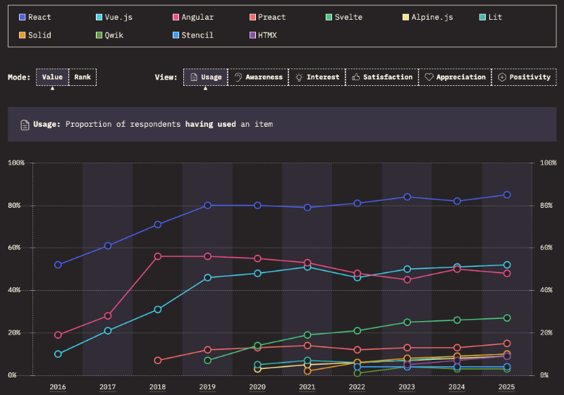

# Web frameworks


<iframe src="https://docs.google.com/presentation/d/e/2PACX-1vShKKMiQHGQ9Z4gbi8LsffGStlrQeS5fZUdIn-0wsldW3petSXftCBEbu-OnLjpVzbVBVh-HkjiKhoj/pubembed?start=false&loop=false&delayms=3000" frameborder="0" width="900" height="540" allowfullscreen="true" mozallowfullscreen="true" webkitallowfullscreen="true"></iframe>

📖 **Deeper dive reading**: [MDN Introduction to client-side frameworks](https://developer.mozilla.org/en-US/docs/Learn/Tools_and_testing/Client-side_JavaScript_frameworks/Introduction)

Web frameworks seek to make the job of writing web applications easier by providing tools for completing common application tasks. This includes things like modularizing code, creating single page applications, simplifying reactivity, and supporting diverse hardware devices.

Some frameworks take things beyond the standard web technologies (HTML, CSS, JavaScript) and create new hybrid file formats that combine things like HTML and JavaScript into a single file. Examples of this include React JSX, Vue SFC, and Svelte files. Abstracting away the core web file formats puts the focus on functional components rather than files.

There are lots of web frameworks to choose from and they evolve all the time. You can view the latest popularity poll at [StateOfJS](https://stateofjs.com).


\- **Source**: _StateOfJS web framework poll_

Each framework has advantages and disadvantages. Some are very prescriptive (opinionated) about how to do things, some have major institutional backing, and others have a strong open source community. Other factors you want to consider include how easy it is to learn, how it impacts productivity, how performant it is, how long it takes to build, and how actively the framework is evolving.


```masteryls
{"id":"9ad21eaa-cd4f-4e2f-8ede-ece0177ef6a5", "title":"Favorite Web Framework", "type":"essay" }
Which Web Framework sounds most interesting to you and why?
```


## Hello world examples

For our classwork we will use the web framework React. However, before we dig into React let's look at how the major frameworks would render a simple hello world application.

### Vue

[Vue](https://vuejs.org/) combines HTML, CSS, and JavaScript into a single file. HTML is represented by a `template` element that can be aggregated into other templates.

**SFC**

```html
<script>
  export default {
    data() {
      return {
        name: 'world',
      };
    },
  };
</script>

<style>
  p {
    color: green;
  }
</style>

<template>
  <p>Hello {{ name }}!</p>
</template>
```

### Svelte

Like Vue, [Svelte](https://svelte.dev/) combines HTML, CSS, and JavaScript into a single file. The difference here is that Svelte requires a transpiler to generate browser-ready code, instead of a runtime virtual DOM.

**Svelte file**

```html
<script>
  let name = 'world';
</script>

<style>
  p {
    color: green;
  }
</style>

<p>Hello {name}!</p>
```

### React

React combines JavaScript and HTML into its component format. CSS must be declared outside of the JSX file. The component itself leverages the functionality of JavaScript and can be represented as a function or class.

**JSX**

```jsx
import 'hello.css';

const Hello = () => {
  let name = 'world';

  return <p>Hello {name}</p>;
};
```

**CSS**

```css
p {
  color: green;
}
```

### Angular component

An Angular component defines what JavaScript, HTML, and CSS are combined together. This keeps a fairly strong separation of files that are usually grouped together in a directory rather than using the single file representation.

**JS**

```js
@Component({
  selector: 'app-hello-world',
  templateUrl: './hello-world.component.html',
  styleUrls: ['./hello-world.component.css'],
})
export class HelloWorldComponent {
  name: string;
  constructor() {
    this.name = 'world';
  }
}
```

**HTML**

```html
<p>hello {{name}}</p>
```

**CSS**

```css
p {
  color: green;
}
```
