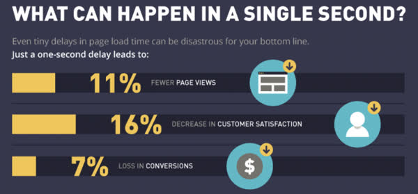
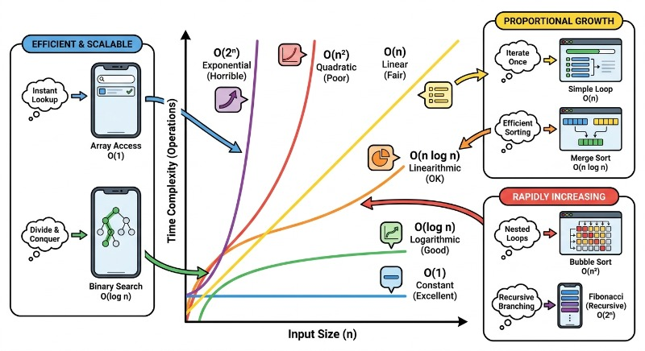
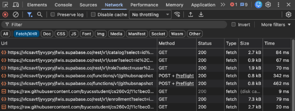
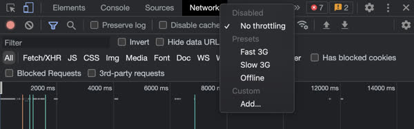
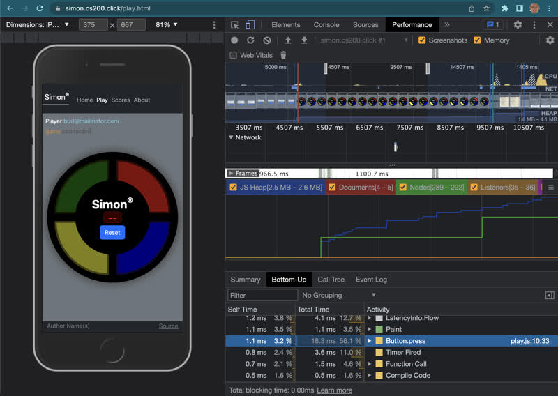
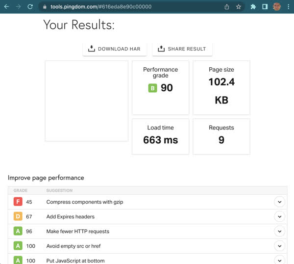
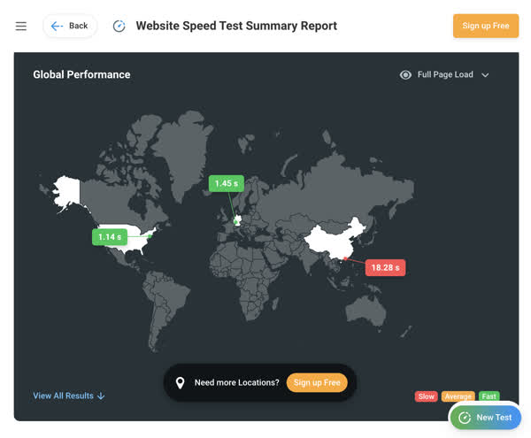

# Performance monitoring

The performance of your application plays a huge role in determining user satisfaction. The following statistics show the impact that just one second of delay can make.



> **Source**: WPEngine

To prevent losing users, you should aim for your application to load in about one second. Achieving this requires that you consistently measure and improve the responsiveness of your application. The primary areas to monitor include:

1. Browser application latency
2. Network latency
3. Service endpoint latency

For the context of this discussion, **latency** is defined as the delay a user experiences before a request is satisfied.

Let's look at each of these performance areas and suggest tools for measuring and improving results.

## Browser application latency

Browser application latency is impacted by the speed of the user's device, the amount of data that needs to be processed, and the time complexity of the processing algorithms.

When a user requests your application, the browser requests the `index.html` page first. This is followed by requests for any files linked within that HTML, such as JavaScript, CSS, video, and image files. Once your JavaScript is loaded, it begins making requests to services—including endpoints you provide and those provided by third parties. Each of these requests takes time for the browser to load and render. A page with many large images and numerous service calls will take significantly longer to load than a page that only loads simple text from a single HTML file.

Likewise, if your JavaScript performs heavy processing while a page is loading, the user will notice the resulting latency. You should make application processing as asynchronous as possible so that it occurs in the background without impacting the user experience.

You can reduce the impact of file size and HTTP requests by doing one or more of the following:

1.  **Use compression** (such as Gzip or Brotli) when transferring files over HTTP.
2.  **Optimize assets** by reducing the quality of images and video to the lowest acceptable level.
3.  **Minify JavaScript and CSS** to remove whitespace and shorten variable names.
4.  **Use HTTP/2 or HTTP/3** so that HTTP headers are compressed and the communication protocol is more efficient.

You can also reduce the number of requests by combining responses from multiple endpoint requests into a single request. This eliminates duplicated fields and decreases the overhead associated with establishing multiple connections.

## Network latency

You pay a latency price for every network request you make. For this reason, you should avoid making unnecessary or excessively large requests.

Network latency is impacted by the amount of data sent, the user's **bandwidth** (the amount of data a user can receive per second), and the physical distance the data must travel.

If a user has a low-bandwidth connection (e.g., lower than 1 megabit per second), you must be extremely careful to minimize the number of bytes sent. Global latency is also a factor; if your application is hosted in a data center in San Francisco and accessed by someone in Nairobi, there will be an additional latency of 100 to 400 milliseconds for every request due to the distance.

You can mitigate the impact of global latency by hosting application files in data centers close to your users. Applications reaching a global audience often use a Content Delivery Network (CDN) to host their application in dozens of locations around the world.

## Service endpoint latency

Service endpoint latency is impacted by the number of requests made and the time required to process each one.

When a web application makes a request to a service endpoint, functionality in the application is often blocked until the endpoint returns. For example, if a user requests the scores for a game, the application will delay rendering that specific component until the data arrives.

Ideally, you should keep individual endpoint latency to less than 10 milliseconds (ms). While this may seem like a very short window, applications often make dozens of endpoint requests to render a single view. If each request takes 10 ms, the cumulative time reaches 100 to 200 ms. When you add network latency, processing time, and browser rendering time, you can easily exceed the desired one-second load time.

## Representing performance impact with Big O notation

In performance monitoring, we need a standardized way to discuss how code performs as it scales. **Big O notation** is a mathematical representation used to describe the efficiency of an algorithm. Specifically, it characterizes the execution time or space requirements of an algorithm based on the size of the input data (usually represented as *n*).

Instead of measuring performance in seconds—which varies based on hardware, background processes, and CPU speed—Big O focuses on the **growth rate**. It answers the question: "As the input grows, how much slower does the code get?" In web development, understanding this helps prevent "jank" (stuttering) in the UI and ensures that backend services can handle thousands of concurrent users efficiently.

### Common Big O values

The following table defines the most common complexities you will encounter when monitoring and optimizing web applications:

| Notation | Name | Growth Rate | Common Example |
| :--- | :--- | :--- | :--- |
| **O(1)** | Constant | Flat | Accessing an element in an array by its index. |
| **O(log n)** | Logarithmic | Very Slow | Searching for a value in a sorted array using Binary Search. |
| **O(n)** | Linear | Proportional | Iterating through a list of users to find a specific ID. |
| **O(n log n)** | Linearithmic | Moderate | Efficient sorting algorithms like `Array.prototype.sort()`. |
| **O(n²)** | Quadratic | Fast | Comparing every item in a list to every other item (nested loops). |
| **O(2ⁿ)** | Exponential | Very Fast | Recursive calculation of Fibonacci numbers. |

### Why Big O matters in web development

Web developers deal with data processing on both the client and server sides. Monitoring the Big O complexity of your functions is critical for several reasons:

1.  **UI Responsiveness:** If a frontend filter function has a complexity of $O(n^2)$, a user with 10,000 items in their dashboard might experience several seconds of the UI "freezing" every time they type in a search bar.
2.  **Scalability:** A backend endpoint that works perfectly with 100 database records might time out when the database grows to 1,000,000 records if the query logic is inefficient.
3.  **Cost Management:** In cloud environments (like AWS Lambda or Google Cloud Functions), you pay for execution time. Moving from $O(n^2)$ to $O(n)$ can significantly reduce infrastructure costs.

### Visualizing complexity growth

The following diagram illustrates how the number of operations increases as the input size (**n**) grows for different complexities.



### Code examples

#### Constant Time: O(1)
This function always takes the same amount of time, regardless of how large the `settings` object is.
```javascript
function getTheme(settings) {
  return settings.theme; // One operation
}
```

#### Linear Time: O(n)
The time taken grows linearly with the number of items in the `products` array.
```javascript
function findProduct(products, targetId) {
  for (let i = 0; i < products.length; i++) {
    if (products[i].id === targetId) return products[i];
  }
  return null;
}
```

#### Quadratic Time: O(n²)
This is common in "brute force" algorithms. If the `users` array has 1,000 items, the code might perform 1,000,000 comparisons.
```javascript
function findSharedInterests(users) {
  for (let i = 0; i < users.length; i++) { // Outer loop
    for (let j = 0; j < users.length; j++) { // Inner loop
      if (i !== j && users[i].interest === users[j].interest) {
        console.log("Match found!");
      }
    }
  }
}
```

## Premature optimization

Performance optimization must be a data-driven discipline; it should never be conducted without empirical evidence to justify the change and validate the outcome. Without precise metrics, developers risk introducing unnecessary complexity to solve perceived issues that are not actually bottlenecks. Establishing a baseline through rigorous measurement is the only way to ensure that an optimization has achieved its goal without introducing regressions. Put another way: *If you haven't measured it in the context of the entire system, don't try to improve it.*

> “Premature optimization is the root of all evil.”
>
> — Donald Knuth

## Performance tools

📖 **Deeper dive reading**: [Chrome performance tools](https://developer.chrome.com/docs/devtools/performance/)


In the modern web landscape, the success of an application is inextricably linked to its speed, responsiveness, and reliability. Performance monitoring tools provide developers with the granular visibility required to transition from anecdotal troubleshooting to data-driven optimization. By integrating these tools into the development lifecycle, engineers can identify latent bottlenecks, optimize resource allocation, and ensure compliance with critical metrics such as Core Web Vitals. Mastering these utilities allows for the proactive detection of regressions before they impact the end-user, ultimately fostering a seamless user experience that reduces bounce rates and maximizes infrastructure efficiency.


### Chrome Network tab

You can view the network requests made by your application and the time required for each by using the browser's developer tools. This shows which files and endpoints are requested and how long they take. Sorting by `Time` or `Size` helps identify areas needing attention. Ensure you clear your cache before testing to see real latency rather than load times from local storage.





### Simulating real users

The Network tab in Chrome DevTools also allows you to simulate low-bandwidth connections by throttling your network. For example, you can simulate a 3G network connection typical of a low-end mobile phone.



Throttling is essential because developers often use high-end computers and high-speed connections. Without throttling, you may not realize your application is unusable for customers with slower hardware or networks.

### Chrome Lighthouse

The Lighthouse tool in Chrome DevTools runs an automated analysis of your application. It provides an average performance rating based on metrics like initial load time, Largest Contentful Paint (LCP), and Time to Interactive (TTI).

### Chrome Performance tab

When you are ready to analyze frontend execution, use the Performance tab. This tool breaks down application activity into discrete time intervals, allowing you to isolate bottlenecks in your code.



To use it, press the record button and interact with your application. Chrome records memory usage, screenshots, and timing information. After stopping the recording, you can review the data. For example, the image above shows that 56% of execution time was spent in the `button.press` function. You can drill down into the source code to see exactly which lines consumed the most processing time.

### Global speed tests

You should also test your application from different geographic locations. Many online providers offer these tests, such as [Pingdom](https://tools.pingdom.com).



In the example above, the tool suggests enabling Gzip compression and adding cache headers to improve performance.

The following tool by [DotComTools](https://www.dotcom-tools.com) allows you to run tests from multiple global locations simultaneously.



Here, performance is acceptable in the United States and Europe but poor in Asia. This is expected if the server is located in Northern Virginia. To correct this, a Content Delivery Network (CDN) with "edge" locations closer to users in Asia would be required.

## Exercises

```masteryls
{"id":"4ccf8c71-194b-4e81-b256-8f7011ae355a", "title":"Timing for Code Optimization", "type":"multiple-choice"}
According to best practices in performance monitoring and the principle of avoiding premature optimization, when is it most appropriate to invest resources into optimizing a specific section of code?

- [ ] Immediately after writing the initial logic to ensure the most efficient implementation is committed to the codebase
- [x] Once performance monitoring data identifies a specific bottleneck that significantly impacts user experience or system stability
- [ ] Whenever a developer identifies an algorithm that could theoretically be replaced by one with a better Big O complexity, regardless of current load
- [ ] During the final phase of every development cycle to ensure that all new functions meet a generic, pre-defined execution time threshold
```

```masteryls
{"id":"8b71562e-1f85-446f-8814-add7c56e0fef", "title":"Performance", "type":"essay" }
You are coding a new component for a complex application. What performance considerations should you make? How can you determine the impact of any performance modifications? 
```

```masteryls
{"id":"793a7bb2-75c5-44f4-a4a2-1ab5b0a1c8d5", "title":"Identifying Complexity", "type":"multiple-choice"}
A developer is monitoring a recursive function that calculates the nth Fibonacci number by calling itself twice for each non-base case. Which Big O notation best describes the growth rate of this operation?

- [ ] O(1)
- [ ] O(n)
- [ ] O(log n)
- [ ] O(n^2)
- [x] O(2^n)
```