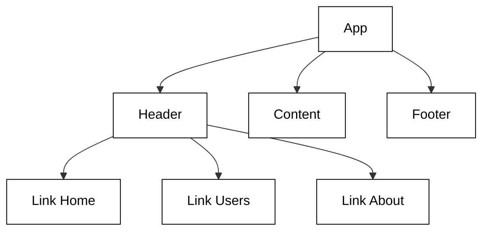

# Components

📖 **Recommended reading**: [React.dev - Your First Component](https://react.dev/learn/your-first-component)

A React component is simply a JavaScript function that returns JSX. The JSX is converted into JavaScript by Babel and then rendered in browser. This makes it easy to combine HTML and JavaScript in your web application.

```js
function SimpleComponent() {
  const who = 'world';
  return <b>Hello {who}</b>;
}
```

React components also allow you to modularize the functionality of your application. Components match well with the structural mental model of users. They also encourage code reuse because it is common for components to show up repeatedly.

## Rendering JSX

One of the primary purposes of a component is to generate the user interface. This is done with the JSX returned from a component. Whatever is returned, inserted into the component HTML element.

As a simple example, a JSX file containing a React component element named `Demo` would cause React to load the `Demo` component, get the JSX returned from the component, and insert the result into the place of the `Demo` element.

**JSX**

```jsx
<div>
  Component: <Demo />
</div>
```

Notice that `Demo` is not a valid HTML element. The transpiler will replace this tag with the resulting rendered HTML.

**React component**

```jsx
function Demo() {
  const who = 'world';
  return <b>Hello {who}</b>;
}
```

**Resulting HTML**

```html
<div>Component: <b>Hello world</b></div>
```

You should note that you can use JSX even without a function. A simple variable representing JSX will work anyplace you would otherwise provide a component.

```jsx
const hello = <div>Hello</div>;
const root = ReactDOM.createRoot(document.getElementById('root'));
root.render(hello);
```

**Resulting HTML**

```html
<div>Hello</div>
```

## Child components

The JSX that a component returns may reference other components. This allows you to build up a complex tree of interrelated components. Consider the following application that has a header with navigational elements, main content, and a footer. The App component is the parent of all the other components.



```mermaid
graph TD
    classDef default fill:#ffffff,stroke:#000000,color:#000000,stroke-width:1px;

    App
    
    App --> Header
    App --> Content
    App --> Footer
    
    Header --> Link1[Link Home]
    Header --> Link2[Link Users]
    Header --> Link3[Link About]
```

With React you typically start with a single HTML element defined in `index.html` and then it is a tree of nested components all the way down.

The following code demonstrates the component structure described above.

#### index.jsx

```jsx
import React from 'react';
import ReactDOM from 'react-dom/client';
import './index.css';

function Header() {
  return (
    <nav className='app-bar'>
      <Link label='home' />
      <Link label='users' />
      <Link label='about' />
    </nav>
  );
}

function Link(label) {
  return <div>{label.label}</div>;
}

function Content() {
  return <div className='content'>Here is the content</div>;
}

function Footer() {
  return <div className='app-bar'>Footer</div>;
}

function App() {
  return (
    <div className='app'>
      <Header />

      <Content />

      <Footer />
    </div>
  );
}

const root = ReactDOM.createRoot(document.getElementById('root'));
root.render(<App />);
```

#### index.css

```css
.app {
  font-family: sans-serif;
}

.app-bar {
  display: flex;
  align-items: center;
  justify-content: center;
  background: #ddd;
}

.app-bar div {
  padding: 0.25em;
}

.content {
  margin: 1em;
}
```

This results in the following.


## Properties

React components also allow you to pass information to them in the form of element properties. The component receives the properties in its constructor and then can display them when it renders.

**JSX**

```jsx
<div>Component: <Demo who="Walke" /><div>
```

**React component**

```jsx
function Demo(props) {
  return <b>Hello {props.who}</b>;
}
```

## State

In addition to properties, a component can have internal state. Component state is created by calling the `React.useState` hook function. The `useState` function returns a variable that contains the current state and a function to update the state. The following example creates a state variable called `clicked` and toggles the click state in the `updateClicked` function that gets called when the paragraph text is clicked.

```jsx
function App() {
  const [clicked, updateClicked] = React.useState(false);

  function onClicked() {
    updateClicked(!clicked);
  }

  return <p onClick={onClicked}>clicked: {`${clicked}`}</p>;
}

const root = ReactDOM.createRoot(document.getElementById('root'));
root.render(<App />);
```

## Styling components

If you don't want to directly style your components with inline CSS rule sets, you can reference and external CSS file and then reference the rules in your JSX just like you would normally do with HTML. For example, if you had a CSS file named `index.css` with the following styles.

```css
div {
  font-family: sans-serif;
}

.code {
  color: green;
}
```

You could apply the style rules using importing the CSS. The styles will then apply as they would normally, with the exception that you need to use `className` attribute on an element instead of `class` because class is a keyword in JavaScript.

```jsx
import React from 'react';
import ReactDOM from 'react-dom/client';
import './index.css';

function App() {
  return (
    <div>
      <pre className='code'>console.log(1+1);</pre>
      <p>Simple math</p>
    </div>
  );
}

const root = ReactDOM.createRoot(document.getElementById('root'));
root.render(<App />);
```

This results in the following.

```masteryls
{"id":"484515fd-8066-4bae-988c-fb6cf13cfc21", "title":"Styling JSX", "type":"web-page", "height":80}
<body>
  <div id="root">... loading</div>

  <style>
  div {font-family: sans-serif;}
  .code {color: green;}
  </style>

  <script src="https://unpkg.com/react@18/umd/react.development.js"></script>
  <script src="https://unpkg.com/react-dom@18/umd/react-dom.development.js"></script>
  <script src="https://unpkg.com/@babel/standalone/babel.min.js"></script>

  <script type="text/babel">
    function App() {
      return (
        <div>
          <pre className='code'>console.log(1+1);</pre>
          <p>Simple math</p>
        </div>
      );
    }

    const root = ReactDOM.createRoot(document.getElementById('root'));
    root.render(<App />);
  </script>
</body>
```

### Dynamic Styling
You can also use React state to control the styling of your components. 

```jsx
function ColorComponent() {
  const [color, setColor] = useState('blue');

  return <div style={{ color: color}}>{color}</div>
}
```

The double curly bracket syntax looks a bit strange to start with, but if you consider that you are first escaping to JavaScript and then supplying an object that defines each of the style properties, it begins to make sense.


```masteryls
{"id":"cf497eee-ab3e-4a39-b2f3-f6f00a5eb6f6", "title":"Dynamic Styling Practice", "type":"ai-web-page", "allowAiPrompt":false, "gradingCriteria":"The background transitions on mouse enter", "height":100 }
Examine the source code and see how React state is used to specify the style of the component element. See what happens when you move your cursor over the text. Then change it so background color changes instead of the text color.

~~~html
<body>
  <div id="root">... loading</div>

  <script src="https://unpkg.com/react@18/umd/react.development.js"></script>
  <script src="https://unpkg.com/react-dom@18/umd/react-dom.development.js"></script>
  <script src="https://unpkg.com/@babel/standalone/babel.min.js"></script>

  <script type="text/babel">
    const { useState } = React;

    function App() {
      const [hovered, setHovered] = useState(false);

      return (
        <div  style={{ display: "flex", justifyContent: "center", alignItems: "center", height: "100vh" }}>
          <div
            onMouseEnter={() => setHovered(true)}
            onMouseLeave={() => setHovered(false)}
            style={{
              fontSize: 32,
              transition: "color 2s",
              color: hovered ? "hotpink" : "steelblue",
            }}
          >
            JSX with Style!
          </div>
        </div>
      );
    }

    const root = ReactDOM.createRoot(document.getElementById('root'));
    root.render(<App />);
  </script>
</body>
~~~
```


## Reactivity

A component's properties and state serve as the "source of truth" that React uses to drive the **reactivity** of the interface. Reactivity is the process by which the UI automatically stays in sync with the underlying data. When a user interacts with the page or an event occurs, the data changes, and React ensures the UI reflects that change immediately.

Whenever a component's state or properties are updated, React triggers a **re-render**. For functional components, this means React executes the component function again to determine what the new JSX should look like based on the updated values. This re-rendering process is recursive: by default, when a parent component re-renders, all of its nested child components are also re-evaluated to ensure the entire UI tree remains consistent.

To keep this process efficient, React uses a "Virtual DOM." Instead of rebuilding the entire webpage's HTML from scratch—which would be slow—React compares the new JSX output with the previous version (a process called "diffing") and calculates the most efficient way to update the actual browser DOM. This ensures that only the specific elements that truly changed are modified, keeping the application fast and responsive.

## ☑ Assignment


```masteryls
{"id":"cc76e021-8012-43be-bb3b-8427ee7aabbf", "title":"Components", "type":"ai-web-page", "allowAiPrompt":false, "gradingCriteria":"There exists a new property to the Demo component that provides the background color for the component. There exists a state variable that changes the color on a mouse over event.", "height":225 }
Examine the provided source code and then modify it to:

1. Add a new property to the Demo component that provides the background color for the component.
2. Add another state variable that changes the color on a mouse over event.

~~~html
<body>
  <div id="root">... loading</div>

  <script src="https://unpkg.com/react@18/umd/react.development.js"></script>
  <script src="https://unpkg.com/react-dom@18/umd/react-dom.development.js"></script>
  <script src="https://unpkg.com/@babel/standalone/babel.min.js"></script>

  <script type="text/babel">
    // Top level component that contains child components
    function App() {
      return (
        <div>
          Function Style Component: <Demo who="function" />
        </div>
      );
    }

    // Child component
    function Demo(props) {
      const [outlook, setOutlook] = React.useState("beautiful");

      function changeOutlook() {
        setOutlook(outlook === "exciting" ? "beautiful" : "exciting");
      }

      return (
        <div className="component">
          <p>
            Hello {outlook} {props.who}
          </p>
          <button onClick={changeOutlook}>change</button>
        </div>
      );
    }

    const root = ReactDOM.createRoot(document.getElementById('root'));
    root.render(<App />);
  </script>

  <style>
    * {font-family: Arial;padding: 0.5em;}
    .component {border: solid thick #888;margin: 0.5em 0;width: %100;}
  </style>
</body>
~~~
```


### 🧧 Possible solution

If you get stuck here is a possible solution.

```jsx
function App() {
  return (
    <div>
      Function Style Component: <Demo who='function' initialColor='yellow' />
    </div>
  );
}

function Demo(props) {
  const [color, setColor] = React.useState(props.initialColor);
  const [outlook, setOutlook] = React.useState('beautiful');

  function changeOutlook() {
    setOutlook(outlook === 'exciting' ? 'beautiful' : 'exciting');
  }

  function changeColor() {
    let randomColor = Math.floor(Math.random() * 16777215).toString(16);
    setColor('#' + randomColor);
  }

  return (
    <div className='component' onMouseOver={changeColor} style={{ background: color }}>
      <p>
        Hello {outlook} {props.who}
      </p>
      <button onClick={changeOutlook}>change</button>
    </div>
  );
}
```
