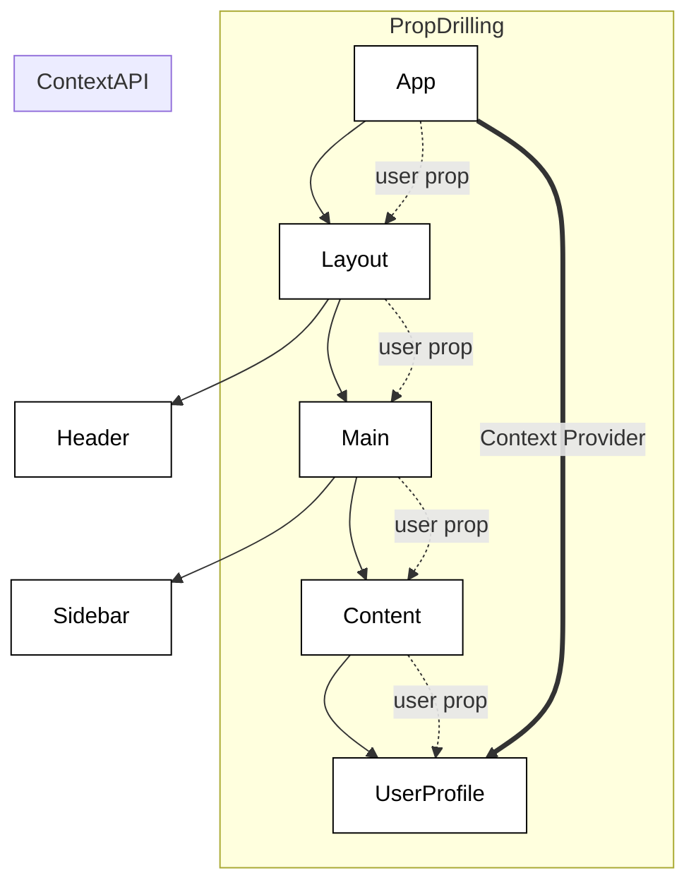
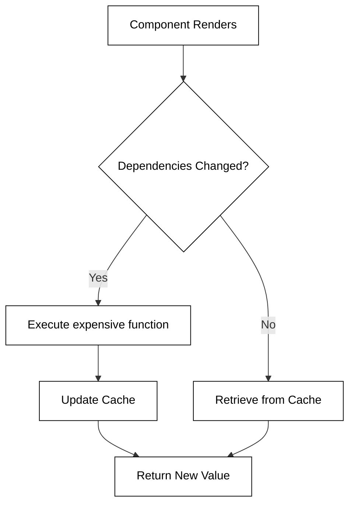

# React hooks

📖 **Recommended reading**: [Reactjs.org - Hooks Overview](https://reactjs.org/docs/hooks-overview.html)

React Hooks are specialized functions that allow developers to "hook into" React state and lifecycle features directly from functional components. They enable the management of local state, side effects, and context. React utilizes hooks to promote the reuse of stateful logic across components and to simplify code by grouping related logic together.

You have already seen one use of hooks to declare and update state in a function component with the `useState` hook.

```jsx
function Clicker({ initialCount }) {
  const [count, updateCount] = React.useState(initialCount);
  return <div onClick={() => updateCount(count + 1)}>Click count: {count}</div>;
}

const root = ReactDOM.createRoot(document.getElementById('root'));
root.render(<Clicker initialCount={3} />);
```

## useEffect hook

The `useEffect` hook allows you to represent lifecycle events. For example, if you want to run a function every time the component completes rendering, you could do the following.

```jsx
function UseEffectHookDemo() {
  React.useEffect(() => {
    console.log('rendered');
  });

  return <div>useEffectExample</div>;
}

const root = ReactDOM.createRoot(document.getElementById('root'));
root.render(<UseEffectHookDemo />);
```

### UseEffect dependencies

By default, the **useEffect** callback is called every time the component is rendered. You can control what triggers a **useEffect** hook by specifying its dependencies. In the following example we have two state variables, but we only want the **useEffect** hook to be called when the component is initially called and when the first variable is clicked. To accomplish this you pass an array of dependencies as a second parameter to the **useEffect** call.

```jsx
function UseEffectHookDemo() {
  const [count1, updateCount1] = React.useState(0);
  const [count2, updateCount2] = React.useState(0);

  React.useEffect(() => {
    console.log(`count1 effect triggered ${count1}`);
  }, [count1]);

  return (
    <ol>
      <li onClick={() => updateCount1(count1 + 1)}>Item 1 - {count1}</li>
      <li onClick={() => updateCount2(count2 + 1)}>Item 2 - {count2}</li>
    </ol>
  );
}

const root = ReactDOM.createRoot(document.getElementById('root'));
root.render(<UseEffectHookDemo />);
```

If you specify an empty array `[]` as the hook dependency then it is only called when the component is first rendered.

> [!NOTE]
>
> Hooks must be called at the top scope of the function and cannot be called inside of a loop or conditional. This restriction ensures that hooks are always called in the same order when a component is rendered.

### useEffect clean up

You can also take action when the component cleans up by returning a cleanup function when you call `useEffect`. Consider the example where a component creates a database connection. The database connection is a resource that needs to be released when the component is destroyed. In the example, the function returned from **useEffect** when get called when the component gets destroyed. This is triggered after a user clicks five times on the clicker component.

```jsx
function Clicker() {
  const [count, update] = React.useState(5);

  return (
    <div onClick={() => update(count - 1)}>
      Click count: {count}
      {count > 0 ? <Db /> : <div>DB Connection Closed</div>}
    </div>
  );
}

function Db() {
  React.useEffect(() => {
    console.log('connected');

    return function cleanup() {
      console.log('disconnected');
    };
  }, []);

  return <div>DB Connection</div>;
}

const root = ReactDOM.createRoot(document.getElementById('root'));
root.render(<Clicker />);
```

## useContext hook

In React, data usually flows from top to bottom via props. However, as an application grows, you may find yourself passing props through many components that don't actually need the data, just to get it to a deeply nested child. This phenomenon is known as **prop drilling**. The `useContext` hook provides a way to share values like themes, user authentication, or preferred language between components without explicitly passing a prop through every level of the tree.

### The Problem: Prop Drilling

When you have a piece of state in a root component that is needed by a component five levels deep, every intermediate component must act as a "middleman." This makes the code harder to maintain and refactor.



### How to use useContext

To implement context in your application, you generally follow three steps:

1.  **Create the Context:** Use `createContext()` to create a context object.
2.  **Provide the Context:** Wrap your component tree with a `Provider` and pass the data into the `value` prop.
3.  **Consume the Context:** Use the `useContext` hook in any child component to access that value.

### Implementation Example: Theme Switching

Below is a practical example of how to implement a light/dark mode toggle using `useContext`.

```jsx
import React, { createContext, useContext, useState } from 'react';

// 1. Create the Context
const ThemeContext = createContext();

export function ThemeProvider({ children }) {
  const [theme, setTheme] = useState('light');

  const toggleTheme = () => {
    setTheme((prev) => (prev === 'light' ? 'dark' : 'light'));
  };

  // 2. Provide the Context
  return <ThemeContext.Provider value={{ theme, toggleTheme }}>{children}</ThemeContext.Provider>;
}

function ThemedButton() {
  // 3. Consume the Context
  const { theme, toggleTheme } = useContext(ThemeContext);

  return (
    <button
      onClick={toggleTheme}
      style={{
        background: theme === 'light' ? '#fff' : '#333',
        color: theme === 'light' ? '#000' : '#fff',
      }}
    >
      Switch to {theme === 'light' ? 'Dark' : 'Light'} Mode
    </button>
  );
}

export default function App() {
  return (
    <ThemeProvider>
      <ThemedButton />
    </ThemeProvider>
  );
}
```

### Key Considerations

- **Performance:** When the `value` of a Provider changes, all components calling `useContext` for that specific context will re-render. To optimize this, keep your context values as granular as possible.
- **Default Values:** When calling `createContext(defaultValue)`, the default value is only used if a component does not have a matching Provider above it in the tree.
- **Composition:** Context is best used for "global" data. If you are only passing props down one or two levels, standard prop passing is often cleaner and easier to trace.

```masteryls
{"id":"16073f88-fc50-4a77-9a94-57144690f2bd", "title":"Understanding useContext", "type":"multiple-choice"}
What is the primary problem that the useContext hook is designed to solve in React applications?

- [ ] It is used to fetch data from external APIs asynchronously.
- [ ] It replaces the useState hook for managing local component state.
- [x] It prevents "prop drilling" by allowing components to access global data without intermediate props.
- [ ] It is used to directly manipulate the browser's DOM elements.
```

## useMemo hook

In React, components re-render whenever their state or props change. While React's reconciliation process is fast, some operations—such as processing large datasets, complex mathematical transformations, or generating filtered lists—can be computationally expensive. If these operations run on every single render, they can lead to UI lag and a poor user experience. The `useMemo` hook is designed to solve this by "memoizing" (caching) the result of a calculation between re-renders.

The `useMemo` hook accepts two arguments: a function that returns a value and a dependency array. React will only re-execute the function when one of the dependencies has changed. If the dependencies remain the same between renders, React skips the function and returns the previously cached value.



### When to use useMemo

There are two primary scenarios where `useMemo` is beneficial:

1.  **Expensive Calculations:** When you have a function that takes a significant amount of time to run (e.g., sorting a list of 10,000 items).
2.  **Referential Equality:** In JavaScript, objects and arrays are compared by reference. If you pass an object or array created inside a component body to a memoized child component (via `React.memo`), that child will re-render every time because the reference changes on every render. `useMemo` ensures the reference stays the same unless dependencies change.

### Implementation Example

Consider a component that filters a large list of users based on a search query. Without `useMemo`, the filtering logic runs even if the user is merely clicking a "Toggle Theme" button that has nothing to do with the user list.

```javascript
import React, { useState, useMemo } from 'react';

const UserList = ({ users }) => {
  const [query, setQuery] = useState('');
  const [isDarkMode, setIsDarkMode] = useState(false);

  // This calculation only re-runs if 'users' or 'query' changes
  const filteredUsers = useMemo(() => {
    console.log('Filtering users...');
    return users.filter((user) => user.name.toLowerCase().includes(query.toLowerCase()));
  }, [users, query]);

  return (
    <div className={isDarkMode ? 'dark' : 'light'}>
      <button onClick={() => setIsDarkMode(!isDarkMode)}>Toggle Theme</button>
      <input value={query} onChange={(e) => setQuery(e.target.value)} placeholder="Search users..." />
      <ul>
        {filteredUsers.map((user) => (
          <li key={user.id}>{user.name}</li>
        ))}
      </ul>
    </div>
  );
};
```

### Best Practices and Pitfalls

While it might be tempting to wrap everything in `useMemo`, it comes with its own overhead. Memory must be allocated to store the cached value, and React must perform a comparison on the dependency array during every render.

- **Don't over-optimize:** For simple arithmetic or small array manipulations, the overhead of `useMemo` may exceed the performance gain.
- **Keep it pure:** The function passed to `useMemo` should be a pure function. Side effects (like API calls) belong in `useEffect`, not `useMemo`.
- **Dependency accuracy:** Always include every variable from the component scope that is used inside the memoized function in the dependency array. Failing to do so will result in "stale" values.

```masteryls
{"id":"25c9b6d0-0074-458e-9cdf-2878abe27bb4", "title":"Understanding useMemo", "type":"multiple-choice"}
What happens if you provide an empty dependency array `[]` to the useMemo hook?

- [ ] The calculation runs on every single render.
- [ ] The hook returns `undefined` because there are no dependencies to track.
- [x] The calculation runs only once during the initial mount and the cached result is returned for all subsequent renders.
- [ ] React will throw a runtime error because at least one dependency is required.
```
