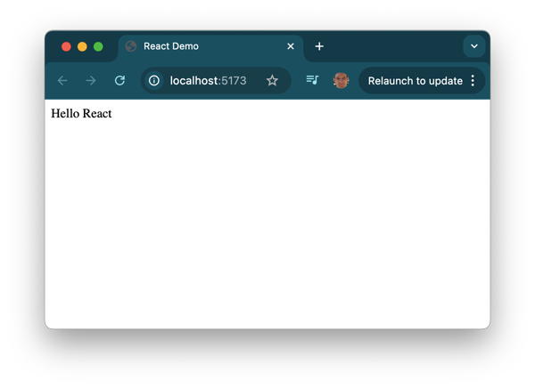

# React


📖 **Recommended reading**:

- [MDN React Introduction Tutorial](https://developer.mozilla.org/en-US/docs/Learn/Tools_and_testing/Client-side_JavaScript_frameworks/React_getting_started)
- [React Quick Start](https://react.dev/learn#components)

React, and its associated projects, provide a powerful web programming framework. The name React comes from its focus on making reactive web page components that automatically update based on user interactions or changes in the underlying data.


> “The best drug is getting little things done that have been weighing on you. Instant high.”
>
> — Jordan Walke (_Source_: [Twitter](https://twitter.com/jordwalke/status/1554625863089418243?cxt=HHwWhsCjgYv_kZMrAAAA))

React was created by Jordan Walke for use at Facebook in 2011. It was first used with Facebook's news feed and then as the main framework for Instagram. Shortly thereafter, Facebook open sourced the framework and it was quickly adopted by many popular web applications.

React abstracts HTML into a JavaScript variant called [JSX](https://reactjs.org/docs/introducing-jsx.html). JSX is converted into valid HTML and JavaScript using a preprocessor such as [Vite](https://vite.dev/) or [Babel](https://babeljs.io/). For example, the following is a JSX file. Notice that it mixes both HTML and JavaScript into a single representation.

```jsx
const i = 3;
const list = (
  <ol class='big'>
    <li>Item {i}</li>
    <li>Item {3 + i}</li>
  </ol>
);
```

The preprocessor will convert the JSX into valid JavaScript that looks really complex to a human, but that a browser can render without any problems.

```js
const i = 3;
const list = React.createElement('ol', { class: 'big' }, React.createElement('li', null, 'Item ', i), React.createElement('li', null, 'Item ', 3 + i));
```

When the JavaScript interpreter running in the browser executes the `React.createElement` functions it will generate HTML elements are displayed to the user.

```html
<ol class="big">
  <li>Item 3</li>
  <li>Item 6</li>
</ol>
```

Later, we will show you how to make your code reactive to user actions such as pressing a button. Those actions will change the state of the application and cause it to rerender the HTML.

## React Hello World

Let's go ahead a create a simple React application. Don't worry too much if you don't understand everything that is done in this example. The point here is to get you using React as quickly as possible and then to use it as a place where you can explore how a modern web framework works. This includes understanding JavaScript, Node, NPM, and Vite.

The first step is to set up a project that can covert JSX into JavaScript that the browser can render. After installing Node.js, open up your command console and execute the following commands. This will create a directory named `reactDemo` that is configured to build a React application.

```sh
mkdir reactDemo && cd reactDemo
npm init -y
npm install vite@latest -D
npm install react react-dom
```

The `npm init` command created a default `package.json` file that defines the project. The `npm install` commands installed the React dependencies into the project. You can see the package source code that was installed if you inspect the `node_modules` directory that NPM created.

Next, you need to create the single HTML file, named index.html, that will contain the entire React application.

#### index.html

```html
<!DOCTYPE html>
<html lang="en">
  <head>
    <title>React Demo</title>
  </head>
  <body>
    <noscript>You need to enable JavaScript to run this app.</noscript>
    <div id="root"></div>
    <script type="module" src="/index.jsx"></script>
  </body>
</html>
```

When the browser loads up the HTML, it will execute the JSX code represented by the `script` tag. That means you need to create a file with the name `index.jsx`. This simple file renders the JSX returned by the `App` component function. Of course the JSX element looks a lot like an HTML element, but that is only because we haven't fully explored what JSX can do. The magic happens when you connect the HTML **div** to the React rendering code by telling React to render the `App` component in place of the root element's contents.

#### index.jsx

```jsx
import React from 'react';
import ReactDOM from 'react-dom/client';

function App() {
  return <div>Hello React</div>;
}

const root = ReactDOM.createRoot(document.getElementById('root'));
root.render(<App />);
```

Now you just need to compile the JSX into JavaScript using Vite and have Vite host a hot reloading HTTP server so that you can see the result in the browser. You do this by running a variant of the NPM command named NPX. NPX will directly execute a Node package without referencing the package.json file. This is really useful for running JavaScript code that is meant to run as a command line program (CLI) such as Vite.

```sh
npx vite
```

This will display something like the following that tells you that Vite has successfully bundled the application and it is ready to be viewed in the browser with the URL `http://localhost:5173`.

```sh
  VITE v6.0.4  ready in 72 ms

  ➜  Local:   http://localhost:5173/
  ➜  Network: use --host to expose
  ➜  press h + enter to show help
```

You can have Vite open the browser for you by pressing `o ⏎`. This should display the following.



This might feel like a lot of work to display something that you could have done with one line of HTML, and so let's finish this tutorial by making our simple application interactive.

```jsx
import React from 'react';
import ReactDOM from 'react-dom/client';

function App() {
  const [bgColor, setBgColor] = React.useState('white');

  const handleClick = () => {
    setBgColor(bgColor === 'white' ? 'yellow' : 'white');
  };

  return (
    <div onClick={handleClick} style={{ backgroundColor: bgColor, height: '100vh', font: 'bold 20vh Arial', display: 'flex', alignItems: 'center', justifyContent: 'center' }}>
      <div> Hello React </div>
    </div>
  );
}

const root = ReactDOM.createRoot(document.getElementById('root'));
root.render(<App />);
```

First we introduce the concept of event handlers. All HTML elements can generate events that JavaScript code can respond to. In this case we are registering an event handler that will call the **handleClick** function whenever the **div** is clicked on. This function will toggle the background color of the element. Because the CSS backgroundColor rule is set to a variable, it will reactively change whenever the variable is changed.

Now the background color will toggle every time you click on the page.


This code demonstrates several important concepts of React.

1. Creating componentized representations of HTML and JavaScript.
1. Storing component state as component variables.
1. Reacting to the user by altering the component's state.

Take some time to experiment with this simple component. You will want to make sure you are completely comfortable with how the pieces fit together in this simple model. In the following instruction you will learn the details of how React does all of this and also learn a bunch of JavaScript along the way.
