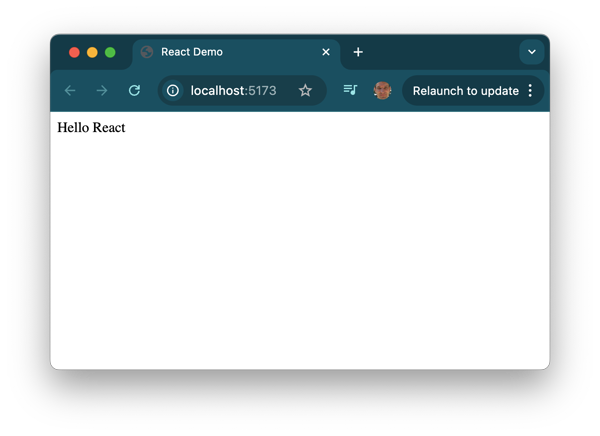

# React


📖 **Recommended reading**:

- [MDN React Introduction Tutorial](https://developer.mozilla.org/en-US/docs/Learn/Tools_and_testing/Client-side_JavaScript_frameworks/React_getting_started)
- [React Quick Start](https://react.dev/learn#components)

React, and its associated projects, provide a powerful web programming framework. The name React comes from its focus on making reactive web page components that automatically update based on user interactions or changes in the underlying data.


> “The best drug is getting little things done that have been weighing on you. Instant high.”
>
> — Jordan Walke (_Source_: [Twitter](https://twitter.com/jordwalke/status/1554625863089418243?cxt=HHwWhsCjgYv_kZMrAAAA))

React was created by Jordan Walke for use at Facebook in 2011. It was first used with Facebook's news feed and then as the main framework for Instagram. Shortly thereafter, Facebook open sourced the framework and it was quickly adopted by many popular web applications.

The core React library support two functional pieces: 

1. **JSX** - A syntax that lets you write UI markup in JavaScript, making interactive interfaces easier to build and read.
1. **State** - Data managed by a component that, when changed, causes the relevant HTML to re-render.


## JSX


React abstracts HTML manipulation into a variant representation called [JSX](https://reactjs.org/docs/introducing-jsx.html). The preprocessor [Babel](https://babeljs.io/) then converts the JSX into JavaScript that the browser then renders into valid HTML.

As an example, consider the following is a JSX file. Notice that it mixes both HTML and JavaScript into a single representation.

```jsx
const i = 3;
const list = (
  <ol className='big'>
    <li>Item {i}</li>
    <li>Item {3 + i}</li>
  </ol>
);
```

Babel converts the JSX into valid JavaScript that looks really complex to a human, but that a browser can render without any problems.

```js
const i = 3;
const list = React.createElement('ol', { style: {color:'green'}}, React.createElement('li', null, 'Item ', i), React.createElement('li', null, 'Item ', 3 + i));
```

When the JavaScript interpreter running in the browser executes the `React.createElement` functions it will generate HTML elements are displayed to the user.

```html
<ol style='color:green'>
  <li>Item 3</li>
  <li>Item 6</li>
</ol>
```

## From JavaScript to JSX

The following interactions demonstrate how JSX simplifies the complexity of representing dynamic DOM manipulation via JavaScript into something that looks much like HTML.


```masteryls
{"id":"b55d56f9-ade3-4b8a-8b54-18e448995a11", "title":"ReactDOM functions", "type":"ai-web-page", "allowAiPrompt":false, "gradingCriteria":"The word 'byu' must be included in the list and the color be blue.", "height":75 }
This code demonstrates using the React library functions to inject dynamically created DOM elements into an HTML `div`. In this case a **list** element is created and added as a child to the div with ID of root. The list has a style attribute that sets its color to green.

Go ahead and play with the code. Manipulate it so that the list contains the word `BYU`. Set the color to blue.
~~~html
<body>
  <div id="root">...loading</div>

  <script type="module">
    import React, { useState } from 'https://esm.sh/react@18.3.1';
    import { createRoot } from 'https://esm.sh/react-dom@18.3.1/client';

    function App() {
      const i = 3;
      const list = React.createElement('ol', { style: {color:'green'}}, React.createElement('li', null, 'Item ', i), React.createElement('li', null, 'Item ', 3 + i));
      return list;
    }

    const root = createRoot(document.getElementById('root'));
    root.render(React.createElement(App));
  </script>
</body>
~~~
```

```masteryls
{"id":"a55d56f9-ade3-4b8a-8b54-18e448995a22", "title":"JSX representation", "type":"ai-web-page", "allowAiPrompt":false, "gradingCriteria":"The word 'byu' must be included in the list and the color be blue.", "height":75 }
Now we can replace the React DOM manipulate functions with JSX. This simplifies things to a representation that is easier to use because it is similar to HTML. Babel pre-processes the JSX into JavaScript that is then passed to the browser for rendering. This basically turns it into the JavaScript code from the previous example interaction.

Once again, change the list text to contain `BYU` and set the color to blue. This should be a lot easier to do with JSX than the previous JavaScript version.
~~~html
<body>
  <div id="root">...loading</div>

  <script src="https://unpkg.com/react@18/umd/react.development.js"></script>
  <script src="https://unpkg.com/react-dom@18/umd/react-dom.development.js"></script>
  <script src="https://unpkg.com/@babel/standalone/babel.min.js"></script>

  <script type="text/babel">
    function App() {
      const i = 3;
      return <ol style={{ color: 'green' }}>
              <li>Item {i}</li>
              <li>Item {3 + i}</li>
            </ol>;
    }

    const root = ReactDOM.createRoot(document.getElementById('root'));
    root.render(<App />);
  </script>
</body>
~~~
```

Next, we will show you how to make your code reactive to user actions such as pressing a button. Those actions will change the state of JSX and cause it to rerender the JSX into new HTML.

## State

JSX gives us the ability to easily represents HTML that is manipulated by JavaScript. The next thing that React gives us is the ability to efficiently trigger with changes to the JavaScript's state variables should trigger a rerendering of the generated HTML.

This happens when a user clicks on a button, inputs information, views different content, or simply moves the mouse. State changes can also be driven by external data sources such as the time of day, stock price, weather, or a chat message.

The following demonstrates using React state to change the target of the hello message whenever the text is click on. This works by declaring a React state variable with `React.useState` and providing it the initial value of the state variable. This returns two things: 1) a constant `name` that is used to reference the current value of the state and 2) a function to set a new value for the variable (`setName`). You can reference the `name` constant in the JSX to render the current value. You can also use the `setName` function to change the name in your JavaScript.


```jsx
function App() {
  const [name, setName] = React.useState('BYU');

  const handleClick = () => {
    setName(name === 'BYU' ? 'Cougar' : 'BYU');
  };

  return (
    <div onClick={handleClick}>
      <div> Hello {name} </div>
    </div>
  );
}
```

Note that here is nothing special about the variable names that you choose as the return values from `React.useState`. You can set those to whatever makes sense in your application.


```masteryls
{"id":"b55d56f9-ade3-4b8a-8b54-18e448995a32", "title":"State driven rendering", "type":"ai-web-page", "allowAiPrompt":false, "gradingCriteria":"The words 'byu' and 'cougar'  must toogle as the react state changes.", "height":75 }
The following example will change the background color when you click on the text. Experiment with the source code and then modify it so that the name toggles between 'BYU' and 'Cougar' when you click on it.
~~~html
<body>
  <div id="root">... loading</div>

  <script src="https://unpkg.com/react@18/umd/react.development.js"></script>
  <script src="https://unpkg.com/react-dom@18/umd/react-dom.development.js"></script>
  <script src="https://unpkg.com/@babel/standalone/babel.min.js"></script>

  <script type="text/babel">
    function App() {
      const [bgColor, setBgColor] = React.useState('white');

      const handleClick = () => {
        setBgColor(bgColor === 'white' ? '#c1ecff' : 'white');
      };

      return (
        <div onClick={handleClick} style={{ backgroundColor: bgColor, height:'100vh', font: 'bold 40vh Arial', display:'flex', alignItems:'center', justifyContent: 'center' }}> Hello React </div>
      );
    }

    const root = ReactDOM.createRoot(document.getElementById('root'));
    root.render(<App />);
  </script>
</body>
~~~
```

## React Hello World

Let's go ahead a create a simple React application. Don't worry too much if you don't understand everything that is done in this example. The point here is to get you using React as quickly as possible and then to use it as a place where you can explore how a modern web framework works. This includes understanding JavaScript, Node, NPM, and Vite.

The first step is to set up a project that can covert JSX into JavaScript that the browser can render. After installing Node.js, open up your command console and execute the following commands. This will create a directory named `reactDemo` that is configured to build a React application.

```sh
mkdir reactDemo && cd reactDemo
npm init -y
npm install vite@latest -D
npm install react react-dom
```

The `npm init` command created a default `package.json` file that defines the project. The `npm install` commands installed the React dependencies into the project. You can see the package source code that was installed if you inspect the `node_modules` directory that NPM created.

Next, you need to create the single HTML file, named index.html, that will contain the entire React application.

#### index.html

```html
<!DOCTYPE html>
<html lang="en">
  <head>
    <title>React Demo</title>
  </head>
  <body>
    <noscript>You need to enable JavaScript to run this app.</noscript>
    <div id="root"></div>
    <script type="module" src="/index.jsx"></script>
  </body>
</html>
```

When the browser loads up the HTML, it will execute the JSX code represented by the `script` tag. That means you need to create a file with the name `index.jsx`. This simple file renders the JSX returned by the `App` component function. Of course the JSX element looks a lot like an HTML element, but that is only because we haven't fully explored what JSX can do. The magic happens when you connect the HTML **div** to the React rendering code by telling React to render the `App` component in place of the root element's contents.

#### index.jsx

```jsx
import React from 'react';
import ReactDOM from 'react-dom/client';

function App() {
  return <div>Hello React</div>;
}

const root = ReactDOM.createRoot(document.getElementById('root'));
root.render(<App />);
```

Now you just need to compile the JSX into JavaScript using Vite and have Vite host a hot reloading HTTP server so that you can see the result in the browser. You do this by running a variant of the NPM command named NPX. NPX will directly execute a Node package without referencing the package.json file. This is really useful for running JavaScript code that is meant to run as a command line program (CLI) such as Vite.

```sh
npx vite
```

This will display something like the following that tells you that Vite has successfully bundled the application and it is ready to be viewed in the browser with the URL `http://localhost:5173`.

```sh
  VITE v6.0.4  ready in 72 ms

  ➜  Local:   http://localhost:5173/
  ➜  Network: use --host to expose
  ➜  press h + enter to show help
```

You can have Vite open the browser for you by pressing `o ⏎`. This should display the following.



This might feel like a lot of work to display something that you could have done with one line of HTML, and so let's finish this tutorial by making our simple application interactive.

```jsx
import React from 'react';
import ReactDOM from 'react-dom/client';

function App() {
  const [bgColor, setBgColor] = React.useState('white');

  const handleClick = () => {
    setBgColor(bgColor === 'white' ? 'yellow' : 'white');
  };

  return (
    <div onClick={handleClick} style={{ backgroundColor: bgColor, height: '100vh', font: 'bold 20vh Arial', display: 'flex', alignItems: 'center', justifyContent: 'center' }}>
      <div> Hello React </div>
    </div>
  );
}

const root = ReactDOM.createRoot(document.getElementById('root'));
root.render(<App />);
```

First we introduce the concept of event handlers. All HTML elements can generate events that JavaScript code can respond to. In this case we are registering an event handler that will call the **handleClick** function whenever the **div** is clicked on. This function will toggle the background color of the element. Because the CSS backgroundColor rule is set to a variable, it will reactively change whenever the variable is changed.

Now the background color will toggle every time you click on the page.


This code demonstrates several important concepts of React.

1. Creating componentized representations of HTML and JavaScript.
1. Storing component state as component variables.
1. Reacting to the user by altering the component's state.

Take some time to experiment with this simple component. You will want to make sure you are completely comfortable with how the pieces fit together in this simple model. In the following instruction you will learn the details of how React does all of this and also learn a bunch of JavaScript along the way.
