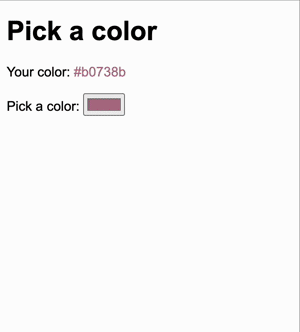
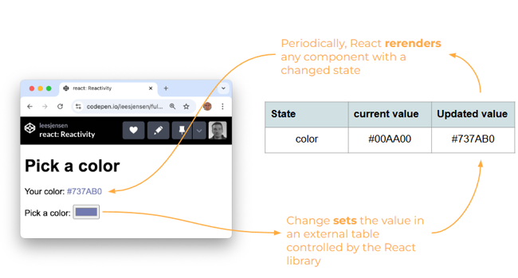

# Reactivity

- [🎥 Reactivity tutorial video](https://youtu.be/xmH_DJF7kOQ)

Making the UI react to changes in user input or data, is one of the architectural foundations of React. React enables reactivity with three major pieces of a React component: `props`, `state`, and `render`.

React keeps a **table** of `state` values for every component. React records requested state in the table whenever a `updateState` method is called. Then periodically, React will rerender every component that has had a change since the last render occurred.

## Demonstration application

In order to understand how React state works, consider a simple React application that picks a color. The application has one state variable (`color`) and three components.

- **App**: Top level component that manages the `color` state.
- **ColorDisplay**: Displays the currently selected color.
- **ColorPicker**: Displays the color and allows for the selection of a new color.

Whenever you change the color using the `ColorPicker` component, it causes the color rendered by the `ColorDisplay` component to update.



The `App` component creates a React state variable by calling the `React.useState` function. This creates an entry in React's state table that tracks the current and desired value of every state object.

```js
const [color, updateColor] = React.useState('#737AB0');
```

The value of `color` is passed as a property to both the App's child components. Whenever React detects a change to the `color` state it will rerender any component that depends on that state.

The `updateColor` state function is also passed as a property to the `ColorPicker` component. This gives the ColorPicker the ability to modify the value of the color state that is registered in the `App` parent component.



Be careful about your assumptions of when state is updated. Just because you called `updateState` does not mean that you can access the updated state on the next line of code. Updates happen asynchronously, and therefore you never really know when it is going to happen. You only know that it will eventually happen.

The following is code for the color picker components. Take some time to understand every line of the code. If you want to debug the application you can experiment with the complete application found in the [example code](exampleCode/implementingReact/).

```jsx
const root = ReactDOM.createRoot(document.getElementById('root'));
root.render(<App />);

function App() {
  const [color, updateColor] = React.useState('#737AB0');

  return (
    <div>
      <h1>Pick a color</h1>
      <ColorDisplay color={color} />
      <ColorPicker color={color} updateColor={updateColor} />
    </div>
  );
}

function ColorDisplay({ color }) {
  return (
    <div>
      Your color: <span style={{ color: color }}>{color}</span>
    </div>
  );
}

function ColorPicker({ color, updateColor }) {
  function onChange(e) {
    updateColor(e.target.value);
  }

  return (
    <div>
      <span>Pick a color: </span>
      <input type='color' onChange={onChange} value={color} />
    </div>
  );
}
```

## ☑ Assignment

Create a fork of this [CodePen](https://codepen.io/leesjensen/pen/NWzYzXE) and experiment. Try changing the input from using the color picker, to using an text input that reactively displays the text as you type.

Don't forget to update your GitHub startup repository `notes.md` with all of the things you learned and want to remember.

_If your section of this course requires that you submit assignments for grading_: Submit your CodePen URL to the Canvas assignment.

### 🧧 Possible solution

If you get stuck here is a possible solution.

```jsx
function ColorPicker({ color, updateColor }) {
  function onChange(e) {
    updateColor(e.target.value);
  }

  return (
    <div>
      <span>Pick a color: </span>
      <input type='text' onChange={onChange} value={color} />
    </div>
  );
}
```

### Diving deep into React state

One good way to better understand a technology is to try to rewrite it. Let's replace the `React.useState` function with a simplistic global variable that manages the current state of `color`.

We then set a timer, using `setInterval`, to check to see if the color state has changed, and if so, updates the color state and rerender the component.

```js
let color;
let colorNext;

React.useState = (defaultValue) => {
  color = color || defaultValue;
  const update = (newColor) => (colorNext = newColor);
  return [color, update];
};

setInterval(() => {
  if (colorNext && color !== colorNext) {
    color = colorNext;
    root.render(App());
  }
}, 50);
```

This is a very simplified implementation of React state management that only handles the specific `color` variable. The React implementation is much more generalized and performant. However, it should help you understand that there is no magic to state management.
