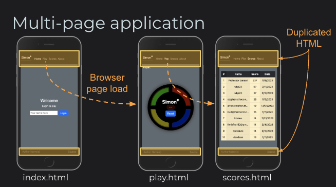
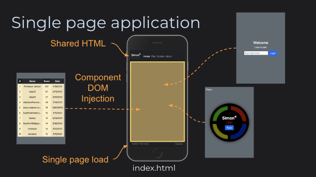
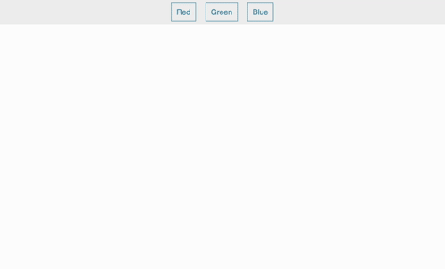

# Router

🔑 **Required reading**: [React Router DOM Tutorial](https://blog.webdevsimplified.com/2022-07/react-router/)

A web framework router provides essential functionality for single-page applications that otherwise would have been handled by rendering multiple HTML pages. With a multiple-webpage application the headers, footers, navigation, and common components must be either duplicated in each HTML page, or injected before the server sends the page to the browser.



With a single page application, the browser only loads one HTML page and then JavaScript is used to manipulate the DOM and give it the appearance of multiple pages. The router defines the routes a user can take through the application, and automatically manipulates the DOM to display the appropriate framework components. This has the advantage of being able to store state as the user interacts with the page and not having to continually go to the server to get new HTML pages.



React does not have a standard router package, and there are many that you can choose from. We will use [react-router-dom](https://www.npmjs.com/package/react-router-dom). The simplified routing functionality of React-router-dom derives from the project [react-router](https://www.npmjs.com/package/react-router) for its core functionality. Do not confuse the two when reading tutorials and documentation.

The following show how the router toggles between content as a user clicks on the header elements.



A basic implementation of the router consists of a `BrowserRouter` component that encapsulates the entire application and controls the routing action. The `Link`, or `NavLink`, component captures user navigation events and modifies what is rendered by the `Routes` component by matching up the `to` and `path` attributes. The example contains two components. The **App** component with the router and a **Page** component that is routed to when a link is pressed.

```jsx
function Page({ color }) {
  return (
    <div className="page" style={{ backgroundColor: color }}>
      <h1>{color}</h1>
    </div>
  );
}

function App() {
  return (
    <BrowserRouter>
      <div className="app">
        <nav>
          <NavLink to="/">Red</NavLink>
          <NavLink to="/green">Green</NavLink>
          <NavLink to="/blue">Blue</NavLink>
        </nav>

        <main>
          <Routes>
            <Route path="/" element={<Page color="red" />} exact />
            <Route path="/green" element={<Page color="green" />} />
            <Route path="/blue" element={<Page color="blue" />} />
          </Routes>
        </main>
      </div>
    </BrowserRouter>
  );
}

const root = ReactDOM.createRoot(document.getElementById('root'));
root.render(<App />);
```

## Router example

You can enhance the simple [Hello World React](../introduction/introduction.md#react-hello-world) app that you created in previous instruction to include a router by first installing the React Router Dom dependency.

```sh
npm install react-router-dom
```

Now you can replace the JSX for the application found in `index.jsx` with the router code given above. You will need to add the reference to the route dom import as well as the CSS that is used for making things look pretty.

```jsx
import { BrowserRouter, Routes, Route, NavLink } from 'react-router-dom';

import './styles.css';
```

Place the following CSS in a new file named `styles.css`.

```css
* {
  margin: 0;
  font-family: sans-serif;
}

.app {
  display: flex;
  flex-direction: column;
  justify-content: center;
  align-items: center;
  height: 100vh;
}

nav {
  display: flex;
  justify-content: center;
  align-items: center;
  width: 100%;
  height: 10vh;
  font-size: 1em;
  background-color: #f1f1f1;
}

a {
  margin: 0 10px;
  color: rgb(76, 146, 171);
  text-decoration: none;
  border: 1px solid rgb(76, 146, 171);
  padding: 10px;
}

a:hover {
  background-color: rgb(76, 146, 171);
  color: #f1f1f1;
}

main {
  height: 100%;
  width: 100%;
}

.page {
  color: #eee;
  display: flex;
  justify-content: center;
  align-items: center;
  width: 100%;
  height: 100%;
  font-size: 10vw;
  background-color: #f9f9f9;
}
```

Now you are ready to start up the application by running `npm run dev` and opening up the application in your browser.

Notice that as you click on the different navigation links the URL of the application changes to match the route. This is happens because the Routes component plugs into the browser's location API and modifies the displayed path so that it gives the appearance that a different resource is being displayed, when in reality the DOM is simply being manipulated to display a different React component.


## ☑ Assignment

Create a fork of this [CodePen](https://codepen.io/leesjensen/pen/poKLKaX) and add another component for the path of `/orange`.

_If your section of this course requires that you submit assignments for grading_: Submit your CodePen URL to the Canvas assignment.

Don't forget to update your GitHub startup repository `notes.md` with all of the things you learned and want to remember.
