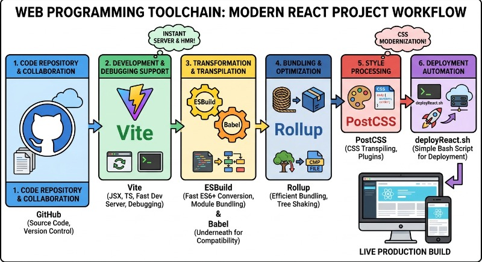
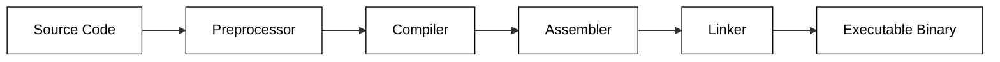

# Toolchains



A toolchain is a collection of distinct software development tools that are linked together to perform a complex task, most commonly the transformation of source code into a functional application. Instead of a single monolithic program, a toolchain relies on a pipeline where the output of one utility becomes the input for the next. This modular approach allows developers to swap out specific components—such as using a different compiler or linker—without redesigning the entire development environment.

In a typical compiled language environment (like C, C++, or Rust), the toolchain manages the transition from human-readable text to machine-executable instructions. A standard toolchain generally includes the following components:

*   **Compiler:** Translates high-level source code into assembly language or intermediate representation.
*   **Assembler:** Converts assembly code into machine-level object files (binary data).
*   **Linker:** Combines multiple object files and external libraries into a single executable or shared library.
*   **Debugger:** Allows developers to observe the execution of the program to identify and fix logic errors.
*   **Build Automation (e.g., Make, Cargo):** Orchestrates the execution of the various tools in the correct order.

The following diagram illustrates the flow of data through a standard compilation toolchain:



Modern toolchains often abstract these steps into a single command for convenience. For example, when using the GNU Compiler Collection (GCC), a developer might run a single command that triggers the entire pipeline behind the scenes:

```bash
# This single command invokes the preprocessor, compiler, assembler, and linker
gcc -o my_application main.c utils.c -lm
```

In this example, `gcc` acts as a "compiler driver." It ensures that `main.c` and `utils.c` are compiled and then linked with the math library (`-lm`) to produce the final file `my_application`. Without a cohesive toolchain, a developer would have to manually manage dozens of temporary files and complex memory addresses, a process that is both error-prone and incredibly time-consuming.

```masteryls
{
  "id": "toolchain-concept-check",
  "title": "Defining the Toolchain",
  "type": "multiple-choice"
}
Which of the following best describes the fundamental characteristic of a software toolchain?

- [ ] A single, monolithic application that handles all coding tasks from UI design to deployment.
- [x] A suite of specialized tools where the output of one stage serves as the input for the next stage in a pipeline.
- [ ] A cloud-based repository used exclusively for storing and versioning source code files.
- [ ] A hardware interface used to connect a development computer to a production server.
```

## Web application toolchains

As web programming becomes more and more complex it became necessary to abstract away some of that complexity with a series of tools. Some common functional pieces in a web application tool chain include:

- **Code repository** - Stores code in a shared, versioned location.
- **Linter** - Removes, or warns of, non-idiomatic code usage.
- **Prettier** - Formats code according to a shared standard.
- **Transpiler** - Compiles code into a different format. For example, from JSX to JavaScript, TypeScript to JavaScript, or SCSS to CSS.
- **Polyfill** - Generates backward compatible code for supporting old browser versions that do not support the latest standards.
- **Bundler** - Packages code into bundles for delivery to the browser. This enables compatibility (for example with ES6 module support), or performance (with lazy loading).
- **Minifier** - Removes whitespace and renames variables in order to make code smaller and more efficient to deploy.
- **Testing** - Automated tests at multiple levels to ensure correctness.
- **Deployment** - Automated packaging and delivery of code from the development environment to the production environment.

The toolchain that we use for our React project consists of [GitHub](https://github.com/) as the code repository, [Vite](https://vitejs.dev/) for JSX, TS, development and debugging support, [ESBuild](https://esbuild.github.io/) for converting to ES6 modules and transpiling (with [Babel](https://babeljs.io/docs/en/) underneath), [Rollup](https://rollupjs.org/) for bundling and tree shaking, [PostCSS]() for CSS transpiling, and finally a simple bash script (deployReact.sh) for deployment.

You don't have to fully understand what each of these pieces in the chain are accomplishing, but the more you know about them the more you can optimize your development efforts.

In the following instruction we will show you how to use Vite to create a simple web application using the tools mentioned above. We will then demonstrate how to convert your startup into a modern web application by converting Simon to use Vite and React.
