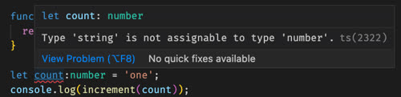
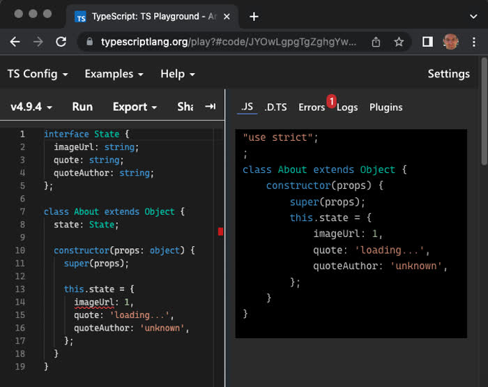

# TypeScript

<iframe src="https://docs.google.com/presentation/d/e/2PACX-1vQjfNA1aBzahkir-nBsWZTN7Dg5EcgKfZTE8pY9bZKQrmTBmCCNpRtYT9HUNLb1sdFEjNHDBGRRQVT0/pubembed?start=false&loop=false&delayms=3000" frameborder="0" width="900" height="540" allowfullscreen="true" mozallowfullscreen="true" webkitallowfullscreen="true"></iframe>

---

📖 **Deeper dive reading**: [Typescript in 5 minutes](https://www.typescriptlang.org/docs/handbook/typescript-in-5-minutes.html)

TypeScript adds static type checking to JavaScript. This provides type checking while you are writing the code to prevent mistakes like using a string when a number is expected. Consider the following simplistic JavaScript code example.

```js
function increment(value) {
  return value + 1;
}

let count = 'one';
console.log(increment(count));
```

When this code executes the console will log `one1` because the count variable was accidentally initialized with a string instead of a number.

## Possible types

The following table defines the most common types. If you don't explicitly provide a type then it defaults to `any`. This means that it can represent any possible type. Usually you want to avoid using `any` because it defeats one of the main reasons for using TypeScript.

| Type           | Description                                                                              |
| -------------- | ---------------------------------------------------------------------------------------- |
| `string`       | Represents textual data.                                                                 |
| `number`       | Represents numeric values, including integers and floating-point numbers.                |
| `boolean`      | Represents `true` or `false`.                                                            |
| `bigint`       | Represents large integers beyond the `number` type limit.                                |
| `null`         | Represents an explicitly empty value.                                                    |
| `undefined`    | Represents a variable that has been declared but not assigned a value.                   |
| `any`          | A dynamic type that disables type checking.                                              |
| `never`        | Represents values that never occur, such as functions that always throw.                 |
| `type[]`       | Represents a collection (array) of elements of a specific type.                          |
| `[type, type]` | Represents an array with a fixed number of elements where each element has a known type. |

## Using types

With TypeScript you explicitly define the types, and as the JavaScript is transpiled (with something like Babel) an error will be generate long before the code is seen by a user. To provide type safety for our increment function, it would look like this:

```ts
function increment(value: number): number {
  return value + 1;
}

let count: number = 'one';
console.log(increment(count));
```

With TypeScript enabled, VS Code will analyze the code and give you an error about the invalid type conversion.



In addition to defining types for function parameters, you can define the types of object. For example, when defining a _Bid_ class, you can define object types with the `type` keyword, or by implicitly creating an object property.

```ts
type Product = {
  imageUrl: string;
  name: string;
};

export class Bid {
  product: Product;
  state: {
    quote: string;
    price: number;
  };

  constructor(product: Product) {
    this.product = product;
    this.state = {
      quote: 'loading...',
      price: 0,
    };
  }
}
```

You can likewise specify the type of a React function style component's properties with an inline object definition.

```ts
function Clicker(props: { initialCount: number }) {
  const [count, updateCount] = React.useState(props.initialCount);

  return <div onClick={() => updateCount(1 + count)}>Click count: {count}</div>;
}
```

## Interfaces

Because it is so common to define object property types, TypeScript introduced the use of the `interface` keyword to define a collection of parameters and types that an object must contain in order to satisfy the interface type. For example, a Book interface might look like the following.

```ts
interface Book {
  title: string;
  id: number;
}
```

You can then create an object and pass it to a function that requires the interface.

```ts
function catalog(book: Book) {
  console.log(`Cataloging ${book.title} with ID ${book.id}`);
}

const myBook = { title: 'Essentials', id: 2938 };
catalog(myBook);
```

### Declaration merging

Declaration merging is a unique TypeScript feature where the compiler merges multiple declarations with the same name into a single definition. While `type` aliases cannot be changed once created, **interfaces** are "open-ended," meaning they can be defined multiple times across different modules or blocks, and TypeScript will automatically combine their properties. This allows for the non-destructive extension of existing types, which is particularly useful when augmenting global objects or third-party library definitions without modifying the original source code.

```typescript
interface Product {
  id: string;
  price: number;
}

// TypeScript merges this second declaration into the original Product interface
interface Product {
  description: string;
}

const item: Product = {
  id: "A101",
  price: 29.99,
  description: "A high-quality wireless mouse."
};
```


## Beyond type checking

TypeScript also provides other benefits, such as warning you of potential uses of an uninitialized variable. Here is an example of when a function may return null, but the code fails to check for this case.


You can correct this problem with a simple `if` block.

```ts
const containerEl = document.querySelector<HTMLElement>('#picture');
if (containerEl) {
  const width = containerEl.offsetWidth;
}
```

Notice that in the above example, the return type is coerced for the `querySelector` call. This is required because the assumed return type for that function is the base class `Element`, but we know that our query will return the subclass `HTMLElement` and so we need to cast that to the subclass with the `querySelector<HTMLElement>()` syntax.

### Unions

TypeScript introduces the ability to define the possible values for a new type. This is useful for doing things like defining an enumerable or possible types.

With plain JavaScript you might create an enumerable with a class.

```js
export class AuthState {
  static Unknown = new AuthState('unknown');
  static Authenticated = new AuthState('authenticated');
  static Unauthenticated = new AuthState('unauthenticated');

  constructor(name) {
    this.name = name;
  }
}
```

With TypeScript you can define this by declaring a new type and defining what its possible values are.

```ts
type AuthState = 'unknown' | 'authenticated' | 'unauthenticated';

let auth: AuthState = 'authenticated';
```

You can also use unions to specify all of the possible types that a variable can represent.

```ts
function square(n: number | string) {
  if (typeof n === 'string') {
    console.log(`{$n}^2`);
  } else {
    console.log(n * n);
  }
}
```

### Enum

TypeScript also supports enumerations. This adds the benefit of using symbols instead of strings for values.

```ts
enum AuthState {
  Authenticated = 'authenticated',
  Unauthenticated = 'unauthenticated',
}

let auth: AuthState = AuthState.Authenticated;
```


In TypeScript, numeric enums benefit from a unique feature called **reverse mapping**, which allows you to retrieve the name of an enum member if you have its numeric value. When a numeric enum is compiled, TypeScript generates an object that maps property names to values and property values back to names. This is particularly useful for debugging or logging when you only have access to the raw underlying value but need the human-readable identifier. It is important to note that this behavior is exclusive to numeric enums; string enums do not support reverse mapping.

```typescript
enum Status {
  Pending = 1,
  Success,
  Error,
}

// Standard mapping: Name to Value
const statusCode = Status.Success; 
console.log(statusCode); // Output: 2

// Reverse mapping: Value to Name
const statusName = Status[statusCode]; 
console.log(statusName); // Output: "Success"
```


### Generics
Generics allow you to create reusable components that work with a variety of types rather than a single one. They act as "type variables" that capture the type provided by the user.

```typescript
function identity<T>(arg: T): T {
  return arg;
}

let output = identity<string>("myString");
```

### Discriminated Unions
A discriminated union is a pattern used to create a type that could be one of several different shapes. By including a common property with a literal type (the "discriminant"), TypeScript can narrow down which specific type you are working with in a conditional block.

```typescript
interface Circle {
  kind: "circle";
  radius: number;
}

interface Square {
  kind: "square";
  sideLength: number;
}

type Shape = Circle | Square;

function getArea(shape: Shape) {
  switch (shape.kind) {
    case "circle":
      return Math.PI * shape.radius ** 2;
    case "square":
      return shape.sideLength ** 2;
  }
}
```

### Type Guards and Type Predicates
Type narrowing allows you to refine a type to a more specific version. While `typeof` and `instanceof` are standard JavaScript guards, TypeScript allows for custom **Type Predicates** using the `parameterName is Type` syntax.

```typescript
function isString(value: unknown): value is string {
  return typeof value === "string";
}

const data: unknown = "Hello";

if (isString(data)) {
  console.log(data.toUpperCase()); // TypeScript knows data is a string here
}
```

### The `unknown` vs. `any` Types
While `any` opts out of type checking entirely, `unknown` is the type-safe counterpart. You can assign anything to `unknown`, but you cannot perform operations on it until it is narrowed to a specific type.

```typescript
let valueAny: any = 10;
let valueUnknown: unknown = 10;

valueAny.toUpperCase(); // Allowed, but might crash at runtime
valueUnknown.toUpperCase(); // Error: Object is of type 'unknown'
```

### The `never` Type
The `never` type represents values that should never occur. It is commonly used for functions that always throw an exception or for exhaustive checks in switch statements to ensure every possible case of a union is handled.

```typescript
function fail(message: string): never {
  throw new Error(message);
}
```

### Utility Types
TypeScript provides built-in transformations called Utility Types to facilitate common type manipulations:

*   **`Partial<T>`**: Makes all properties in `T` optional.
*   **`Readonly<T>`**: Makes all properties in `T` immutable.
*   **`Pick<T, K>`**: Creates a type by picking a set of properties `K` from `T`.
*   **`Omit<T, K>`**: Creates a type by removing a set of properties `K` from `T`.
*   **`Record<K, T>`**: Constructs an object type with keys `K` and values `T`.

### Mapped Types
Mapped types allow you to create new types based on the properties of an existing type. They use a syntax similar to index signatures.

```typescript
type OptionsFlags<Type> = {
  [Property in keyof Type]: boolean;
};

type FeatureFlags = {
  darkMode: () => void;
  newUser: () => void;
};

type FeatureOptions = OptionsFlags<FeatureFlags>;
// Result: { darkMode: boolean; newUser: boolean; }
```

### Template Literal Types
Template literal types build on string literal types and have the ability to expand into many strings via unions. They use the same syntax as template literals in JavaScript but are used in type positions.

```typescript
type World = "world";
type Greeting = `hello ${World}`; // "hello world"

type Color = "red" | "blue";
type Intensity = "light" | "dark";
type Palette = `${Intensity}-${Color}`; 
// "light-red" | "light-blue" | "dark-red" | "dark-blue"
```

### Indexed Access Types
You can use an indexed access type to look up a specific property on another type.

```typescript
type Person = { age: number; name: string; alive: boolean };
type Age = Person["age"]; // number
```

### Const Assertions
Using `as const` signals to TypeScript that a specific object should be treated as a literal type rather than a general version of that type (e.g., making an array a read-only tuple).

```typescript
let colors = ["red", "green", "blue"] as const;
// colors is now of type readonly ["red", "green", "blue"]
```


## Using TypeScript

### Experimenting

If you would like to experiment with TypeScript you can easily use [CodePen](https://codepen.io), or the official [TypeScript playground](https://www.typescriptlang.org/play). The TypeScript playground has the advantage of showing you inline errors and what the resulting JavaScript will be.



### TypeScript with Vite

Vite automatically supports the use of TypeScript. That means you can simply write your components with TypeScript.

#### app.tsx

```tsx
import React, { JSX } from 'react';
import ReactDOM from 'react-dom/client';

interface Props {
  greeting: string;
  count?: number;
}

function App({ greeting, count = 3 }: Props): JSX.Element {
  return (
    <div>
      {Array.from({ length: count }).map((_, index: number) => (
        <h1 key={index}>{greeting}, World!</h1>
      ))}
    </div>
  );
}

const root = ReactDOM.createRoot(document.getElementById('root'));
root.render(<App greeting='hello' />);
```

### TypeScript with Node.js

Node LTS version 22 introduced experimental use of TypeScript with the expectation of it being enabled by default in future versions.

**index.ts**

```ts
function add(a: number, b: number | string): number {
  if (typeof b === 'string') {
    b = parseInt(b, 10);
  }
  return a + b;
}

const x: number = 3;
const result: number = add(x, '3');

console.log(result);
```

The following will run the above code with Node.js but it will display several warning messages.

```sh
node --experimental-transform-types index.ts

6
```

Node LTS version 24 handles TypeScript right out of the box. 

```sh
node index.ts

6
```

### Installing type bundles

Some NPM packages put their type information in different packages. For example, to install the Node and React types you would execute the following.

```sh
npm install -D @types/node
npm install -D @types/react
```

### Typescript with an existing application

If you want to convert an existing application, then install the NPM `typescript` package to your development dependencies.

```sh
npm install -D typescript
```

This will only include typescript package when you are developing and will not distribute it with a production bundle.

## Exercises


```masteryls
{"id":"6f48a958-b994-44f4-a682-230e7563ece9", "title":"Defining a Tuple", "type":"multiple-choice"}
In TypeScript, which of the following is the correct syntax to define a **tuple** that must contain exactly two elements: a `string` followed by a `number`?

- [ ] `let user: (string, number) = ["Alice", 30];`
- [x] `let user: [string, number] = ["Alice", 30];`
- [ ] `let user: Array<string, number> = ["Alice", 30];`
- [ ] `let user: string | number[] = ["Alice", 30];`
```


```masteryls
{"id":"98add419-6f1f-4941-8fb5-f0c980ee463b", "title":"Understanding the 'any' Type", "type":"multiple-choice"}
What is the primary consequence of using the `any` type for a variable in TypeScript?

- [ ] It forces the TypeScript compiler to perform exhaustive runtime type checks to ensure the variable's value matches its usage.
- [ ] It functions identically to the `unknown` type, requiring a type guard or type assertion before any properties on the variable can be accessed.
- [ ] It restricts the variable so that it can only be assigned to other variables that are also explicitly typed as `any`.
- [x] It effectively opts out of type checking for that variable, allowing you to access non-existent properties or call arbitrary methods without a compiler error.
```


```masteryls
{"id":"46ce27c0-7d9e-409f-a1ad-57451d8f53a7", "title":"TypeScript Enum Reverse Mapping", "type":"multiple-choice"}
In TypeScript, how does the behavior of reverse mapping (looking up a member name by its value) differ between numeric enums and string enums?

- [ ] Both numeric and string enums automatically generate reverse mappings in the compiled JavaScript to ensure consistency.
- [x] Numeric enums generate a reverse mapping from value to name, whereas string enums do not support reverse mapping at all.
- [ ] String enums support reverse mapping only if the values are identical to the member names, while numeric enums always support it.
- [ ] Reverse mapping is a feature exclusive to `const enum` declarations to improve runtime lookup performance.
```


````masteryls
{"id":"9a06ca74-cc17-4406-b983-df3566953b3c", "title":"TypeScript Interface Declaration Merging", "type":"multiple-choice"}
In TypeScript, what is the outcome of the following code snippet?

```typescript
interface Employee {
  name: string;
}

interface Employee {
  id: number;
}

const staff: Employee = {
  name: "Jordan",
  id: 101
};
```

- [x] It compiles successfully because TypeScript automatically merges multiple interface declarations with the same name into a single definition.
- [ ] It results in a compiler error: "Duplicate identifier 'Employee'" because interfaces cannot be redefined in the same scope.
- [ ] It compiles, but the `staff` object only requires the `id` property because the second declaration overwrites the first.
- [ ] It results in a runtime error because interfaces are not converted to JavaScript objects and cannot be merged at execution time.
````
