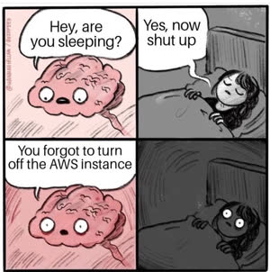

# Wrap up

<iframe src="https://docs.google.com/presentation/d/e/2PACX-1vRci-wz0rzCS8R-f-pZmyCV4GqK6LDs9g3ZiGCg3KmW7jtdTyrG2EeE7sfzLXn8qX6OP_tcenXg0w2X/pubembed?start=false&loop=false&delayms=3000" frameborder="0" width="900" height="540" allowfullscreen="true" mozallowfullscreen="true" webkitallowfullscreen="true"></iframe>

---

We hope that you have enjoyed learning how to build a web application. The concepts you have mastered from this instruction are the same ones that professional software engineers use on a daily basis.

Always remember to continually invest in your capabilities, collaboration, curiosity, creativity, and Christlike skills as you make the world a better place.


```masteryls
{"id":"c979acf0-1bec-47a5-8660-5f49e74de47f", "title":"Course Outcomes", "type":"likert", "showResults":"editor", "required":"true"}
After completing the course, how familiar are you with the course outcomes?

Scale: Beginner|Intermediate|Proficient|Advanced|Expert


| id | statement |
|----|-----------|
|dev|**Full-Stack Web Application Development**|
|arch|**Web Architecture**|
|ai|**AI-Augmented Development**|
|sec|**Security and Societal Impact**|
|devop|**Deployment and Application Management**|
```


## Clean up AWS

After everything has been graded, you should consider cleaning up your resources on AWS.



- Terminate your EC2 instance ($3.00 - $5.00/month depending upon instance type)
- Disassociate and release your elastic IP address ($3.00/month for unassociated instances)
- Make sure you do not have auto renew set for your domain name ($3.00/year for .click)
- Delete your Route 53 hosted zone for your domain name ($0.50/month)
- Clean up your security group and key pair. Note that there is no charge for these.

## ☑ Assignment - Optional

Please take the time to provide us with honest feedback by responding to the university student ratings survey.
