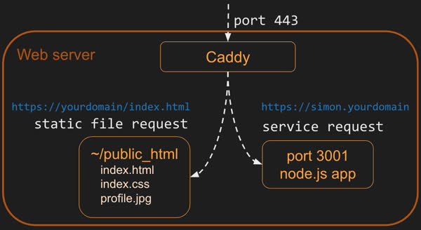
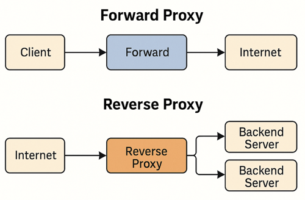

# Caddy


📖 **Recommended reading**: [Getting Started](https://caddyserver.com/docs/getting-started)


> “Imperfect member of the restored Church of Jesus Christ. Husband. Father. Stepdad.”
>
> — Matt Holt (_Source_: [Twitter](https://twitter.com/mholt6))

Released in 2020, Matt Holt combined the power of building an HTTP server using the [Go programming language](https://go.dev/) with the ease of generating TLS certificates using [LetsEncrypt](https://letsencrypt.org/).

Caddy is a web service that listens for incoming HTTP requests. Caddy then either serves up the requested static files or routes the request to another web service. This ability to route requests is called a `gateway`, or `reverse proxy`, and allows you to expose multiple web services (i.e. your project services) as a single external web service (i.e. Caddy).

For this course, we use Caddy for the following reasons.

- Caddy handles all of the creation and rotation of web certificates. This allows us to easily support HTTPS.
- Caddy serves up all of your static HTML, CSS, and JavaScript files. All of your early application work will be hosted as static files.
- Caddy acts as a gateway for subdomain requests to your Simon and startup application services. For example, when a request is made to `simon.yourdomain` Caddy will proxy the request to the Simon application running with node.js as an internal web service.



Caddy is preinstalled and configured on your server and so you do not need to do anything specifically with it other than configure your root domain name.

## Important Caddy files

As part of the installation of Caddy we created two links in the Ubuntu user's home directory that point to the key Caddy configuration files. The links were created in the home directory so that you do not have to hunt around your server looking for these files.

- **Configuration file**: `~/Caddyfile`

  Contains the definitions for routing HTTP requests that Caddy receives. This is used to determine the location where static HTML files are loaded from, and also to proxy requests into the services you will create later. Except for when you configure the domain name of your server, you should never have to modify this file manually. However, it is good to know how it works in case things go wrong. You can read about this in the [Caddy Server documentation](https://caddyserver.com/docs/caddyfile).

- **HTML files**: `~/public_html`

  This is the directory of files that Caddy serves up when requests are made to the root or your web server. This is configured in the Caddyfile discussed above. If you actually look at the Caddyfile you will see that the static file server is mapped to `/usr/share/caddy`. That is the location that the file link in the Ubuntu user's home directory, `~/public_html`, is pointing to.

  ```
  :80 {
        root * /usr/share/caddy
        file_server
  }
  ```

  Therefore, according to this configuration, whenever Caddy receives an HTTP request for any domain name on port 80 it will use the path of the request to find a corresponding file in this directory. For example, a request for `http://yourdomainname/index.html` will look for a file named `index.html` in the `public_html` directory.

## Proxy Servers

A **proxy server** acts as an intermediary between a client and a server. It handles requests and responses, often providing benefits like security, anonymity, load balancing, and caching.

There are two main types:

### Forward Proxy

- **Sits in front of the client**
- **Forwards client requests** to external servers
- Used for content filtering, hiding client identity, or bypassing restrictions

### Reverse Proxy

- **Sits in front of the server**
- **Handles incoming client requests** and routes them to internal servers
- Used for load balancing, SSL termination, caching, and hiding backend architecture

### Proxy comparison table

| Feature           | Forward Proxy              | Reverse Proxy              |
| ----------------- | -------------------------- | -------------------------- |
| Placement         | In front of **clients**    | In front of **servers**    |
| Who it hides      | The **client**             | The **server**             |
| Common use        | Anonymity, filtering       | Load balancing, protection |
| Awareness         | Client knows it's using it | Client is unaware          |
| Request direction | Client -> Proxy -> Server  | Client -> Proxy -> Server  |

Both proxies handle **requests and responses**, so the term "reverse" doesn’t refer to data flow but to **reversed roles**.

### Visualizing the Difference



These diagrams show that traffic flows the same way, but with the forward proxy the client is proxied. With the reverse proxy the **role of the proxy is reversed** and the server is proxied.

## Exercises


```masteryls
{"id":"a34ac072-d0cd-45ca-99b7-cd68de602b76", "title":"Defining Caddy", "type":"multiple-choice"}
Which of the following best describes **Caddy** and its primary distinguishing feature in a modern web infrastructure?

- [ ] A proprietary load balancer and hardware firewall designed for enterprise data centers.
  Good effort. Caddy does route traffic.

  It's open-source software that runs on ordinary servers, though, not proprietary hardware.

  Reread the introduction to the Caddy lesson.

- [ ] A specialized Python-based static site generator that compiles Markdown into optimized HTML.
  You're thinking about static sites, which Caddy can serve.

  Caddy isn't a site generator, though, and it isn't written in Python.

  Revisit the introduction to the Caddy lesson.

- [ ] A distributed key-value store used primarily for service discovery and secret management.
  Good effort. Distributed key-value stores are useful infrastructure.

  Caddy is a web server, though, not a data store.

  Reread the introduction to the Caddy lesson.

- [x] An open-source, extensible web server written in Go that provides automatic HTTPS by default.
  **Correct!** Caddy is written in Go, and it automatically obtains and renews TLS certificates from Let's Encrypt.

  That makes HTTPS work with almost no configuration. In this course, it also serves your static files and acts as a reverse proxy for your services.
```


```masteryls
{"id":"2a9e30d3-27d0-47be-b272-479c14333b73", "title":"Reverse vs. Forward Proxies", "type":"multiple-choice"}
In the context of web architecture and Caddy configuration, what is the primary functional difference between a reverse proxy and a forward proxy?

- [ ] A reverse proxy is used by clients to bypass local firewalls, while a forward proxy is used by servers to hide their internal IP addresses.
  Good effort. You've picked up the idea of hiding IP addresses and bypassing restrictions.

  The roles are reversed, though. Clients use *forward* proxies, and servers use *reverse* proxies.

  Reread the *Forward Proxy* and *Reverse Proxy* sections.

- [x] A reverse proxy sits in front of one or more web servers to intercept and route incoming requests from the internet, while a forward proxy sits in front of clients to manage and filter outgoing requests to the internet.
  **Exactly right!** A reverse proxy represents the *servers*, and a forward proxy represents the *clients*.

  Caddy acts as a reverse proxy for you, receiving every request on port 443 and routing it to the right service. A forward proxy, like a corporate web filter, does the opposite for users going out to the internet.

- [ ] Caddy only supports reverse proxying for HTTPS traffic, whereas forward proxying is required for legacy HTTP/1.1 connections.
  You're thinking about protocol support, which matters.

  The difference between these proxies isn't about HTTP versions, though. It's about which side of the connection they act for.

  Revisit the *Proxy comparison table*.

- [ ] A forward proxy is used to distribute load across multiple backend instances, while a reverse proxy is used exclusively for encrypting traffic via TLS.
  Good effort. Load balancing and TLS are both proxy features.

  Load balancing across backend instances is a *reverse* proxy job, though. Forward proxies sit in front of clients.

  Reread the *Proxy comparison table*.
```


