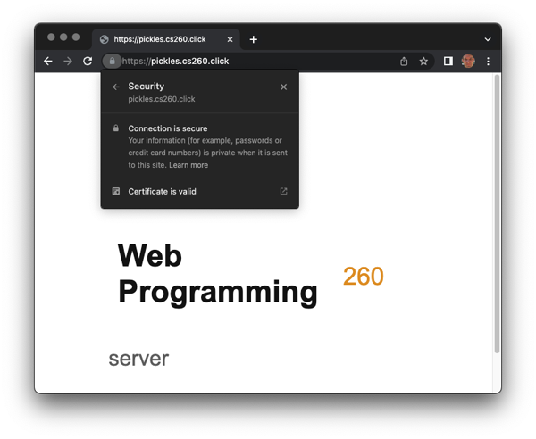

# Startup AWS


## Prerequisites

> [!IMPORTANT]
>
> Before you start work on this deliverable make sure you have read all of the proceeding instruction topics and have completed all of the dependant exercises (topics marked with a ☑). This includes:

- ☑ [Amazon Web Services - EC2](../amazonWebServicesEc2/amazonWebServicesEc2.md)
- [Domain names](../domainNames/domainNames.md)
- ☑ [Amazon Web Services - Route 53](../amazonWebServicesRoute53/amazonWebServicesRoute53.md)
- [Caddy](../caddy/caddy.md)
- ☑ [HTTPS, TLS, and certificates](../https/https.md)

Failing to do this will likely slow you down as you will not have the required knowledge to complete the deliverable.

## Getting started

This startup just requires you to create your AWS web server and set up a DNS Route53 domain for your server.
You need to follow the instructions with exactness.  
Typing in one wrong character can cause your server to not respond or to crash with an error.

When you are finished, the placeholder for your startup will be available from `https://startup.yourdomainname`.

## 🚀 Deliverable

1. [Set up your AWS account](../../essentials/awsAccount/awsAccount.md) using your byu.edu email address.
1. [Create a new EC2 instance](../amazonWebServicesEc2/amazonWebServicesEc2.md) and access the server using `http://x.x.x.x` (where x.x.x.x is your IP address).
1. [Lease a domain](../amazonWebServicesRoute53/amazonWebServicesRoute53.md) in Route53. Make sure you respond to the email that they will send you.
1. Make sure that you can access your server through HTTP through http://startup.yourdomain (where yourdomain is replaced with the domain you leased from Route53)
1. [Edit your Caddyfile](../https/https.md) so that you can access your server through HTTPS.
1. You should see the default web page displayed through HTTPS 
1. You should see the default startup pages with a URL like https://startup.yourdomain



## Grading Rubric

> [!IMPORTANT]
>
> Submit your Startup URL that includes your domain name for this deliverable (e.g. `https://startup.yourdomain`). **Do not** submit your GitHub repository URL.

- **Prerequisite**: Notes in your startup Git repository README.md file documenting what you modified and added with this deliverable. The TAs will only grade things that have been clearly described as being completed. Review the [voter app](https://github.com/webprogramming260/startup-example) as an example.

- 10% Rented an EC2 server from AWS and it is accessible.
- 10% Leased a domain name and associated it with my server.
- 80% My server is available using your hostname. For example: `https://yourdomainnamehere.click`


```masteryls
{"id":"6edadab4-91ee-46f0-952e-469f42dc841e", "title":"Startup AWS Deliverable", "type":"url-submission", "syncGrade":true, "autoGrade":true, "gradingCriteria":"The content must contain the text `web programming 260`. The URL protocol must be HTTPS." }
After completing all the prerequisites and rubric items, submit the URL to your startup server. The server must be up and running correctly.

_Example: https://mydomainname.click_
```


## Go celebrate

You did it! You now have a web server that can be seen by anyone in the world.
