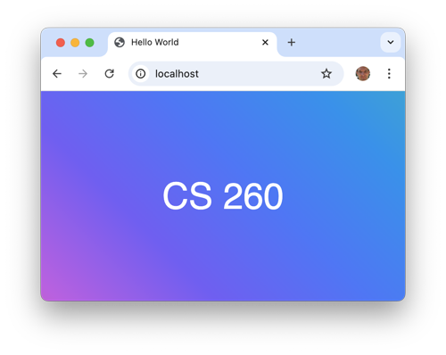
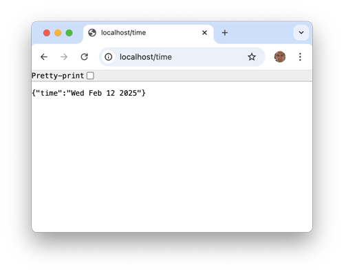

# Web servers

A web server is a computing device that is hosting a web service that knows how to accept incoming internet connections and speak the HTTP application protocol.

## Monolithic web servers

In the early days of web programming, you would buy a massive, complex, expensive, software program that could serve up HTML files and then install it on a hardware device. The package of server hardware and software was considered the web server because the web service software was the only thing running on the server. Eventually, open source web servers became available that made it easy to host a website. Examples of web server software include: Apache HTTP server, Nginx, or Microsoft IIS. However, the web server software was still a separate program from the content, or application, it hosted.

## Combining web and application services

Today, most modern programming languages include libraries that make it easy to serve up web content. This removed the requirement to have a separate program for _hosting_ you application. Instead, your application is also the web service. For example, here is a simple HTTP service written in JavaScript can load up HTML content from a **public** directory.

```go
const express = require('express');
const app = express();

// Serve static files from the 'public' directory
app.use(express.static('public'));

app.listen(80);
```



### Web service endpoints

Being able to easily create web services means that we can completely drop the monolithic web server concept and just build web support right into your application. We can also add web accessible methods, called endpoints, that provide functionality beyond simply serving up static HTML files. For example, by adding three lines of code, we can add an endpoint that returns the current time when you add path `/time` to the browser's URL.

```go
app.get('/time', (req, res) => {
  res.json({ time: new Date().toDateString() });
});
```



## Web service gateways

Since it is so easy to build web services it is common to find multiple web services running on the same computing device. The idea of having multiple services on a single server highlights the difference between a **web server**, the physical computing device, and a **web service**, that provides a web application functionality.

Every web server allows for access to multiple services by referring to a different **port number** for each service. Think of a port as a house address on a given street, and the server as the street. In the example above, the _JavaScript_ web service was assigned port 80. A user could then talk to the image service on port 3000 and the file service on port 3002. However, this makes it difficult for the user of the services to remember what port number matches which service.

To resolve this we introduce a service gateway, or sometimes called a reverse proxy, that is itself a simple web service that listens on the common HTTPS port 443. The gateway then looks at the request URL and maps it to the other services running on a different ports.


Our web server will use a web service application called `Caddy` as the gateway to our services. We will explain the details of how Caddy works later in the instruction.

## Microservices

Web services that provide a single functional purpose are referred to as microservices. By partitioning larger functionality into small logical chunks, you can develop and manage them independently from other functionality in a larger system. They can also handle large fluctuations in user demand by simply running more and more stateless copies of the microservice from multiple virtual servers hosted in a dynamic cloud environment. For example, one microservice for generating your genealogical family tree might be able to handle 1,000 users concurrently. So in order to support 1 million users, you just deploy 1,000 instances of the service running on scalable virtual hardware.

## Serverless

The idea of microservices naturally evolved into the world of `serverless` functionality where the server is conceptually removed from the architecture and you just write code that represents single service endpoint. That endpoint is loaded through an gateway that maps a web request to the endpoint. The gateway automatically scales the hardware needed to host the serverless endpoint based on demand. This reduces what the web application developer needs to think about down to a single independent endpoint.
