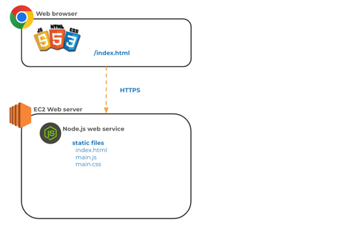
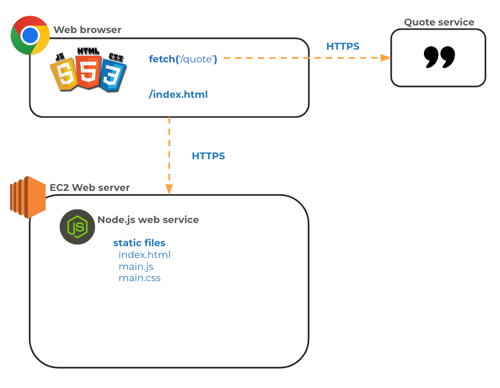
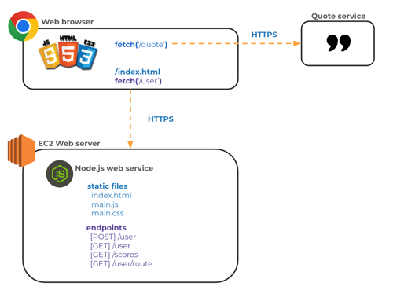
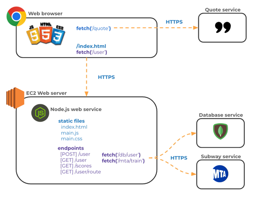

# Web services introduction

Up to this point, your entire application is loaded from your web server and runs on the user's browser. It starts when the browser requests the `index.html` file from the web server. The `index.html`, in turn, references other HTML, CSS, JavaScript, or image files. All of these files, that are running on the browser, comprise the `frontend` of your application.

Notice that when the frontend requests the application files from the web server it is using the HTTPS protocol. All web programming requests between devices use HTTPS to exchange data.



From our frontend JavaScript we can make requests to external services running anywhere in the world. This allows us to get external data, such as an inspirational quote, that we then inject into the DOM for the user to read. To make a web service request, we supply the URL of the web service to the `fetch` function that is built into the browser.



The next step in building a full stack web application, is to create our own web service. Our web service will provide the static frontend files along with functions to handle `fetch` requests for things like storing data persistently, providing security, running tasks, executing application logic that you don't want your user to be able to see, and communicating with other users. The functionality provided by your web service represents the `backend` of your application.

Generally the functions provided by a web service are called `endpoints`, or sometimes APIs. You access the web service endpoints from your frontend JavaScript with the fetch function. In the picture below, the backend web service is not only providing the static files that make up the frontend, but also providing the web service endpoints that the frontend calls to do things like get a user, create a user, or get high scores.



The backend web service can also use `fetch` to make requests to other web services. For example, in the image below the frontend uses `fetch` to request the user's data from the backend web service. The backend then uses `fetch` to call two other web services, one to get the user's data from the database, and another one to request subway routes that are near the user's home. That data is then combined together by the backend web service and returned to the frontend for display in the browser.



In following instruction we will discuss how to use fetch, HTTP, and URLs, and build a web service using the Node.js application. With all of this in place your application will be a full stack application comprised of both a frontend and a backend.

```masteryls
{"id":"24dca640-d993-41b1-a213-a01c4112b28e", "title":"Front-End Data Retrieval", "type":"multiple-choice"}
In a modern web architecture, how does a front-end application typically interact with a web service to display dynamic data without reloading the entire page?

- [ ] By establishing a direct connection to the back-end SQL database to execute queries via the browser.
- [x] By sending asynchronous HTTP requests to API endpoints and processing the returned data, such as JSON.
- [ ] By using the SMTP protocol to request formatted text files from the web server's file system.
- [ ] By downloading the entire back-end application logic to run data processing locally on the client's hardware.
```

```masteryls
{"id":"6d266946-5690-4e6c-a425-8c4a55b69202", "title":"Role of Back-End Applications", "type":"multiple-choice"}
In the context of a web service architecture, what is the primary responsibility of the back-end application?

- [ ] Rendering the user interface and handling client-side animations within the web browser
- [x] Processing incoming requests, executing business logic, and managing data persistence
- [ ] Managing the physical network infrastructure and hardware cooling systems in a data center
- [ ] Translating domain names into IP addresses through the Domain Name System (DNS)
```
