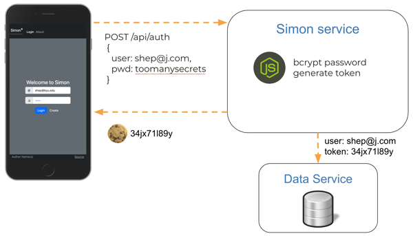
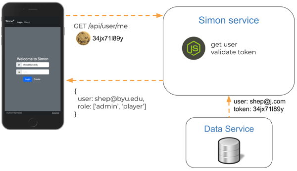
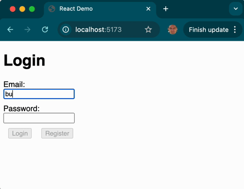

# Account creation and login

You support secure authentication in a web application by first providing a way for users to uniquely identify themselves. This usually requires three service endpoints. One to initially `register`, a second to `login` on future visits, and a third to `logout`. Once a user is authenticated we can control access to other authorized endpoints such as getting user data or making purchases. The following demonstrates how to make this all work correctly.

## Endpoint design

First, let's define what each of our endpoints do by creating simple Curl commands. We can also use these commands to test the endpoints when we are done.

| Endpoint     | Purpose                                          |
| ------------ | ------------------------------------------------ |
| Registration | Create account (create user and auth)            |
| Login        | Log into account (create auth)                   |
| Logout       | Logout of account (delete auth)                  |
| Get Me       | Returns information about the authenticated user |

### Registration endpoint

Given an email and password, return a cookie containing the authentication token. If the email already exists, the return 409 (conflict).

```http
POST /api/auth HTTP/2
Content-Type: application/json
{
  "email":"marta@id.com",
  "password":"toomanysecrets"
}

HTTP/2 200 OK
Content-Type: application/json
Set-Cookie: auth=tokenHere
{
  "email":"marta@id.com"
}
```

### Login authentication endpoint

Given an email and password, return a cookie containing the authentication token. If the email does not exist or the password is bad, return 401 (unauthorized).

```http
POST /api/auth HTTP/2
Content-Type: application/json
{
  "email":"marta@id.com",
  "password":"toomanysecrets"
}

HTTP/2 200 OK
Content-Type: application/json
Set-Cookie: auth=tokenHere
{
  "email":"marta@id.com"
}
```

### Logout authentication endpoint

Given a cookie containing an authentication token, mark the token as invalid for future use. Always return 200 (ok).

```http
DELETE /api/auth HTTP/2
Cookie: auth=tokenHere

HTTP/2 200 OK
Content-Type: application/json
{
}
```

### GetMe endpoint

Given a cookie containing an authentication token, return the authenticated user. If the token is invalid, or the user does not exist, return a `401 (unauthorized)` .

```http
GET /api/user HTTP/2
Cookie: auth=tokenHere

HTTP/2 200 OK
Content-Type: application/json
{
  "email":"marta@id.com"
}
```

## Web service

With our service endpoints defined, we can start building our web service by stubbing out each of the endpoints.

**service.js**

```js
const express = require('express');
const app = express();

// registration
app.post('/api/auth', async (req, res) => {
  res.send({ email: 'marta@id.com' });
});

// login
app.put('/api/auth', async (req, res) => {
  res.send({ email: 'marta@id.com' });
});

// logout
app.delete('/api/auth', async (req, res) => {
  res.send({});
});

// getMe
app.get('/api/user', async (req, res) => {
  res.send({ email: 'marta@id.com' });
});

app.listen(3000);
```

Using the above code, we build the authorization application with the following steps.

1. Create a directory called `authTest` for the project.
1. Save the above code to a file named `service.js`. This is our starting web service.
1. Run `npm install express cookie-parser uuid bcryptjs` to install all of the packages we are going to use.
1. Run `node --watch service.js` or press `F5` in VS Code to start up the web service.
1. Validate that everything is working by opening a console window and use `curl` to try out one of the endpoints.

   ```sh
   curl -X POST localhost:3000/api/auth -d '{"email":"test@id.com", "password":"a"}'

   {"email":"marta@id.com"}
   ```

## Handling requests

With our service stubbed out, we now begin to fill in the registration endpoint. The first step is to read the credentials from the body of the HTTP request. Since the body is designed to contain JSON we need to tell Express to automatically parse any HTTP requests that have a content type of `application/json` into a JavaScript object. We do this with by installing the `express.json` middleware and reading the JSON object from the `req.body`.

For now, we simply demonstrate that the JSON parsing is working by echoing the request body back in the response.

```js
app.use(express.json());

app.post('/api/auth', (req, res) => {
  res.send(req.body);
});
```

Test that it is working with a `curl` command.

```sh
curl -X POST localhost:3000/api/auth -H "Content-Type: application/json" -d '{"email":"test@id.com", "password":"a"}'

{"email":"test@id.com","password":"a"}
```

### Storing users and hashing passwords

Now that we have proven that we can parse a request body correctly, we want to create a function that will actually create the user and store it in memory. We also want to properly manage passwords by storing a cryptographically hashed version of the original password. Hashing the password protects our user in case our database gets compromised.

To hash our passwords, we use the `bcryptjs` package. This creates a very secure one-way hash of the password. If you are curious about how [bcrypt](https://en.wikipedia.org/wiki/Bcrypt) works, it is definitely worth the time. Here is our resulting code.

```js
const bcrypt = require('bcryptjs');

const users = [];

async function createUser(email, password) {
  const passwordHash = await bcrypt.hash(password, 10);

  const user = {
    email: email,
    password: passwordHash,
  };

  users.push(user);

  return user;
}

function getUser(field, value) {
  if (value) {
    return users.find((user) => user[field] === value);
  }
  return null;
}
```

### Simple registration endpoint

We now implement the registration endpoint by first checking to see if we already have a user with that email address. If the user already exists, then we immediately return a 409 (conflict) status code. Otherwise we create a new user and only return the user's email.

```js
app.post('/api/auth', async (req, res) => {
  if (await getUser('email', req.body.email)) {
    res.status(409).send({ msg: 'Existing user' });
  } else {
    const user = await createUser(req.body.email, req.body.password);
    res.send({ email: user.email });
  }
});
```

## Secure registration endpoint

To complete the registration endpoint, we need to generate an authorization token and store it on the browser using an HTTP cookie.

### Generating authentication tokens

To generate a random authentication token we use the `uuid` NPM package. [UUID](https://en.wikipedia.org/wiki/Universally_unique_identifier) stands for Universally Unique Identifier, and it does a really good job creating a hard to guess, random, unique ID.

```js
const uuid = require('uuid');

token: uuid.v4();
```

### Generating cookies

When a user successfully registers, or logs in, we generate and store the authentication token and send a cookie containing the token as part of the HTTP response.



To generate an HTTP cookie we use the `cookie-parser` NPM package. Cookie parser does all the work of sending a cookie to the browser and parsing it when the browser makes subsequent requests.

We want to make it as secure as possible, and so we use the cookie `httpOnly`, `secure`, and `sameSite` options.

- `httpOnly` tells the browser to not allow JavaScript running on the browser to read the cookie.
- `secure` requires HTTPS to be used when sending the cookie back to the server.
- `sameSite` will only return the cookie to the domain that generated it.

```js
const cookieParser = require('cookie-parser');
app.use(cookieParser());

// Create a token for the user and send a cookie containing the token
function setAuthCookie(res, user) {
  user.token = uuid.v4();

  res.cookie('token', user.token, {
    secure: true,
    httpOnly: true,
    sameSite: 'strict',
  });
}
```

### Complete registration code

The following shows all of the code necessary to generate a token and then stores it on the browser in an HTTP cookie. This is done by calling the `setAuthCookie` function from the registration and login endpoints.

```js
const cookieParser = require('cookie-parser');
const uuid = require('uuid');

app.use(cookieParser());

function setAuthCookie(res, user) {
  user.token = uuid.v4();

  res.cookie('token', user.token, {
    secure: true,
    httpOnly: true,
    sameSite: 'strict',
  });
}

// Registration endpoint
app.post('/api/auth', async (req, res) => {
  if (await getUser('email', req.body.email)) {
    res.status(409).send({ msg: 'Existing user' });
  } else {
    const user = await createUser(req.body.email, req.body.password);

    setAuthCookie(res, user);

    res.send({ email: user.email });
  }
});
```

## Login endpoint

The login endpoint needs to get the hashed password that was stored for the user, compare it to the provided password using `bcrypt.compare`, and if successful set the authentication token in the cookie. If the password does not match, or there is no user with the given email, the endpoint returns status 401 (unauthorized).

```js
app.put('/api/auth', async (req, res) => {
  const user = await getUser('email', req.body.email);
  if (user && (await bcrypt.compare(req.body.password, user.password))) {
    setAuthCookie(res, user);

    res.send({ email: user.email });
  } else {
    res.status(401).send({ msg: 'Unauthorized' });
  }
});
```

## Logout endpoint

If the the provided token represents an actual authenticated user, then the token and cookie are deleted. If there is no user for the token then the request is ignored.

```js
app.delete('/api/auth', async (req, res) => {
  const token = req.cookies['token'];
  const user = await getUser('token', token);
  if (user) {
    clearAuthCookie(res, user);
  }

  res.send({});
});

function clearAuthCookie(res, user) {
  delete user.token;
  res.clearCookie('token');
}
```

## GetMe endpoint

With everything in place to register and login using the credentials, we can now implement the secure `getMe` endpoint. To implement this we get the user object from the database by querying on the authentication token.



If there is not an authentication token, or there is no user with that token, we return status 401 (unauthorized).

```js
app.get('/api/user/me', async (req, res) => {
  const token = req.cookies['token'];
  const user = await getUser('token', token);
  if (user) {
    res.send({ email: user.email });
  } else {
    res.status(401).send({ msg: 'Unauthorized' });
  }
});
```

## The final login backend code

Here is the full example code.

```js
const express = require('express');
const app = express();
const cookieParser = require('cookie-parser');
const uuid = require('uuid');
const bcrypt = require('bcryptjs');

app.use(express.json());
app.use(cookieParser());

app.post('/api/auth', async (req, res) => {
  if (await getUser('email', req.body.email)) {
    res.status(409).send({ msg: 'Existing user' });
  } else {
    const user = await createUser(req.body.email, req.body.password);
    setAuthCookie(res, user);

    res.send({ email: user.email });
  }
});

app.put('/api/auth', async (req, res) => {
  const user = await getUser('email', req.body.email);
  if (user && (await bcrypt.compare(req.body.password, user.password))) {
    setAuthCookie(res, user);

    res.send({ email: user.email });
  } else {
    res.status(401).send({ msg: 'Unauthorized' });
  }
});

app.delete('/api/auth', async (req, res) => {
  const token = req.cookies['token'];
  const user = await getUser('token', token);
  if (user) {
    clearAuthCookie(res, user);
  }

  res.send({});
});

app.get('/api/user/me', async (req, res) => {
  const token = req.cookies['token'];
  const user = await getUser('token', token);
  if (user) {
    res.send({ email: user.email });
  } else {
    res.status(401).send({ msg: 'Unauthorized' });
  }
});

const users = [];

async function createUser(email, password) {
  const passwordHash = await bcrypt.hash(password, 10);

  const user = {
    email: email,
    password: passwordHash,
  };

  users.push(user);

  return user;
}

async function getUser(field, value) {
  if (value) {
    return users.find((user) => user[field] === value);
  }
  return null;
}

function setAuthCookie(res, user) {
  user.token = uuid.v4();

  res.cookie('token', user.token, {
    secure: true,
    httpOnly: true,
    sameSite: 'strict',
  });
}

function clearAuthCookie(res, user) {
  delete user.token;
  res.clearCookie('token');
}

const port = 3000;
app.listen(port, function () {
  console.log(`Listening on port ${port}`);
});
```

## Experiment

With everything implemented, we can use `curl` to try it out. First start up the web service from VS Code by pressing `F5` and selecting `node.js` as the debugger if you have not already done that. You can set breakpoints on all of the different endpoints to see what they do and inspect the different variables. Then open a console window and run the following `curl` commands. You should see results similar to what is shown below. Note that the `-c` and `-b` parameters tell curl to store and use cookies with the given file.

```sh
curl -X POST localhost:3000/api/auth -H 'Content-Type:application/json' -d '{"email":"지안@id.com", "password":"toomanysecrets"}'
```

```sh
{"email":"지안@id.com"}
```

```sh
curl -c cookie.txt -X PUT localhost:3000/api/auth -H 'Content-Type:application/json' -d '{"email":"지안@id.com", "password":"toomanysecrets"}'
```

```sh
{"email":"지안@id.com"}
```

```sh
curl -b cookie.txt localhost:3000/api/user/me
```

```sh
{"email":"지안@id.com"}
```

## Login frontend code

With the backend service in place, we can create a simple React application that demonstrates the use of the authentication endpoints.



First we need to follow the basic React setup that we discussed in the simple [Hello World React](../../webFrameworks/react/introduction/introduction.md#react-hello-world) app that we created in previous instruction. This includes:

1. Creating an NPM project, installing Vite, and installing React.
   ```sh
   npm init -y
   npm install vite@latest -D
   npm install react react-dom react-router-dom
   ```
1. Configuring Vite to proxy API requests through to the backend when debugging.
1. Creating a basic `index.html` file that loads your React application.
1. Creating your React application in `index.jsx`.

### The authentication components

In the index.jsx file we will set up some simple routing between a **login** component and a user **profile** component.

```jsx
function App() {
  return (
    <BrowserRouter>
      <main>
        <Routes>
          <Route path="/" element={<Login />} exact />
          <Route path="/profile" element={<Profile />} />
        </Routes>
      </main>
    </BrowserRouter>
  );
}
```

The login component will handle the authentication calls to the backend.

```jsx
function Login() {
  const navigate = useNavigate();
  const [email, setEmail] = React.useState('');
  const [password, setPassword] = React.useState('');

  function handleLogin() {
    createAuth('PUT');
  }

  function handleRegister() {
    createAuth('POST');
  }

  async function createAuth(method) {
    const res = await fetch('api/auth', {
      method: method,
      headers: { 'Content-Type': 'application/json' },
      body: JSON.stringify({ email, password }),
    });
    await res.json();
    if (res.ok) {
      navigate('/profile');
    } else {
      alert('Authentication failed');
    }
  }

  return (
    <div>
      <h1>Login</h1>
      <div>
        <label>Email:</label>
        <input type="text" onChange={(e) => setEmail(e.target.value)} required />
      </div>
      <div>
        <label>Password:</label>
        <input type="password" onChange={(e) => setPassword(e.target.value)} required />
      </div>
      <button type="submit" disabled={!(email && password)} onClick={handleLogin}>
        Login
      </button>
      <button type="button" disabled={!(email && password)} onClick={handleRegister}>
        Register
      </button>
    </div>
  );
}
```

The profile component will display the current user and provide the ability to logout.

```jsx
function Profile() {
  const navigate = useNavigate();
  const [userInfo, setUserInfo] = React.useState('');

  React.useEffect(() => {
    (async () => {
      const res = await fetch('api/user/me');
      const data = await res.json();
      setUserInfo(data);
    })();
  }, []);

  function handleLogout() {
    fetch('api/auth', {
      method: 'DELETE',
    });
    navigate('/');
  }

  return (
    <div>
      <h1>Profile</h1>
      <div>Logged in as: {userInfo.email}</div>
      <button type="button" onClick={handleLogout}>
        Logout
      </button>
    </div>
  );
}
```

## Experiment

You can find this complete example [here](exampleCode/login). To run it yourself, take the following steps:

1. Clone the [course instruction repository](https://github.com/webprogramming260/.github) if you haven't already.
1. Navigate to the `instruction/webServices/login/exampleCode/login` directory in your your command console window.
1. Run `npm install` from a console window in the `exampleCode/login` directory.
1. Run `npm install` from a console window in the `exampleCode/login/service` subdirectory.
1. Open up the login application in VS Code and review what it is doing.
1. Run and debug the example by pressing `F5` for the file `exampleCode/login/service/service.js`. You may need to select node.js as the debugger the first time you run.
1. Start the frontend by running `npm run dev` from a console window.
1. Open a browser window and point it to http://localhost:5137.
1. Register, login, logout, and access the protected endpoint to get your user information.
1. Use the browser's debugger to view the authentication communication.
