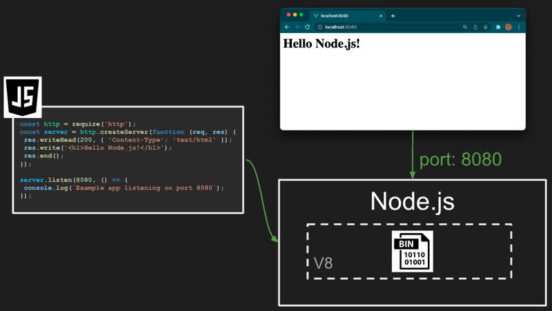

# Node web service

With JavaScript we can write code that listens on a network port (e.g. 80, 443, 3000, or 3000), receives HTTP requests, processes them, and then responds. We can use this to create a simple web service that we then execute using Node.js.

Before you get started, make sure you have properly installed [Node.js](/course/05cf2876-16ce-4db0-864e-caa5d05200ad/topic/d37bc80e-b699-4249-9a11-388e2548fd29) in your development environment. Make sure you have installed the latest **long term support (LTS)** version. You can check what version you have running with the following commands:


```bash
# Check the version of Node.js installed
node -v

# Check the version of NPM installed
npm -v
```

If the installation was successful, these commands will output version numbers (e.g., `v24.14.1` and `11.11.0`). If you receive a "command not found" error, you may need to restart your terminal or manually add the installation directory to your environment variables.

## Using Node.js

Once you have installed Node.js, you are ready to create a Node based service. First you need to create a directory that you can play around with and then throw away. You can then initialize the directory as a **Node** project using the `npm init` command.

```sh
mkdir webservicetest
cd webservicetest
npm init -y
```

Now, open VS Code and create a file named `index.js`. Paste the following code into the file and save.

```js
const http = require('http');
const server = http.createServer(function (req, res) {
  res.writeHead(200, { 'Content-Type': 'text/html' });
  res.write(`<h1>Hello Node.js! [${req.method}] ${req.url}</h1>`);
  res.end();
});

server.listen(3000, () => {
  console.log(`Web service listening on port 3000`);
});
```

This code uses the Node.js built-in `http` package to create our HTTP server using the `http.createServer` function along with a callback function that takes a request (`req`) and response (`res`) object. That function is called whenever the server receives an HTTP request. In our example, the callback always returns the same HTML snippet, with a status code of 200, and a Content-Type header, no matter what request is made. Basically this is just a simple dynamically generated HTML page. A real web service would examine the HTTP path and return meaningful content based upon the purpose of the endpoint.

The `server.listen` call starts listening on port 3000 and blocks until the program is terminated.

We execute the program by going back to our console window and running Node.js to execute our index.js file. If the service starts up correctly then it should look like the following.

```sh
node index.js

Web service listening on port 3000
```

You can now open your browser and point it to `localhost:3000` and view the result. The interaction between the JavaScript, node, and the browser looks like this.



Use different URL paths in the browser and note that it will echo the HTTP method and path back in the document. You can kill the process by pressing `CTRL-C` in the console.

Note that you can also start up Node and execute the `index.js` code directly in VS Code. To do this open index.js in VS Code and press the 'F5' key. This should ask you what program you want to run. Select `node.js`. This starts up Node.js with the `index.js` file, but also attaches a debugger so that you can set breakpoints in the code and step through each line of code.

> [!NOTE]
>
> Make sure you complete the above steps. For the rest of the course you will be executing your code using Node.js to run your backend code and serve up your frontend code to the browser. This means you will no longer be using the `VS Code Live Server extension` to serve your frontend code in the browser.

## Exercise


````masteryls
{"id":"d8fd3c86-0fdd-424c-8f9d-043201e81d2e", "title":"Node HTTP service", "type":"essay" }
Explain what the following code is doing.

```js
const http = require('http');
const server = http.createServer(function (req, res) {
  res.writeHead(200, { 'Content-Type': 'text/html' });
  res.write(`<li>${req.httpVersion}</li><li>[${req.method}]</li><li>${req.url}</li>`);
  res.end();
});

server.listen(3000, () => {
  console.log(`Web service listening on port 3000`);
});
```
````

