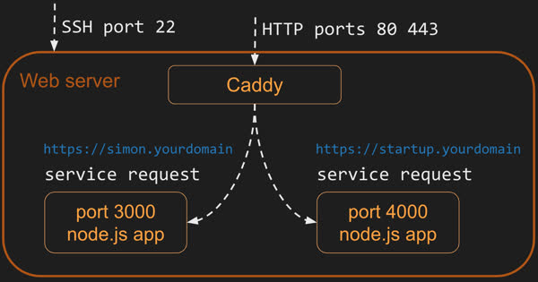

# Ports

When you connect to a device on the internet you need both an IP address and a numbered port. Port numbers allow a single device to support multiple protocols (e.g. HTTP, HTTPS, FTP, or SSH) as well as different types of services (e.g. search, document, or authentication). The ports may be exposed externally, or they may only be used internally on the device. For example, the HTTPS port (443) might allow the world to connect, the SSH port (22) might only allow computers at your school, and a service defined port (say 3000) may only allow access to processes running on the device.

The internet governing body, IANA, defines the standard usage for port numbers. Ports from 0 to 1023 represent standard protocols. Generally a web service should avoid these ports unless it is providing the protocol represented by the standard. Ports from 1024 to 49151 represent ports that have been assigned to requesting entities. However, it is very common for these ports to be used by services running internally on a device. Ports from 49152 to 65535 are considered dynamic and are used to create dynamic connections to a device. [Here](https://www.iana.org/assignments/service-names-port-numbers/service-names-port-numbers.xhtml) is the link to IANA's registry.

### Port Number Ranges
The Internet Assigned Numbers Authority (IANA) categorizes port numbers into three distinct ranges:

| Range Type | Port Numbers | Description |
| :--- | :--- | :--- |
| **Well-Known Ports** | 0 – 1,023 | Reserved for standard system services and core protocols (e.g., HTTP, FTP, SSH). |
| **Registered Ports** | 1,024 – 49,151 | Assigned to specific user processes or applications upon request to IANA (e.g., MySQL, Microsoft SQL). |
| **Dynamic/Private Ports** | 49,152 – 65,535 | Used for temporary connections (ephemeral ports) initiated by client applications. |


Here is a list of common port numbers that you might come across.

| Port | Protocol                                                                                           |
| ---- | -------------------------------------------------------------------------------------------------- |
| 20   | File Transfer Protocol (FTP) for data transfer                                                     |
| 22   | Secure Shell (SSH) for connecting to remote devices                                                |
| 25   | Simple Mail Transfer Protocol (SMTP) for sending email                                             |
| 53   | Domain Name System (DNS) for looking up IP addresses                                               |
| 80   | Hypertext Transfer Protocol (HTTP) for web requests                                                |
| 110  | Post Office Protocol (POP3) for retrieving email                                                   |
| 123  | Network Time Protocol (NTP) for managing time                                                      |
| 161  | Simple Network Management Protocol (SNMP) for managing network devices such as routers or printers |
| 194  | Internet Relay Chat (IRC) for chatting                                                             |
| 443  | HTTP Secure (HTTPS) for secure web requests                                                        |

## Your server ports

As an example of how ports are used we can look at your web server. When you built your web server you externally exposed port 22 so that you could use SSH to open a remote console on the server, port 443 for secure HTTP communication, and port 80 for unsecure HTTP communication.



Your web service, Caddy, is listening on ports 80 and 443. When Caddy gets a request on port 80, it automatically redirects the request to port 443 so that a secure connection is used. When Caddy gets a request on port 443 it examines the path provided in the HTTP request (as defined by the URL) and if the path matches a static file, it reads the file off disk and returns it. If the HTTP path matches one of the definitions it has for a gateway service, Caddy makes a connection on that service's port (e.g. 3000 or 4000) and passes the request to the service.

Internally on your web server, you can have as many web services running as you would like. However, you must make sure that each one uses a different port to communicate on. You run your Simon service on port 3000 and therefore **cannot** use port 3000 for your startup service. Instead you use port 4000 for your startup service. It does not matter what high range port you use. It only matters that you are consistent and that they are only used by one service.


### The Role of Ephemeral Ports
When a client (like a web browser) connects to a server, it does not use a well-known port on its own end. Instead, the Operating System assigns a random **Ephemeral Port** from the dynamic range. 

1.  **Source Port:** A random high-numbered port (e.g., 51023) on the client machine.
2.  **Destination Port:** The standard service port (e.g., 443) on the server.

This ensures that when the server sends data back, it knows exactly which specific window or tab in the client's browser requested the information.

#### Visualizing the Data Flow
```text
[ Client: 10.0.0.5 ]                               [ Server: 93.184.216.34 ]
  Source Port: 52001  ---- Request (TCP 443) ---->   Destination Port: 443
  Source Port: 52001  <--- Response (TCP 443) ----   Destination Port: 52001
```


## Exercises

```masteryls
{"id":"1d53c5a4-3138-4fbd-96e7-51c7bdbfbcb2", "title":"Standard HTTP Port", "type":"multiple-choice"}
By default, which port does a web server use to listen for standard, unencrypted HTTP traffic?

- [ ] 21
- [x] 80
- [ ] 443
- [ ] 3389
```

```masteryls
{"id":"5a5d6266-c4cd-431b-b6ef-2513cdbeadd5", "title":"HTTPS Port Identification", "type":"multiple-choice"}
Which port number is used by default for secure web traffic encrypted via TLS/SSL (HTTPS)?

- [ ] 80
- [x] 443
- [ ] 22
- [ ] 8080
```
