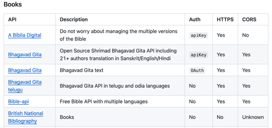

# Startup Service


## Prerequisites

Before you start work on this deliverable make sure you have read all of the proceeding instruction topics and have completed all of the dependant exercises (topics marked with a ☑). This includes:

- [The internet](../../webServers/internet/internet.md)
- [Web servers](../../webServers/webServers/webServers.md)
- [Web Services Introduction](../introduction/introduction.md)
- [URL](../url/url.md)
- [Ports](../ports/ports.md)
- [HTTP](../http/http.md)
- [Modules](../../javascript/modules/modules.md)
- ☑ [Fetch](../fetch/fetch.md)
- [Node web service](../nodeWebService/nodeWebService.md)
- ☑ [Express](../express/express.md)
- [Troubleshoot 502](../troubleshoot502/troubleshoot502.md)
- [SOP and CORS](../cors/cors.md)
- [Service design](../design/design.md)
- [Authorization services](../authorizationServices/authorizationServices.md)
- [Account creation and login](../login/login.md)
- [Simon service](../../simon/simonService/simonService.md)

Failing to do this will likely slow you down as you will not have the required knowledge to complete the deliverable.

## Getting started

Now that you have learned how to use and create services, it is time to add backend support to your startup application. The main things you should focus on in this deliverable includes:

1. Calling a third party service from your frontend.
1. Creating a backend service using Node.js.
1. Providing authentication endpoints from your backend service.
1. Providing application endpoints from your backend service.

You must use the same startup GitHub repository that you created in the earlier instruction. Update the `notes.md` file with things that you learn as you work on your startup. As you make changes to your HTML, CSS, and JavaScript, commit those changes and push them to GitHub. Make sure you have enough commits that you can demonstrate your ownership of the code and protect yourself from loss. Usually this will mean at least ten commits, but in reality you may have many more than that. Failing to fully document your work may result in the rejection of your submission.

Remember to use the browser's debugger window to debug your frontend HTML, CSS and JavaScript. You can also debug your backend service JavaScript running on Node.js using the built in VS Code Node.js debugger. You should no longer be using the VS Code Live Server extension to serve up your frontend code to the browser since Vite does that now.

## Third party APIs

You can find a list of free third party APIs on [GitHub](https://github.com/public-apis/public-apis). You can make most services work, but the easiest ones to use don't require authentication, support CORS, and require HTTPS.



## Creating your backend service

In order to follow the pattern that Simon demonstrates and the deployment script expects you **must** organize your source code with the following structure:

```sh
.                    // Project root
├── deployService.sh
├── .gitignore
├── index.html       // Frontend application code
├── index.jsx
├── package.json     // Frontend NPM package configuration
├── public
│   └── *            // Images and other static files your frontend uses
├── src
│   └── *            // Frontend React source code files
├── vite.config.js   // Config to route API calls when debugging
│
└── service          // Backend service code
    ├── index.js
    └── package.json // Backend NPM package configuration
```

Note that you now have _two applications_ represented in your Git repository. The frontend code in the root of the project, and the backend code in the `service` directory. Each of these applications must have their own NPM configuration as represented by the `package.json` file.

When you install NPM packages for your front or backend code, make sure you do your `NPM install` in the proper directory. If you put your backend dependencies in your frontend package.json your application will not deploy properly and you will see 502 errors.

## Deployment

Once you have developed your application to where you want it, you need to release it to your production environment. **Replace** your previous startup deployment script with a copy of the `deployService.sh` script from the [Simon Service repository](https://github.com/webprogramming260/simon-service/blob/main/deployService.sh) and use `startup` for the service parameter (`-s`).

```sh
./deployService.sh -k <yourpemkey> -h <yourdomain> -s startup
```

For example,

```sh
./deployService.sh -k ~/keys/production.pem -h yourdomain.click -s startup
```

Doing this will make this deliverable of your startup available from `https://startup.yourdomainname`.

> [!NOTE]
>
> If after your deployed your startup to your production environment the browser displays a `502` error you should consult the [instruction](../troubleshoot502/troubleshoot502.md) on resolving this error. Most likely the problem is that you do not have the required project structure or you are installing your NPM dependencies to the wrong application `package.json`.

## 🚀 Deliverable

1. Review and deploy Simon Service

   1. Clone the Simon Service repository to your development environment.
      ```
      git clone https://github.com/webprogramming260/simon-service.git
      ```
   1. Run `npm install` in the root of the project to install the frontend dependencies.
   1. Run `npm install` in the `service` directory to install the backend dependencies.
   1. Open the project in VS Code and examine the application's use of Node.js, Express, and JavaScript to create service endpoints.
   1. Execute in your development environment by debugging the application using VS Code's Node.js debugger (press F5 while viewing `index.js`). Set breakpoints in VS Code and step through the backend JavaScript.
   1. Start your frontend code using Vite by running `npm run dev` in the root of the project.
   1. Open your browser to http://localhost:5173 and use the browser's dev tools to step through the frontend JavaScript using the Source tab.
   1. Deploy to your production environment using the deployment script so that it is available with your domain's `simon` subdomain.

1. Convert your startup application into a web service using Node.js and Express.

   1. Create a `service` directory for your backend application and install the dependencies you need.

      ```sh
      mkdir service && cd service
      npm init -y
      npm install express cookie-parser bcryptjs uuid
      ```

   1. Create a service/index.js file for your backend
   1. Add this code to service/index.js to allow your code to select a port to run on based on the command line parameters. You **must** use port 4000 for your backend service.
      ```js
      const port = process.argv.length > 2 ? process.argv[2] : 4000;
      ```
   1. Add this code to service/index.js to cause Express static middleware to serve files from the public directory once your code has been deployed to your AWS server.
      ```js
      app.use(express.static('public'));
      ```
   1. Add a vite.config.js file to your main startup directory (right above the service and src directories) with the following content (or copy it over from Simon). This will forward fetch requests that go to a path like "fetch('/api/scores')" to connect to your backend server running on port 4000.

      ```js
      import { defineConfig } from 'vite';

      export default defineConfig({
        server: {
          proxy: {
            '/api': 'http://localhost:4000',
          },
        },
      });
      ```

   1. Create new endpoints for your backend (service/index.js) that are similar to those created by Simon.
   1. Call your endpoints from your frontend code using fetch.
   1. Call third party endpoints from your frontend code using fetch. This can be as simple as displaying a quote like Simon does.
   1. Debug your application by running your backend using VS Code's Node debugger on the service/index.js file and the browser's inspect dev tools to verify it is working correctly. You will have to run "npm run dev" to get your front end running.
   1. Periodically commit and push your code to GitHub.
   1. Periodically update your startup repository's notes.md file to reflect what you have learned and want to remember.
   1. Push your final version of your project to GitHub.
   1. Copy "deployService.sh" over from your Simon Service source code. You won't be able to use the deploy scripts from previous projects.
   1. Deploy your startup application to your production environment (your server) using "deployService.sh".
   1. Make sure your application is available from your production environment.
   1. Upload the URL to your startup application to the Canvas assignment.

This [video](https://youtu.be/lr6rmjUhOc0) may help you understand how to develop, debug and deploy your startup as a service.

## Grading Rubric

- **Prerequisite**: Simon Service deployed to your production environment
- **Prerequisite**: A link to your GitHub startup repository prominently displayed on your application's home page
- **Prerequisite**: Notes in your startup Git repository README.md file documenting what you modified and added with this deliverable. The TAs will only grade things that have been clearly described as being completed. Review the [voter app](https://github.com/webprogramming260/startup-example) as an example.
- **Prerequisite**: Enough Git commits to fully prove your ownership of your code. This usually means dozens of commits spread across multiple days of the deliverable development period. Failure to do this may result in the rejection of your submission.
- Backend web service support and interaction
  - 10% - Create an HTTP service using Node.js and Express
  - 10% - Frontend served up using Express static middleware
  - 10% - Your frontend calls third party service endpoints
  - 20% - Your backend provides service endpoints
  - 20% - Your frontend calls your service endpoints
  - 25% - Supports registration, login, logout, and restricted endpoint
  - 5% - Uses Brcypt to hash passwords

## Go celebrate

You did it! This is a significant milestone. Time to grab some friends, show them what you did, and celebrate by watching a movie with popcorn 🍿.
