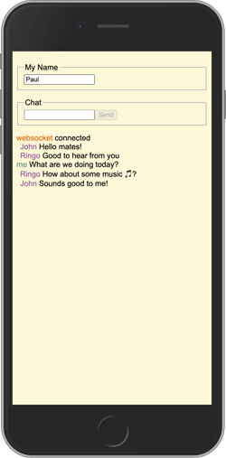

# WebSocket chat

With the understanding of what the WebSocket protocol is, the basics of using it from Node and the browser, and the ability to debug the communication, it is time to use WebSocket to build a simple chat application.



In this example we will create a React frontend that uses WebSocket and displays chats between multiple users. The React code for the client will be organized similarly to Simon and your Startup. A backend Express server will forward the WebSocket communication from the different clients.

## Setting up the project

Before we begin writing the code, we need to set up the React application project. We can follow the basic React setup that we discussed in the simple [Hello World React](../../../webFrameworks/react/introduction/introduction.md#react-hello-world) app that we created in previous instruction. This includes:

1. Creating an NPM project, installing Vite, React, and the WebSocket package.
   ```sh
   mkdir chatDemo && cd chatDemo
   npm init -y
   npm install vite@latest -D
   npm install react react-dom
   ```
1. Configuring NPM to run Vite
   ```json
   "scripts": {
     "dev": "vite"
   },
   ```
1. Configuring Vite to proxy WebSocket requests to the backend when debugging.
1. Creating a basic `index.html` file that loads your React application.
1. Creating your React application in `index.jsx`.
1. Creating your backend service in `service/service.js` and installing the `express` and `ws` packages.
   ```sh
   mkdir service && cd service
   npm install express ws
   ```

## Frontend React

In the root of the project create all of the files representing the frontend code.

This consists of our main `index.html`, `main.css`, and a `index.jsx` file that contains all the React components.

#### index.html

```html
<!DOCTYPE html>
<html lang="en">
  <head>
    <title>Chat React</title>
    <meta name="viewport" content="width=device-width, initial-scale=1" />
    <link rel="stylesheet" href="main.css" />
  </head>
  <body>
    <noscript>You need to enable JavaScript to run this app.</noscript>
    <div id="root"></div>
    <script type="module" src="/index.jsx"></script>
  </body>
</html>
```

#### main.css

```css
body {
  font-family: Arial, Helvetica, sans-serif;
  background: #fff8d8;
}
#chat-text {
  padding: 1em 0;
}
.received {
  color: rgb(153, 87, 148);
  margin-left: 0.5em;
}
.sent {
  color: rgb(87, 153, 117);
}
.system {
  color: rgb(225, 103, 10);
}
.name {
  padding: 1em 0;
}
```

#### index.jsx

```jsx
import React from 'react';
import ReactDOM from 'react-dom/client';
```

Next we add all of the React components to the `index.jsx` file.

### Chat component

The `Chat` component introduces a state variable for the user's name and injects three sub-components: `Name`, `Message`, and `Conversation`. The **Name** component allows the user to specify what name they want to associate with their messages. The **Message** component allows the user to create and send a message. The **Conversation** component displays the chat messages. Using component properties we can share the ability access the access the name and webSocket communication object.

```jsx
function Chat({ webSocket }) {
  const [name, setName] = React.useState('');

  return (
    <main>
      <Name updateName={setName} />
      <Message name={name} webSocket={webSocket} />
      <Conversation webSocket={webSocket} />
    </main>
  );
}
```

### Name component

The `Name` component implements a simple input element that uses the updateName function function to change the name used by the entire application.

```jsx
function Name({ updateName }) {
  return (
    <main>
      <div className='name'>
        <fieldset id='name-controls'>
          <legend>My Name</legend>
          <input onChange={(e) => updateName(e.target.value)} id='my-name' type='text' />
        </fieldset>
      </div>
    </main>
  );
}
```

### Message component

The `Message` component provides an input element for chat text as well as a button for sending the message. Notice that if `disabled` evaluates to true, then the chat box and button are disabled. The `doneMessage` function provides alternative message sending capability that is initiated when the `return` key is pressed. The `sendMsg` function calls the `sendMessage` method on the 'webSocket' object to send the message to other users, and also calls the `setMessage` function to allow other components to process what the user has input.

```jsx
function Message({ name, webSocket }) {
  const [message, setMessage] = React.useState('');

  function doneMessage(e) {
    if (e.key === 'Enter') {
      sendMsg();
    }
  }

  function sendMsg() {
    webSocket.sendMessage(name, message);
    setMessage('');
  }

  const disabled = name === '' || !webSocket.connected;
  return (
    <main>
      <fieldset id='chat-controls'>
        <legend>Chat</legend>
        <input disabled={disabled} onKeyDown={(e) => doneMessage(e)} value={message} onChange={(e) => setMessage(e.target.value)} type='text' />
        <button disabled={disabled || !message} onClick={sendMsg}>
          Send
        </button>
      </fieldset>
    </main>
  );
}
```

### Conversation component

The `Conversation` component provides a place for chat messages to be displayed. It maintains a list of all chats in the `chats` state variable and dynamically creates JSX to render the conversation.

```jsx
function Conversation({ webSocket }) {
  const [chats, setChats] = React.useState([]);
  React.useEffect(() => {
    webSocket.addObserver((chat) => {
      setChats((prevMessages) => [...prevMessages, chat]);
    });
  }, [webSocket]);

  const chatEls = chats.map((chat, index) => (
    <div key={index}>
      <span className={chat.event}>{chat.from}</span> {chat.msg}
    </div>
  ));

  return (
    <main>
      <div id='chat-text'>{chatEls}</div>
    </main>
  );
}
```

## ChatClient

Finally we add the `ChatClient` class. The `ChatClient` class manages the WebSocket in order to connect, send, and receive WebSocket messages.

In order to properly handle both secure and insecure WebSocket connections the ChatClient examines what protocol is currently being used for HTTP communication as represented by the browser's `window.location.protocol` variable. If it is non-secure HTTP then we set our WebSocket protocol to be non-secure WebSocket (`ws`). Otherwise we use secure WebSocket (`wss`). With the correct protocol in hand, we then connect the WebSocket to the same location that we loaded the HTML from by referencing the `window.location.host` variable.

```js
const protocol = window.location.protocol === 'http:' ? 'ws' : 'wss';
this.socket = new WebSocket(`${protocol}://${window.location.host}/ws`);
```

We then register several listeners on the websocket connection. This incudes the `onopen`, `onmessage` and `onclose` events. The ChatClient interacts with the React components by allowing them to register as observers for when chat messages are received. Then when the WebSocket events are triggered, the ChatClient can notify the observers of the events.

```jsx
class ChatClient {
  observers = [];
  connected = false;

  constructor() {
    // Adjust the webSocket protocol to what is being used for HTTP
    const protocol = window.location.protocol === 'http:' ? 'ws' : 'wss';
    this.socket = new WebSocket(`${protocol}://${window.location.host}/ws`);

    // Display that we have opened the webSocket
    this.socket.onopen = (event) => {
      this.notifyObservers('system', 'websocket', 'connected');
      this.connected = true;
    };

    // Display messages we receive from our friends
    this.socket.onmessage = async (event) => {
      const text = await event.data.text();
      const chat = JSON.parse(text);
      this.notifyObservers('received', chat.name, chat.msg);
    };

    // If the webSocket is closed then disable the interface
    this.socket.onclose = (event) => {
      this.notifyObservers('system', 'websocket', 'disconnected');
      this.connected = false;
    };
  }

  // Send a message over the webSocket
  sendMessage(name, msg) {
    this.notifyObservers('sent', 'me', msg);
    this.socket.send(JSON.stringify({ name, msg }));
  }

  addObserver(observer) {
    this.observers.push(observer);
  }

  notifyObservers(event, from, msg) {
    this.observers.forEach((h) => h({ event, from, msg }));
  }
}
```

### Load the app component

You complete the frontend code by loading the `Chat` component into the DOM and pass it a WebSocket `ChatClient`.

```js
const root = ReactDOM.createRoot(document.getElementById('root'));
root.render(<Chat webSocket={new ChatClient()} />);
```

## Backend chat server

The chat server runs the web service, serves up the client code, manages the WebSocket connections, and forwards messages from the peers.

To get started with the backend code we create a file named `service.js` in the `service` directory.

### Web and WebSocket service

The web service HTTP communication is facilitated by using a simple Express configuration.

When we create our WebSocket object, we simply provide our Express HTTP server object in the constructor. This allows the WebSocket code to intercept WebSocket upgrade requests and process future WebSocket messages.

```js
const { WebSocketServer } = require('ws');
const express = require('express');
const app = express();

// Serve up the chat frontend
app.use(express.static('./public'));

const port = process.argv.length > 2 ? process.argv[2] : 3000;
server = app.listen(port, () => {
  console.log(`Listening on ${port}`);
});

// Create a websocket object
const socketServer = new WebSocketServer({ server });
```

### Forwarding messages

With the WebSocket object in place, we can use the on `connection`, `message`, and `pong` events to receive and send data between peers. We use the WebSocket object's built in connection list to determine who we forward messages to, and to decide if the connections are still open.

So that we can test if a connection has closed, we use the ping/pong protocol that is built into WebSocket. At a given interval we send a ping message to the frontend. The frontend then responds with a pong message. When the backend receives the pong message it updates that the socket is still alive. Any connection that did not respond, will remain in the not alive state, and get terminated on the next pass.

```js
socketServer.on('connection', (socket) => {
  socket.isAlive = true;

  // Forward messages to everyone except the sender
  socket.on('message', function message(data) {
    socketServer.clients.forEach(function each(client) {
      if (client !== socket && client.readyState === WebSocket.OPEN) {
        client.send(data);
      }
    });
  });

  // Respond to pong messages by marking the connection alive
  socket.on('pong', () => {
    socket.isAlive = true;
  });
});

// Periodically send out a ping message to make sure clients are alive
setInterval(() => {
  socketServer.clients.forEach(function each(client) {
    if (client.isAlive === false) return client.terminate();

    client.isAlive = false;
    client.ping();
  });
}, 10000);
```

## Vite.config.js

When debugging, the `vite.config.js` file in the root directory is configured to route websocket traffic from port 5137 (where Vite is serving the frontend) to port 3000 (where the backend is listening for chat traffic). We have seen something similar before when we used Vite to reroute our service endpoints while debugging in our development environment. This configuration is only used for debugging during development and is not used in our production environment. Since we only use the insecure WebSocket protocol (ws) when debugging we only proxy that protocol in this configuration.

```js
import { defineConfig } from 'vite';

export default defineConfig({
  server: {
    proxy: {
      '/ws': {
        target: 'ws://localhost:3000',
        ws: true,
      },
    },
  },
});
```

## Experiment

You can find this complete example [here](exampleCode). To run it yourself, take the following steps:

1. Clone the repository.
1. Run `npm install` from a console window in the example root directory.
1. Run `npm install` from a console window in the example service subdirectory.
1. Open up the code in VS Code and review what it is doing.
1. Run and debug the example by pressing `F5` for the file `service/index.js`. You may need to select Node as the debugger the first time you run.
1. Run `npm run dev` from a console window in the example root directory.
1. Open multiple browser windows and point them to http://localhost:5137.
1. Provide a user name and start chatting.
1. Use the browser's debugger to view the WebSocket communication.


