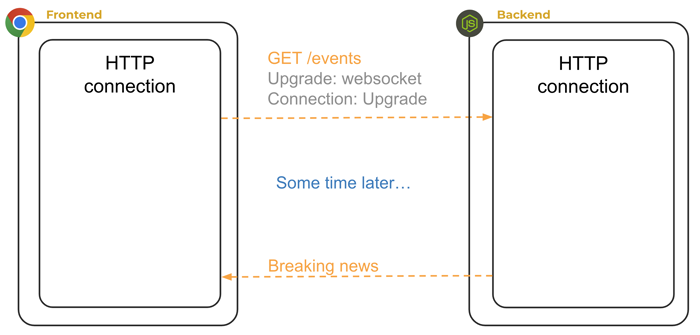
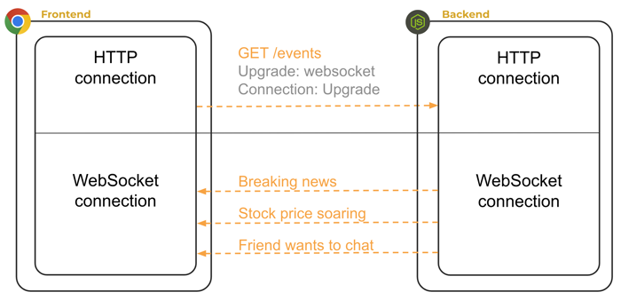
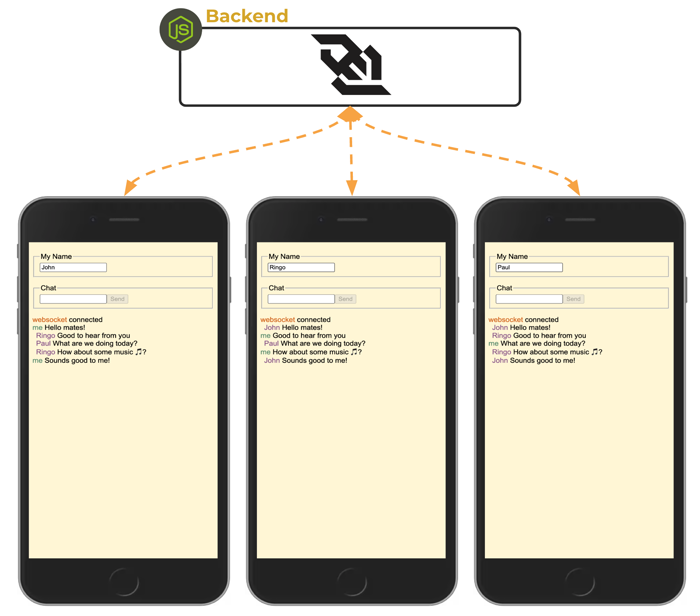
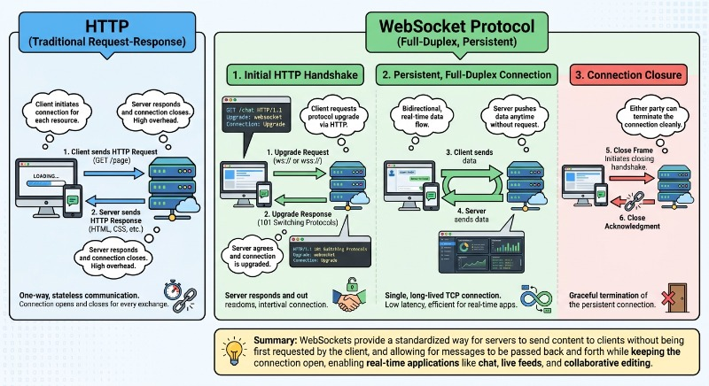

# WebSocket

<iframe src="https://docs.google.com/presentation/d/e/2PACX-1vQcgglX5RnK8G9gp9fkiUluBR5J3zx4phXHh3qCEkDqDY84ofcoI_HfmxVqNFl9p6yeiZXmTQofKWvJ/pubembed?start=false&loop=false&delayms=3000" frameborder="0" width="900" height="540" allowfullscreen="true" mozallowfullscreen="true" webkitallowfullscreen="true"></iframe>

---


HTTP is based on a client-server architecture. A client always initiates the request and the server responds. This is great if you are building a global document library connected by hyperlinks, but for many other use cases it just doesn't work. Applications for notifications, distributed task processing, peer-to-peer communication, or asynchronous events need communication that is initiated by two or more connected devices.

For years, web developers created hacks to work around the limitation of the client/server model. This included solutions like having the client frequently pinging the server to see if the server had anything to say, or keeping client-initiated connections open for a very long time as the client waited for some event to happen on the server.



Needless to say, none of these solutions were elegant or efficient.

Finally, in 2011 the communication protocol WebSocket was created to solve this problem. The core feature of WebSocket is that it is fully duplexed. This means that after the initial connection is made from a client, using vanilla HTTP, and then upgraded by the server to a WebSocket connection, the relationship changes to a peer-to-peer connection where either party can efficiently send data at any time.



This enables the server to send notifications to the client, or for the client and server to have an asynchronous exchange of information.

WebSocket connections are still only between two parties. So if you want to facilitate a conversation between a group of users, the server must act as the intermediary. Each peer first connects to the server, and then the server forwards messages amongst the peers.



## Creating a WebSocket conversation

JavaScript running on a browser can initiate a WebSocket connection with the browser's WebSocket API. Assuming the browser is addressing an appropriate host and port (e.g., localhost:9900), first you create a WebSocket object: the first line below queries the browser to determine which protocol is being used (http or https) and selects the appropriate websocket upgrade (unsecure or secure, respectively); the second line creates the WebSocket object, using the selected protocol and the hostname and port currently being used by the browser:

```js
const protocol = window.location.protocol === 'http:' ? 'ws' : 'wss';
const socket = new WebSocket(`${protocol}://${window.location.host}`);
```

You can then register a callback using the `onmessage` function to specify how to handle incoming messages (does this look like an event listener?):

```js
socket.onmessage = (event) => {
  console.log('received: ', event.data);
};
```

and, you can send messages using the `send` function:

```js
socket.send('I am listening');
```

The server uses the `ws` package to create a WebSocketServer that is listening on the same port the browser is using. By specifying a port when you create the WebSocketServer, you are telling the server to listen for HTTP connections on that port and to automatically upgrade them to a WebSocket connection if the request has a `connection: Upgrade` header.

When a connection is detected it calls the server's `on connection` callback. The server can then send messages with the `send` function, and register a callback using the `on message` function to receive messages.

```js
const { WebSocketServer } = require('ws');

const wss = new WebSocketServer({ port: 3000 });

wss.on('connection', (ws) => {
  ws.on('message', (data) => {
    const msg = String.fromCharCode(...data);
    console.log('received: %s', msg);

    ws.send(`I heard you say "${msg}"`);
  });

  ws.send('Hello webSocket');
});
```

In a later instruction we will show you how to run and debug this example.


## WebSocket details

Although the `ws` package makes it easy to use WebSocket in your applications, you should be aware of some of the internal details that can be easy to overlook. Without a basic understanding of how WebSocket works it can be frustrating to implement in a production system.



### The WebSocket Handshake
WebSockets begin as a standard HTTP request. To establish a connection, the client sends an "Upgrade" header to the server. If the server supports the protocol, it responds with an HTTP 101 status code (Switching Protocols). Once this handshake is successful, the TCP connection remains open, and both parties can send data at any time.

### Full-Duplex Communication
Unlike standard HTTP (Request-Response), WebSockets are **full-duplex**. This means the client and server can send data simultaneously without waiting for the other to finish. This eliminates the overhead of opening a new connection for every message.

### Connection Statefulness
WebSockets are stateful. The server must keep track of every active connection in memory. This differs from RESTful APIs, which are stateless. Because of this, scaling WebSockets often requires a "Sticky Session" strategy on load balancers or a pub/sub mechanism (like Redis) to synchronize messages across multiple server instances.

### Handling Binary Data
WebSockets support both UTF-8 text and binary data. When handling binary data, you can choose between `Blob` (useful for files) and `ArrayBuffer` (useful for raw binary processing).

```javascript
const socket = new WebSocket('ws://example.com/socket');

// Set the binary type to 'arraybuffer' or 'blob'
socket.binaryType = 'arraybuffer';

socket.onmessage = (event) => {
  if (event.data instanceof ArrayBuffer) {
    const view = new DataView(event.data);
    console.log('Received binary data:', view.getInt8(0));
  } else {
    console.log('Received text data:', event.data);
  }
};
```

### Heartbeats and Keep-Alive
WebSocket connections can be dropped by firewalls, proxies, or load balancers if they are idle for too long. To prevent this, implement a "heartbeat" (ping/pong) mechanism to ensure the connection remains active.

```javascript
// Server-side logic (Node.js using 'ws' library)
const WebSocket = require('ws');
const wss = new WebSocket.Server({ port: 8080 });

wss.on('connection', (ws) => {
  ws.isAlive = true;
  
  // Mark as alive when a 'pong' is received
  ws.on('pong', () => {
    ws.isAlive = true;
  });
});

// Check every 30 seconds if connections are still alive
const interval = setInterval(() => {
  wss.clients.forEach((ws) => {
    if (ws.isAlive === false) return ws.terminate();
    
    ws.isAlive = false;
    ws.ping(); // Send ping to client
  });
}, 30000);
```

### Closing Codes
When a connection closes, the WebSocket API provides a numeric code and a reason. Understanding these codes is critical for debugging and implementing auto-reconnect logic.
*   `1000`: Normal Closure.
*   `1001`: Going Away (e.g., server shutdown or browser tab closed).
*   `1006`: Abnormal Closure (connection lost without a close frame).

```javascript
socket.onclose = (event) => {
  if (event.wasClean) {
    console.log(`Closed cleanly, code=${event.code} reason=${event.reason}`);
  } else {
    // e.g. server process killed or network down
    console.error('Connection died');
    // Implement reconnection logic here
  }
};
```

### Security (WSS)
Always use `wss://` (WebSocket Secure) in production. It uses TLS/SSL to encrypt the data stream. This not only protects data but also prevents "Man-in-the-Middle" attacks and ensures that transparent proxy servers do not interfere with or block the WebSocket traffic.

## Exercises


```masteryls
{"id":"1c9ef4b5-ba34-4e52-a2d5-80ae6d426997", "title":"HTTP vs WebSocket", "type":"essay" }
Explain the essential differences between the HTTP and WebSocket protocols.
```

